<!-- markdownlint-disable MD024 MD032 MD033 MD036 MD041 MD049 -->

# z-fastq Check Benchmark Report

_Generated by `bench/check/generate_report.py` from zebrac results._

_This is a bring-up measurement: zebrac duration_ms=5000, runs=5, warmup=3 (published default is 5000 ms, 25 runs, 5 warmups). Read it as a suite check, not a published ranking._

## Overview

This report times `z-fastq check` on the shared FASTQ corpus. Coverage is kept in one suite; the showcase is four families so geometry, pair layout, name policy, and concat-gzip are not one race.

Set: **small**.

- **SE shapes:** SE: DenseSmall, SE: Variable, SE: HiFi. Occupancy and efficiency live only here.
- **Pair layout:** paired: DenseSmall + PairSmallR2, interleaved: InterleavedSmall. Same mate count; not mixed with SE file geometry.
- **Name policy:** paired: DenseSmall + PairSmallR2, casava: CasavaR1 + CasavaR2, slash: SlashR1 + SlashR2. Same MiniSeq sequences; only headers change.
- **Concat gzip:** gzip edge: ConcatGzip. z-fastq ISA-L vs native; member traversal is proven by record count.

**What is timed**

- One process, one validation workload. Zebrac starts the argv directly; no shell or pipeline is measured.
- Plain and gzip inputs are separate sections. Gzip includes native z-fastq only as the second inflate backend.
- External validators are descriptive peers. Their raw wall time, peak RSS, and minor faults are reported only for positive lanes they accept.
- Concatenated gzip is probed with peers for the capability matrix and is not timed for them: a zero exit does not prove every gzip member was traversed.

## What each tool does

A valid z-fastq check produces no output and exits 0. Invalid inputs return stable S001-S006 structural/semantic codes; paired and interleaved failures return P001/P002. The z-fastq contract is checked independently before timing. External validators are descriptive: they are timed only when they exit 0 on a positive workload they claim to support.

| Tool               | Command                                                                                                               | Same check job                                 | Timed as                     |
| :----------------- | :-------------------------------------------------------------------------------------------------------------------- | :--------------------------------------------- | :--------------------------- |
| z-fastq (ISA-L)    | `z-fastq check`                                                                                                       | yes; S001-S006 and P001/P002                   | contract reference           |
| z-fastq (native)   | `z-fastq-native check`                                                                                                | yes, gzip only                                 | second inflate backend       |
| fq                 | `fq lint --lint-mode panic`                                                                                           | no; SE and two-file pairs                      | hatched; descriptive         |
| FastQValidator     | `fastQValidator --file … --minReadLen 0 --quiet` plus `--disableSeqIDCheck` on SE or `--interleaved` on interleaved   | no; no two-file pair mode                      | hatched; descriptive         |
| SeqFu              | `seqfu check --deep --quiet` (`--no-paired` on one file)                                                              | no; SE and two-file pairs                      | hatched; RSS not occupancy   |
| fqtools            | `fqtools -d -a -u -l -q s validate` (`-i` when interleaved)                                                           | no; extra DNA/empty/uniqueness/Sanger policy   | hatched; descriptive         |

**Role coverage**

| Tool               | SE             | paired         | casava         | slash          | interleaved     | concat gzip         |
| :----------------- | :------------- | :------------- | :------------- | :------------- | :-------------- | :------------------ |
| z-fastq (ISA-L)    | timed          | timed          | timed          | timed          | timed           | timed (gzip only)   |
| z-fastq (native)   | timed (gzip)   | timed (gzip)   | timed (gzip)   | timed (gzip)   | timed (gzip)    | timed (gzip)        |
| fq lint            | timed          | timed          | timed          | timed          | unsupported     | unsupported         |
| FastQValidator     | timed          | unsupported    | unsupported    | unsupported    | timed           | unsupported         |
| SeqFu check        | timed          | timed          | timed          | timed          | unsupported     | unsupported         |
| fqtools validate   | timed          | timed          | timed          | timed          | timed           | unsupported         |

**Not timed**

| Tool                             | Why it is not here                                          |
| :------------------------------- | :---------------------------------------------------------- |
| seqtk                            | no validator; count suite only                              |
| SeqKit `seq --validate-seq`      | alphabet check, not FASTQ structure or pair names           |
| Needletail / Helicase adapters   | count and stats wrappers; no check command                  |
| fastp                            | QC and transformation, not a gate validator                 |
| BBTools                          | JVM pair utilities; RSS is not a comparable process image   |

<strong>Peer lane decisions</strong> (plain and gzip, every workload)

| Section     | Workload                           | Tool               | Result        |
| :---------- | :--------------------------------- | :----------------- | :------------ |
| gzip        | casava: CasavaR1 + CasavaR2        | FastQValidator     | unsupported   |
| gzip        | casava: CasavaR1 + CasavaR2        | fq lint            | timed         |
| gzip        | casava: CasavaR1 + CasavaR2        | fqtools validate   | timed         |
| gzip        | casava: CasavaR1 + CasavaR2        | SeqFu check        | timed         |
| gzip        | gzip edge: ConcatGzip              | FastQValidator     | unsupported   |
| gzip        | gzip edge: ConcatGzip              | fq lint            | unsupported   |
| gzip        | gzip edge: ConcatGzip              | fqtools validate   | unsupported   |
| gzip        | gzip edge: ConcatGzip              | SeqFu check        | unsupported   |
| gzip        | interleaved: InterleavedSmall      | FastQValidator     | timed         |
| gzip        | interleaved: InterleavedSmall      | fq lint            | unsupported   |
| gzip        | interleaved: InterleavedSmall      | fqtools validate   | timed         |
| gzip        | interleaved: InterleavedSmall      | SeqFu check        | unsupported   |
| gzip        | paired: DenseSmall + PairSmallR2   | FastQValidator     | unsupported   |
| gzip        | paired: DenseSmall + PairSmallR2   | fq lint            | timed         |
| gzip        | paired: DenseSmall + PairSmallR2   | fqtools validate   | timed         |
| gzip        | paired: DenseSmall + PairSmallR2   | SeqFu check        | timed         |
| gzip        | SE: DenseSmall                     | FastQValidator     | timed         |
| gzip        | SE: DenseSmall                     | fq lint            | timed         |
| gzip        | SE: DenseSmall                     | fqtools validate   | timed         |
| gzip        | SE: DenseSmall                     | SeqFu check        | timed         |
| gzip        | SE: HiFi                           | FastQValidator     | timed         |
| gzip        | SE: HiFi                           | fq lint            | timed         |
| gzip        | SE: HiFi                           | fqtools validate   | timed         |
| gzip        | SE: HiFi                           | SeqFu check        | timed         |
| gzip        | SE: Variable                       | FastQValidator     | timed         |
| gzip        | SE: Variable                       | fq lint            | timed         |
| gzip        | SE: Variable                       | fqtools validate   | timed         |
| gzip        | SE: Variable                       | SeqFu check        | timed         |
| gzip        | slash: SlashR1 + SlashR2           | FastQValidator     | unsupported   |
| gzip        | slash: SlashR1 + SlashR2           | fq lint            | timed         |
| gzip        | slash: SlashR1 + SlashR2           | fqtools validate   | timed         |
| gzip        | slash: SlashR1 + SlashR2           | SeqFu check        | timed         |
| plain       | casava: CasavaR1 + CasavaR2        | FastQValidator     | unsupported   |
| plain       | casava: CasavaR1 + CasavaR2        | fq lint            | timed         |
| plain       | casava: CasavaR1 + CasavaR2        | fqtools validate   | timed         |
| plain       | casava: CasavaR1 + CasavaR2        | SeqFu check        | timed         |
| plain       | interleaved: InterleavedSmall      | FastQValidator     | timed         |
| plain       | interleaved: InterleavedSmall      | fq lint            | unsupported   |
| plain       | interleaved: InterleavedSmall      | fqtools validate   | timed         |
| plain       | interleaved: InterleavedSmall      | SeqFu check        | unsupported   |
| plain       | paired: DenseSmall + PairSmallR2   | FastQValidator     | unsupported   |
| plain       | paired: DenseSmall + PairSmallR2   | fq lint            | timed         |
| plain       | paired: DenseSmall + PairSmallR2   | fqtools validate   | timed         |
| plain       | paired: DenseSmall + PairSmallR2   | SeqFu check        | timed         |
| plain       | SE: DenseSmall                     | FastQValidator     | timed         |
| plain       | SE: DenseSmall                     | fq lint            | timed         |
| plain       | SE: DenseSmall                     | fqtools validate   | timed         |
| plain       | SE: DenseSmall                     | SeqFu check        | timed         |
| plain       | SE: HiFi                           | FastQValidator     | timed         |
| plain       | SE: HiFi                           | fq lint            | timed         |
| plain       | SE: HiFi                           | fqtools validate   | timed         |
| plain       | SE: HiFi                           | SeqFu check        | timed         |
| plain       | SE: Variable                       | FastQValidator     | timed         |
| plain       | SE: Variable                       | fq lint            | timed         |
| plain       | SE: Variable                       | fqtools validate   | timed         |
| plain       | SE: Variable                       | SeqFu check        | timed         |
| plain       | slash: SlashR1 + SlashR2           | FastQValidator     | unsupported   |
| plain       | slash: SlashR1 + SlashR2           | fq lint            | timed         |
| plain       | slash: SlashR1 + SlashR2           | fqtools validate   | timed         |
| plain       | slash: SlashR1 + SlashR2           | SeqFu check        | timed         |

## Check agreement

Status: **ALL PASSED**. Both z-fastq binaries passed valid plain/gzip fixtures, exact S001-S006 failure checks, alphabet policy, slash and Casava pair-name checks, pair-count checks, odd-interleaved checks, and ConcatGzip member traversal (record count). Positive real workloads were then probed with external validators; incompatible peer behavior was recorded rather than treated as a z-fastq failure.

Log: `verify_20260915_143436.log`.

**Peer fixture probes**

These rows are descriptive. A fail does not stop the run. `pass` is exit 0; `fail` is a nonzero exit on a fixture z-fastq accepts or rejects under its own contract; `unsupported` means that tool is not invoked for that role.

_No peer fixture probes were recorded in this run. Re-run `bench/check/run.sh` to fill this matrix._

## Run provenance

- **Timestamp:** `20260915_143436`
- **Runner:** zebrac, warm page cache, runs=5, warmup=3, duration_ms=5000
- **zebrac:** zebrac 0.6.2
- **z-fastq ISA-L:** z-fastq 0.0.18 (754,560 bytes)
- **z-fastq native:** z-fastq 0.0.18 (535,088 bytes)

**Peer versions**

- **fq:** fq v0.12.0 (51779f50e 2024-07-08)
- **fastqvalidator:** fastQValidator 0.1.1a
- **seqfu:** 1.27.1
- **fqtools:** fqtools 2.3 (HTSlib 1.24)

## Performance: SE FASTQ

Single-end file geometry. Small set: DenseSmall, Variable, HiFi. Publication set: Dense, Variable, Long, HiFi. Occupancy and efficiency live only on these SE shapes. The z-fastq ISA-L lane is the 1x time reference; external validators are not treated as semantic equivalents.

### Wall time

Zebrac mean wall time for one validation process. Vertical annotations are time relative to the z-fastq ISA-L lane where a peer lane exists.

**Table 1:** Mean ± standard deviation by workload and tool.

| Workload         | z-fastq (ISA-L)     | fq lint         | FastQValidator     | SeqFu check     | fqtools validate     |
| :--------------- | :------------------ | :-------------- | :----------------- | :-------------- | :------------------- |
| SE: DenseSmall   | 0.005±0.000 s       | 0.021±0.001 s   | 0.124±0.002 s      | 0.516±0.015 s   | 0.063±0.002 s        |
| SE: Variable     | 0.037±0.002 s       | 0.160±0.002 s   | 1.218±0.005 s      | 4.930±0.124 s   | 0.615±0.009 s        |
| SE: HiFi         | 0.002±0.000 s       | 0.005±0.000 s   | 0.040±0.001 s      | 0.149±0.008 s   | 0.020±0.001 s        |

<strong>Table 2:</strong> Time relative to z-fastq ISA-L.

| Workload         | z-fastq vs         | z-fastq     | Peer      | Time relative to z-fastq     |
| :--------------- | :----------------- | :---------- | :-------- | :--------------------------- |
| SE: DenseSmall   | fq lint            | 0.0049s     | 0.0206s   | 4.16x                        |
| SE: DenseSmall   | FastQValidator     | 0.0049s     | 0.1239s   | 25.0x                        |
| SE: DenseSmall   | SeqFu check        | 0.0049s     | 0.5162s   | 104x                         |
| SE: DenseSmall   | fqtools validate   | 0.0049s     | 0.0631s   | 12.8x                        |
| SE: Variable     | fq lint            | 0.0374s     | 0.1596s   | 4.27x                        |
| SE: Variable     | FastQValidator     | 0.0374s     | 1.2177s   | 32.6x                        |
| SE: Variable     | SeqFu check        | 0.0374s     | 4.9298s   | 132x                         |
| SE: Variable     | fqtools validate   | 0.0374s     | 0.6148s   | 16.4x                        |
| SE: HiFi         | fq lint            | 0.0017s     | 0.0054s   | 3.26x                        |
| SE: HiFi         | FastQValidator     | 0.0017s     | 0.0402s   | 24.2x                        |
| SE: HiFi         | SeqFu check        | 0.0017s     | 0.1486s   | 89.7x                        |
| SE: HiFi         | fqtools validate   | 0.0017s     | 0.0198s   | 11.9x                        |

### Peak memory

Peak RSS of the timed process. These are raw process measurements; validator implementations do not share one memory contract.

**Table 3:** Mean ± standard deviation by workload and tool.

| Workload         | z-fastq (ISA-L)     | fq lint        | FastQValidator     | SeqFu check     | fqtools validate     |
| :--------------- | :------------------ | :------------- | :----------------- | :-------------- | :------------------- |
| SE: DenseSmall   | 0.92±0.01 MB        | 4.04±0.14 MB   | 4.33±0.20 MB       | 3.48±0.12 MB    | 3.15±0.10 MB         |
| SE: Variable     | 0.92±0.00 MB        | 4.01±0.16 MB   | 4.23±0.16 MB       | 3.41±0.01 MB    | 3.17±0.04 MB         |
| SE: HiFi         | 0.92±0.00 MB        | 4.04±0.14 MB   | 4.61±0.18 MB       | 4.18±0.18 MB    | 3.14±0.11 MB         |

### Minor page faults

Minor page faults for the same direct commands. These are descriptive process measurements.

**Table 4:** Mean ± standard deviation by workload and tool.

| Workload         | z-fastq (ISA-L)     | fq lint     | FastQValidator     | SeqFu check     | fqtools validate     |
| :--------------- | :------------------ | :---------- | :----------------- | :-------------- | :------------------- |
| SE: DenseSmall   | 118±1               | 196±2       | 178±2              | 229±1           | 354±2                |
| SE: Variable     | 118±1               | 196±2       | 186±1              | 245±2           | 353±1                |
| SE: HiFi         | 118±1               | 200±2       | 266±2              | 428±1           | 356±2                |

**Figure 1:** Wall time, peak RSS, and minor page faults for SE check workloads.

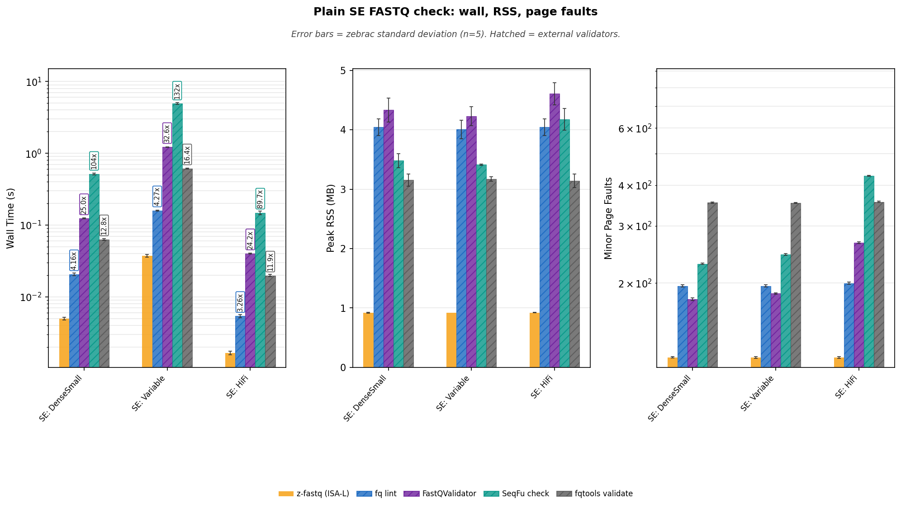

**Reading Figure 1**

- Facets: wall time (log y) | peak RSS (linear) | minor page faults (log y).
- X-axis: SE catalog shapes only. Occupancy and efficiency follow this family.
- Gold bars are z-fastq ISA-L. Amber bars are native inflate on gzip. Hatched bars are external validators with different edge-case contracts.

### Occupancy (50/50 wall and RSS)

Occupancy is mean wall time × peak RSS, and only SE shapes use it. These figures use accepted positive lanes; blank cells mean unsupported or rejected. SeqFu stays on the wall/RSS facets and is omitted here because its RSS is a helper-spawning CLI, not a single validator image. Occupancy is descriptive resource accounting, not a semantic-equivalence ranking.

**Table 5:** Occupancy (MB·s) = mean wall × peak RSS.

| Workload         | z-fastq (ISA-L)     | fq lint     | FastQValidator     | fqtools validate     |
| :--------------- | ------------------: | ----------: | -----------------: | -------------------: |
| SE: DenseSmall   | 0.0046              | 0.0833      | 0.5368             | 0.199                |
| SE: Variable     | 0.0345              | 0.6397      | 5.1554             | 1.9515               |
| SE: HiFi         | 0.0015              | 0.0219      | 0.1852             | 0.0622               |

**Table 6:** Occupancy efficiency vs z-fastq ISA-L. Higher is better.

| Workload         | z-fastq (ISA-L)     | fq lint     | FastQValidator     | fqtools validate     |
| :--------------- | :------------------ | :---------- | :----------------- | :------------------- |
| SE: DenseSmall   | 1x                  | 0.055x      | 0.008x             | 0.023x               |
| SE: Variable     | 1x                  | 0.054x      | 0.007x             | 0.018x               |
| SE: HiFi         | 1x                  | 0.070x      | 0.008x             | 0.025x               |

**Figure 2:** Peak RSS vs mean wall. Per-workload occupancy isocosts through z-fastq ISA-L.

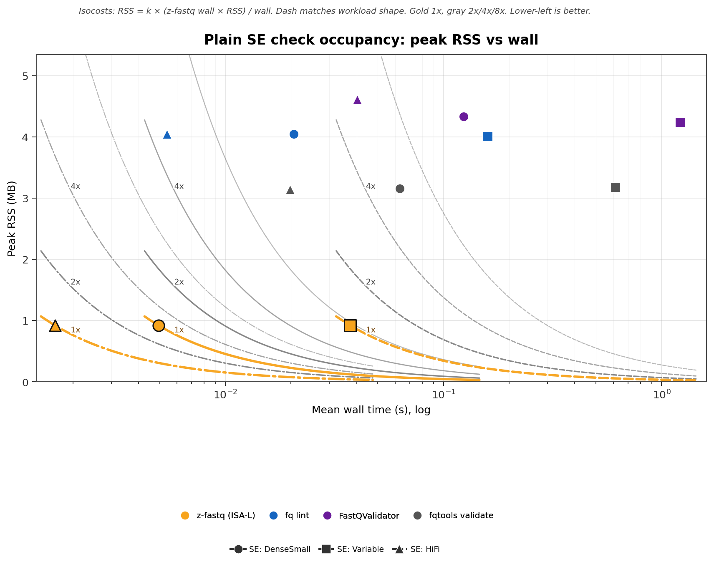

**Reading Figure 2**

- X: mean wall (s, log). Y: peak RSS (MB, linear).
- Color = tool. Shape and line dash = workload; the legend names every SE shape.
- Curves are 1x/2x/4x/8x memory-seconds of that workload's z-fastq ISA-L lane. Gold 1x, gray 2x/4x/8x.
- Lower-left is better. Missing points are not treated as zero.

**Figure 3:** Occupancy efficiency vs z-fastq ISA-L. Higher is better. 1.00 matches z-fastq memory-seconds.

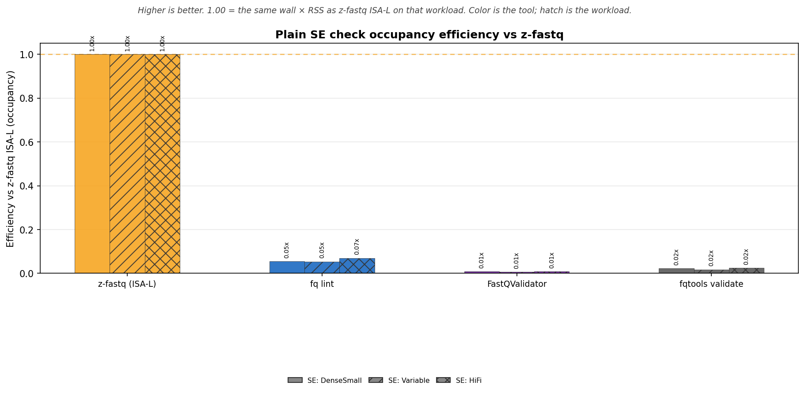

**Reading Figure 3**

- X-axis is the tool. Grouped bars are SE: DenseSmall / SE: Variable / SE: HiFi; hatches identify workloads.
- Bar color is the tool. Gold dashed line is 1x.
- This is the inverse of occupancy cost on the scatter and is descriptive for accepted positive SE lanes.

## Performance: SE FASTQ (gzip)

The same SE shapes as gzip. Gold is z-fastq ISA-L; amber is native Zig inflate. Decoded FASTQ MiB/s uses the uncompressed sibling size divided by wall time.

### Wall time

Zebrac mean wall time for one validation process. Vertical annotations are time relative to the z-fastq ISA-L lane where a peer lane exists.

**Table 7:** Mean ± standard deviation by workload and tool.

| Workload         | z-fastq (ISA-L)     | z-fastq (native)     | fq lint         | FastQValidator     | SeqFu check     | fqtools validate     |
| :--------------- | :------------------ | :------------------- | :-------------- | :----------------- | :-------------- | :------------------- |
| SE: DenseSmall   | 0.013±0.000 s       | 0.018±0.000 s        | 0.038±0.001 s   | 0.133±0.001 s      | 0.453±0.013 s   | 0.072±0.002 s        |
| SE: Variable     | 0.315±0.002 s       | 0.580±0.003 s        | 0.843±0.011 s   | 1.609±0.009 s      | 4.622±0.186 s   | 0.976±0.012 s        |
| SE: HiFi         | 0.013±0.000 s       | 0.027±0.000 s        | 0.030±0.000 s   | 0.056±0.001 s      | 0.142±0.005 s   | 0.035±0.001 s        |

<strong>Table 8:</strong> Time relative to z-fastq ISA-L.

| Workload         | z-fastq vs         | z-fastq     | Peer      | Time relative to z-fastq     |
| :--------------- | :----------------- | :---------- | :-------- | :--------------------------- |
| SE: DenseSmall   | z-fastq (native)   | 0.0127s     | 0.0177s   | 1.40x                        |
| SE: DenseSmall   | fq lint            | 0.0127s     | 0.0382s   | 3.01x                        |
| SE: DenseSmall   | FastQValidator     | 0.0127s     | 0.1331s   | 10.5x                        |
| SE: DenseSmall   | SeqFu check        | 0.0127s     | 0.4534s   | 35.7x                        |
| SE: DenseSmall   | fqtools validate   | 0.0127s     | 0.0716s   | 5.64x                        |
| SE: Variable     | z-fastq (native)   | 0.3150s     | 0.5801s   | 1.84x                        |
| SE: Variable     | fq lint            | 0.3150s     | 0.8430s   | 2.68x                        |
| SE: Variable     | FastQValidator     | 0.3150s     | 1.6090s   | 5.11x                        |
| SE: Variable     | SeqFu check        | 0.3150s     | 4.6221s   | 14.7x                        |
| SE: Variable     | fqtools validate   | 0.3150s     | 0.9760s   | 3.10x                        |
| SE: HiFi         | z-fastq (native)   | 0.0134s     | 0.0268s   | 1.99x                        |
| SE: HiFi         | fq lint            | 0.0134s     | 0.0296s   | 2.20x                        |
| SE: HiFi         | FastQValidator     | 0.0134s     | 0.0558s   | 4.15x                        |
| SE: HiFi         | SeqFu check        | 0.0134s     | 0.1420s   | 10.6x                        |
| SE: HiFi         | fqtools validate   | 0.0134s     | 0.0347s   | 2.58x                        |

### Peak memory

Peak RSS of the timed process. These are raw process measurements; validator implementations do not share one memory contract.

**Table 9:** Mean ± standard deviation by workload and tool.

| Workload         | z-fastq (ISA-L)     | z-fastq (native)     | fq lint        | FastQValidator     | SeqFu check     | fqtools validate     |
| :--------------- | :------------------ | :------------------- | :------------- | :----------------- | :-------------- | :------------------- |
| SE: DenseSmall   | 0.92±0.00 MB        | 0.92±0.00 MB         | 4.04±0.16 MB   | 4.54±0.22 MB       | 3.93±0.13 MB    | 3.70±0.10 MB         |
| SE: Variable     | 0.92±0.00 MB        | 0.92±0.00 MB         | 4.02±0.10 MB   | 4.42±0.20 MB       | 3.82±0.14 MB    | 3.67±0.03 MB         |
| SE: HiFi         | 0.92±0.00 MB        | 0.87±0.00 MB         | 4.03±0.14 MB   | 4.78±0.13 MB       | 4.60±0.21 MB    | 3.69±0.11 MB         |

### Minor page faults

Minor page faults for the same direct commands. These are descriptive process measurements.

**Table 10:** Mean ± standard deviation by workload and tool.

| Workload         | z-fastq (ISA-L)     | z-fastq (native)     | fq lint     | FastQValidator     | SeqFu check     | fqtools validate     |
| :--------------- | :------------------ | :------------------- | :---------- | :----------------- | :-------------- | :------------------- |
| SE: DenseSmall   | 144±1               | 139±1                | 205±2       | 284±2              | 336±2           | 463±1                |
| SE: Variable     | 128±1               | 139±0                | 204±1       | 292±2              | 354±2           | 463±2                |
| SE: HiFi         | 114±1               | 139±1                | 215±2       | 374±2              | 535±1           | 464±1                |

### Decoded throughput

Decoded FASTQ MiB/s is the uncompressed input size divided by wall time. It is the useful gzip unit for a validator; compressed on-disk throughput is supporting context.

**Table 11:** Decoded FASTQ MiB/s.

| Workload         | z-fastq (ISA-L)     | z-fastq (native)     | fq lint       | FastQValidator     | SeqFu check     | fqtools validate     |
| :--------------- | :------------------ | :------------------- | :------------ | :----------------- | :-------------- | :------------------- |
| SE: DenseSmall   | 1539.3 MiB/s        | 1101.8 MiB/s         | 512.1 MiB/s   | 146.9 MiB/s        | 43.1 MiB/s      | 273.0 MiB/s          |
| SE: Variable     | 624.2 MiB/s         | 339.0 MiB/s          | 233.2 MiB/s   | 122.2 MiB/s        | 42.5 MiB/s      | 201.5 MiB/s          |
| SE: HiFi         | 447.3 MiB/s         | 224.5 MiB/s          | 203.2 MiB/s   | 107.8 MiB/s        | 42.3 MiB/s      | 173.4 MiB/s          |

<strong>Table 12:</strong> Compressed on-disk MiB/s.

| Workload         | z-fastq (ISA-L)     | z-fastq (native)     | fq lint       | FastQValidator     | SeqFu check     | fqtools validate     |
| :--------------- | :------------------ | :------------------- | :------------ | :----------------- | :-------------- | :------------------- |
| SE: DenseSmall   | 118.7 MiB/s         | 85.0 MiB/s           | 39.5 MiB/s    | 11.3 MiB/s         | 3.3 MiB/s       | 21.1 MiB/s           |
| SE: Variable     | 231.0 MiB/s         | 125.5 MiB/s          | 86.3 MiB/s    | 45.2 MiB/s         | 15.7 MiB/s      | 74.6 MiB/s           |
| SE: HiFi         | 232.4 MiB/s         | 116.6 MiB/s          | 105.5 MiB/s   | 56.0 MiB/s         | 22.0 MiB/s      | 90.1 MiB/s           |

**Figure 4:** Wall time, peak RSS, and minor page faults for gzip SE check workloads.

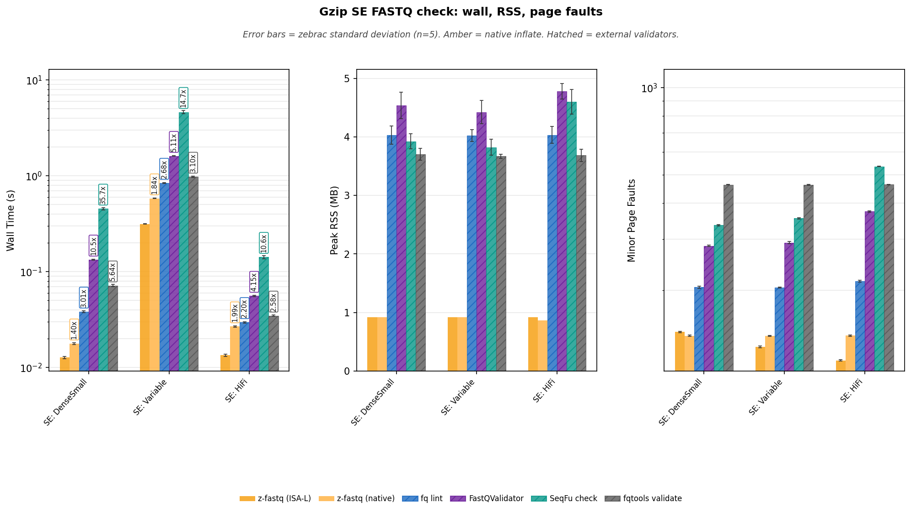

**Reading Figure 4**

- Facets: wall time (log y) | peak RSS (linear) | minor page faults (log y).
- X-axis: SE catalog shapes only. Occupancy and efficiency follow this family.
- Gold bars are z-fastq ISA-L. Amber bars are native inflate on gzip. Hatched bars are external validators with different edge-case contracts.

### Occupancy (50/50 wall and RSS)

Occupancy is mean wall time × peak RSS, and only SE shapes use it. These figures use accepted positive lanes; blank cells mean unsupported or rejected. SeqFu stays on the wall/RSS facets and is omitted here because its RSS is a helper-spawning CLI, not a single validator image. Occupancy is descriptive resource accounting, not a semantic-equivalence ranking.

**Table 13:** Occupancy (MB·s) = mean wall × peak RSS.

| Workload         | z-fastq (ISA-L)     | z-fastq (native)     | fq lint     | FastQValidator     | fqtools validate     |
| :--------------- | ------------------: | -------------------: | ----------: | -----------------: | -------------------: |
| SE: DenseSmall   | 0.0117              | 0.0164               | 0.1541      | 0.6041             | 0.2652               |
| SE: Variable     | 0.2904              | 0.5348               | 3.3908      | 7.1198             | 3.5823               |
| SE: HiFi         | 0.0124              | 0.0232               | 0.1194      | 0.2667             | 0.1279               |

**Table 14:** Occupancy efficiency vs z-fastq ISA-L. Higher is better.

| Workload         | z-fastq (ISA-L)     | z-fastq (native)     | fq lint     | FastQValidator     | fqtools validate     |
| :--------------- | :------------------ | :------------------- | :---------- | :----------------- | :------------------- |
| SE: DenseSmall   | 1x                  | 0.716x               | 0.076x      | 0.019x             | 0.044x               |
| SE: Variable     | 1x                  | 0.543x               | 0.086x      | 0.041x             | 0.081x               |
| SE: HiFi         | 1x                  | 0.533x               | 0.104x      | 0.046x             | 0.097x               |

**Figure 5:** Peak RSS vs mean wall. Per-workload occupancy isocosts through z-fastq ISA-L.

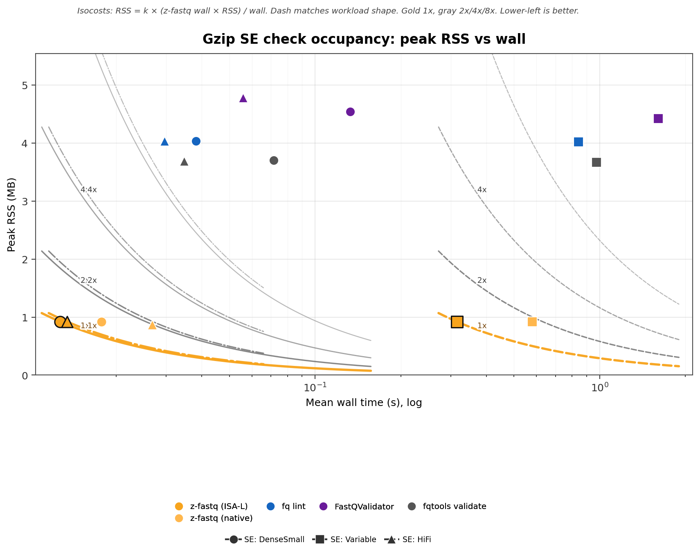

**Reading Figure 5**

- X: mean wall (s, log). Y: peak RSS (MB, linear).
- Color = tool. Shape and line dash = workload; the legend names every SE shape.
- Curves are 1x/2x/4x/8x memory-seconds of that workload's z-fastq ISA-L lane. Gold 1x, gray 2x/4x/8x.
- Lower-left is better. Missing points are not treated as zero.

**Figure 6:** Occupancy efficiency vs z-fastq ISA-L. Higher is better. 1.00 matches z-fastq memory-seconds.

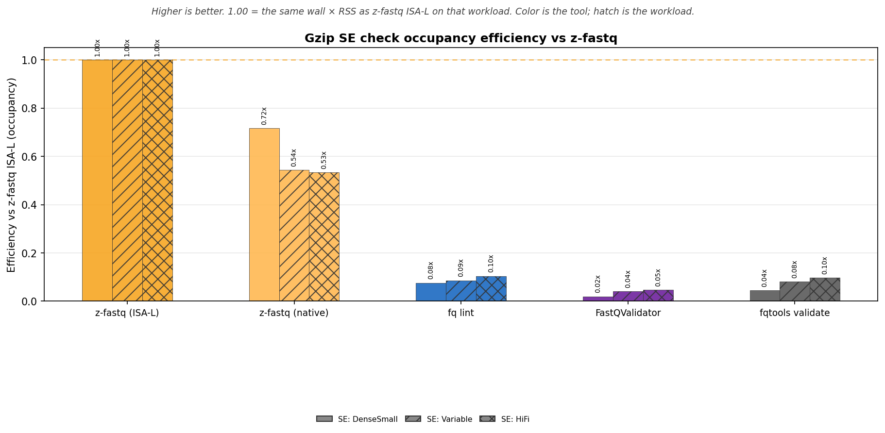

**Reading Figure 6**

- X-axis is the tool. Grouped bars are SE: DenseSmall / SE: Variable / SE: HiFi; hatches identify workloads.
- Bar color is the tool. Gold dashed line is 1x.
- This is the inverse of occupancy cost on the scatter and is descriptive for accepted positive SE lanes.

## Performance: pair layout

`--paired` vs `--interleaved` on the matching mates (same pair count). SE DenseSmall is half the records of this pair and is not plotted here as pair overhead. Tables and a 3-facet bar only; no occupancy.

### Wall time

Zebrac mean wall time for one validation process. Vertical annotations are time relative to the z-fastq ISA-L lane where a peer lane exists.

**Table 15:** Mean ± standard deviation by workload and tool.

| Workload                           | z-fastq (ISA-L)     | fq lint         | FastQValidator     | SeqFu check     | fqtools validate     |
| :--------------------------------- | :------------------ | :-------------- | :----------------- | :-------------- | :------------------- |
| paired: DenseSmall + PairSmallR2   | 0.015±0.001 s       | 0.100±0.002 s   |                    | 1.032±0.011 s   | 0.123±0.003 s        |
| interleaved: InterleavedSmall      | 0.016±0.000 s       |                 | 0.270±0.004 s      |                 | 0.127±0.003 s        |

<strong>Table 16:</strong> Time relative to z-fastq ISA-L.

| Workload                           | z-fastq vs         | z-fastq     | Peer      | Time relative to z-fastq     |
| :--------------------------------- | :----------------- | :---------- | :-------- | :--------------------------- |
| paired: DenseSmall + PairSmallR2   | fq lint            | 0.0146s     | 0.0998s   | 6.85x                        |
| paired: DenseSmall + PairSmallR2   | SeqFu check        | 0.0146s     | 1.0323s   | 70.9x                        |
| paired: DenseSmall + PairSmallR2   | fqtools validate   | 0.0146s     | 0.1231s   | 8.45x                        |
| interleaved: InterleavedSmall      | FastQValidator     | 0.0158s     | 0.2705s   | 17.1x                        |
| interleaved: InterleavedSmall      | fqtools validate   | 0.0158s     | 0.1274s   | 8.05x                        |

### Peak memory

Peak RSS of the timed process. These are raw process measurements; validator implementations do not share one memory contract.

**Table 17:** Mean ± standard deviation by workload and tool.

| Workload                           | z-fastq (ISA-L)     | fq lint         | FastQValidator     | SeqFu check     | fqtools validate     |
| :--------------------------------- | :------------------ | :-------------- | :----------------- | :-------------- | :------------------- |
| paired: DenseSmall + PairSmallR2   | 0.99±0.05 MB        | 26.98±0.15 MB   |                    | 3.40±0.06 MB    | 4.14±0.11 MB         |
| interleaved: InterleavedSmall      | 0.93±0.00 MB        |                 | 10.58±0.27 MB      |                 | 3.16±0.08 MB         |

### Minor page faults

Minor page faults for the same direct commands. These are descriptive process measurements.

**Table 18:** Mean ± standard deviation by workload and tool.

| Workload                           | z-fastq (ISA-L)     | fq lint     | FastQValidator     | SeqFu check     | fqtools validate     |
| :--------------------------------- | :------------------ | :---------- | :----------------- | :-------------- | :------------------- |
| paired: DenseSmall + PairSmallR2   | 208±1               | 11901±2     |                    | 229±1           | 613±2                |
| interleaved: InterleavedSmall      | 124±1               |             | 1834±2             |                 | 353±2                |

**Figure 7:** Wall time, peak RSS, and minor page faults for paired vs interleaved check.

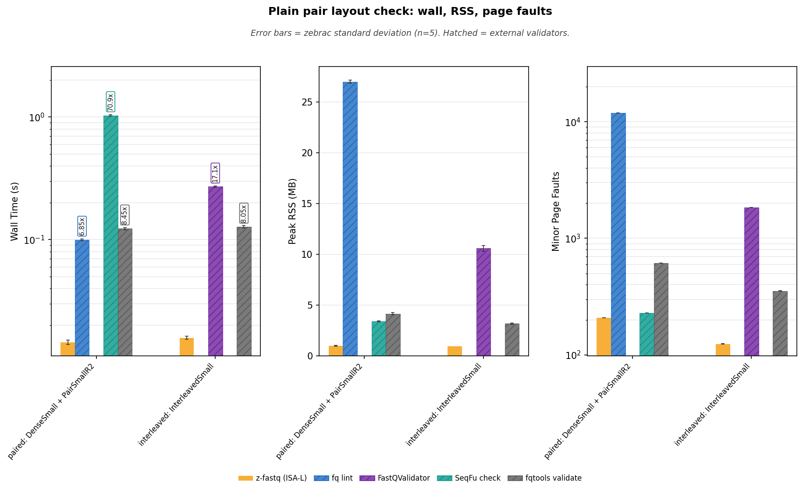

**Reading Figure 7**

- Facets: wall time (log y) | peak RSS (linear) | minor page faults (log y).
- X-axis: `--paired` then `--interleaved` on the matching mates. SE DenseSmall is not on this plot.
- Gold bars are z-fastq ISA-L. Amber bars are native inflate on gzip. Hatched bars are external validators.

## Performance: pair layout (gzip)

The same paired vs interleaved mates as gzip. Gold is z-fastq ISA-L; amber is native Zig inflate.

### Wall time

Zebrac mean wall time for one validation process. Vertical annotations are time relative to the z-fastq ISA-L lane where a peer lane exists.

**Table 19:** Mean ± standard deviation by workload and tool.

| Workload                           | z-fastq (ISA-L)     | z-fastq (native)     | fq lint         | FastQValidator     | SeqFu check     | fqtools validate     |
| :--------------------------------- | :------------------ | :------------------- | :-------------- | :----------------- | :-------------- | :------------------- |
| paired: DenseSmall + PairSmallR2   | 0.030±0.001 s       | 0.042±0.001 s        | 0.156±0.005 s   |                    | 0.895±0.013 s   | 0.141±0.002 s        |
| interleaved: InterleavedSmall      | 0.031±0.001 s       | 0.044±0.001 s        |                 | 0.291±0.003 s      |                 | 0.145±0.004 s        |

<strong>Table 20:</strong> Time relative to z-fastq ISA-L.

| Workload                           | z-fastq vs         | z-fastq     | Peer      | Time relative to z-fastq     |
| :--------------------------------- | :----------------- | :---------- | :-------- | :--------------------------- |
| paired: DenseSmall + PairSmallR2   | z-fastq (native)   | 0.0298s     | 0.0424s   | 1.42x                        |
| paired: DenseSmall + PairSmallR2   | fq lint            | 0.0298s     | 0.1564s   | 5.24x                        |
| paired: DenseSmall + PairSmallR2   | SeqFu check        | 0.0298s     | 0.8948s   | 30.0x                        |
| paired: DenseSmall + PairSmallR2   | fqtools validate   | 0.0298s     | 0.1412s   | 4.73x                        |
| interleaved: InterleavedSmall      | z-fastq (native)   | 0.0312s     | 0.0435s   | 1.40x                        |
| interleaved: InterleavedSmall      | FastQValidator     | 0.0312s     | 0.2913s   | 9.35x                        |
| interleaved: InterleavedSmall      | fqtools validate   | 0.0312s     | 0.1448s   | 4.65x                        |

### Peak memory

Peak RSS of the timed process. These are raw process measurements; validator implementations do not share one memory contract.

**Table 21:** Mean ± standard deviation by workload and tool.

| Workload                           | z-fastq (ISA-L)     | z-fastq (native)     | fq lint         | FastQValidator     | SeqFu check     | fqtools validate     |
| :--------------------------------- | :------------------ | :------------------- | :-------------- | :----------------- | :-------------- | :------------------- |
| paired: DenseSmall + PairSmallR2   | 1.29±0.00 MB        | 0.93±0.00 MB         | 27.02±0.13 MB   |                    | 4.25±0.16 MB    | 4.97±0.11 MB         |
| interleaved: InterleavedSmall      | 1.03±0.04 MB        | 0.93±0.00 MB         |                 | 10.83±0.37 MB      |                 | 3.69±0.06 MB         |

### Minor page faults

Minor page faults for the same direct commands. These are descriptive process measurements.

**Table 22:** Mean ± standard deviation by workload and tool.

| Workload                           | z-fastq (ISA-L)     | z-fastq (native)     | fq lint     | FastQValidator     | SeqFu check     | fqtools validate     |
| :--------------------------------- | :------------------ | :------------------- | :---------- | :----------------- | :-------------- | :------------------- |
| paired: DenseSmall + PairSmallR2   | 255±0               | 128±1                | 11939±1     |                    | 442±1           | 831±1                |
| interleaved: InterleavedSmall      | 149±1               | 158±1                |             | 1940±2             |                 | 463±1                |

### Decoded throughput

Decoded FASTQ MiB/s is the uncompressed input size divided by wall time. It is the useful gzip unit for a validator; compressed on-disk throughput is supporting context.

**Table 23:** Decoded FASTQ MiB/s.

| Workload                           | z-fastq (ISA-L)     | z-fastq (native)     | fq lint       | FastQValidator     | SeqFu check     | fqtools validate     |
| :--------------------------------- | :------------------ | :------------------- | :------------ | :----------------- | :-------------- | :------------------- |
| paired: DenseSmall + PairSmallR2   | 1311.1 MiB/s        | 923.3 MiB/s          | 250.0 MiB/s   |                    | 43.7 MiB/s      | 277.0 MiB/s          |
| interleaved: InterleavedSmall      | 1255.4 MiB/s        | 898.4 MiB/s          |               | 134.3 MiB/s        |                 | 270.1 MiB/s          |

<strong>Table 24:</strong> Compressed on-disk MiB/s.

| Workload                           | z-fastq (ISA-L)     | z-fastq (native)     | fq lint      | FastQValidator     | SeqFu check     | fqtools validate     |
| :--------------------------------- | :------------------ | :------------------- | :----------- | :----------------- | :-------------- | :------------------- |
| paired: DenseSmall + PairSmallR2   | 108.1 MiB/s         | 76.1 MiB/s           | 20.6 MiB/s   |                    | 3.6 MiB/s       | 22.8 MiB/s           |
| interleaved: InterleavedSmall      | 101.9 MiB/s         | 73.0 MiB/s           |              | 10.9 MiB/s         |                 | 21.9 MiB/s           |

**Figure 8:** Wall time, peak RSS, and minor page faults for gzip paired vs interleaved check.

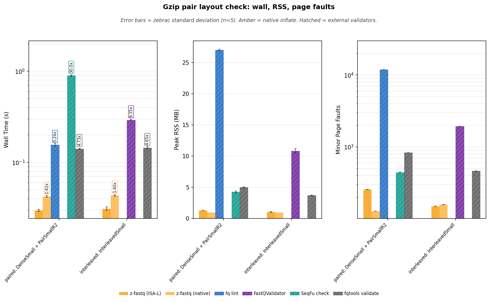

**Reading Figure 8**

- Facets: wall time (log y) | peak RSS (linear) | minor page faults (log y).
- X-axis: `--paired` then `--interleaved` on the matching mates. SE DenseSmall is not on this plot.
- Gold bars are z-fastq ISA-L. Amber bars are native inflate on gzip. Hatched bars are external validators.

## Performance: name policy

Paired (SRA-style names) vs Casava `1:N:0:` / `2:N:0:` vs `@id/1` / `@id/2`. Same MiniSeq sequences; only headers change. This is a header-policy story, not a volume race. Tables and a compact 3-facet; no occupancy.

### Wall time

Zebrac mean wall time for one validation process. Vertical annotations are time relative to the z-fastq ISA-L lane where a peer lane exists.

**Table 25:** Mean ± standard deviation by workload and tool.

| Workload                           | z-fastq (ISA-L)     | fq lint         | SeqFu check     | fqtools validate     |
| :--------------------------------- | :------------------ | :-------------- | :-------------- | :------------------- |
| paired: DenseSmall + PairSmallR2   | 0.015±0.001 s       | 0.100±0.002 s   | 1.032±0.011 s   | 0.123±0.003 s        |
| casava: CasavaR1 + CasavaR2        | 0.016±0.000 s       | 0.101±0.003 s   | 1.014±0.006 s   | 0.126±0.003 s        |
| slash: SlashR1 + SlashR2           | 0.014±0.000 s       | 0.098±0.002 s   | 0.986±0.005 s   | 0.122±0.002 s        |

<strong>Table 26:</strong> Time relative to z-fastq ISA-L.

| Workload                           | z-fastq vs         | z-fastq     | Peer      | Time relative to z-fastq     |
| :--------------------------------- | :----------------- | :---------- | :-------- | :--------------------------- |
| paired: DenseSmall + PairSmallR2   | fq lint            | 0.0146s     | 0.0998s   | 6.85x                        |
| paired: DenseSmall + PairSmallR2   | SeqFu check        | 0.0146s     | 1.0323s   | 70.9x                        |
| paired: DenseSmall + PairSmallR2   | fqtools validate   | 0.0146s     | 0.1231s   | 8.45x                        |
| casava: CasavaR1 + CasavaR2        | fq lint            | 0.0159s     | 0.1015s   | 6.36x                        |
| casava: CasavaR1 + CasavaR2        | SeqFu check        | 0.0159s     | 1.0141s   | 63.6x                        |
| casava: CasavaR1 + CasavaR2        | fqtools validate   | 0.0159s     | 0.1255s   | 7.87x                        |
| slash: SlashR1 + SlashR2           | fq lint            | 0.0142s     | 0.0985s   | 6.93x                        |
| slash: SlashR1 + SlashR2           | SeqFu check        | 0.0142s     | 0.9856s   | 69.4x                        |
| slash: SlashR1 + SlashR2           | fqtools validate   | 0.0142s     | 0.1218s   | 8.57x                        |

### Peak memory

Peak RSS of the timed process. These are raw process measurements; validator implementations do not share one memory contract.

**Table 27:** Mean ± standard deviation by workload and tool.

| Workload                           | z-fastq (ISA-L)     | fq lint         | SeqFu check     | fqtools validate     |
| :--------------------------------- | :------------------ | :-------------- | :-------------- | :------------------- |
| paired: DenseSmall + PairSmallR2   | 0.99±0.05 MB        | 26.98±0.15 MB   | 3.40±0.06 MB    | 4.14±0.11 MB         |
| casava: CasavaR1 + CasavaR2        | 0.98±0.06 MB        | 26.99±0.17 MB   | 3.45±0.04 MB    | 4.16±0.09 MB         |
| slash: SlashR1 + SlashR2           | 0.99±0.05 MB        | 26.99±0.15 MB   | 3.43±0.03 MB    | 4.14±0.10 MB         |

### Minor page faults

Minor page faults for the same direct commands. These are descriptive process measurements.

**Table 28:** Mean ± standard deviation by workload and tool.

| Workload                           | z-fastq (ISA-L)     | fq lint     | SeqFu check     | fqtools validate     |
| :--------------------------------- | :------------------ | :---------- | :-------------- | :------------------- |
| paired: DenseSmall + PairSmallR2   | 208±1               | 11901±2     | 229±1           | 613±2                |
| casava: CasavaR1 + CasavaR2        | 208±1               | 11901±2     | 230±2           | 614±2                |
| slash: SlashR1 + SlashR2           | 209±1               | 11901±2     | 229±1           | 614±2                |

**Figure 9:** Wall time, peak RSS, and minor page faults for pair-name policy check.

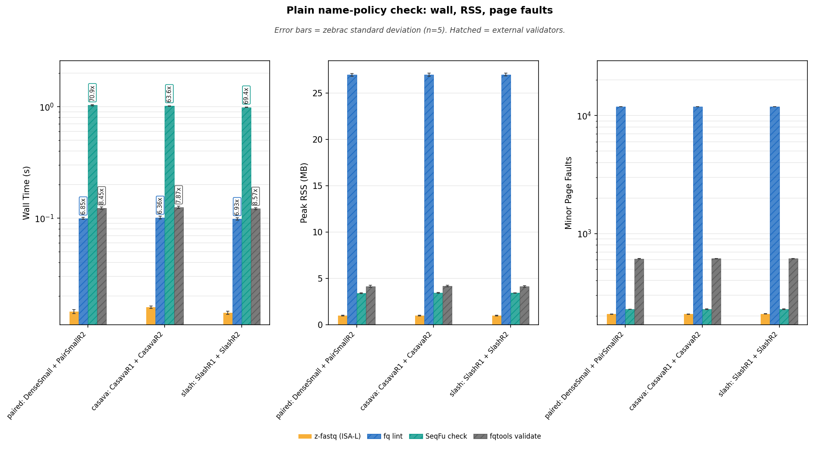

**Reading Figure 9**

- Facets: wall time (log y) | peak RSS (linear) | minor page faults (log y).
- X-axis: SRA-style paired names, Casava `1:N:0:`, then `@id/1` `/2`. Same sequences; only headers change.
- Gold bars are z-fastq ISA-L. Amber bars are native inflate on gzip. Hatched bars are external validators.

## Performance: name policy (gzip)

The same MiniSeq sequences as gzip, still only headers changing. Gold is z-fastq ISA-L; amber is native Zig inflate.

### Wall time

Zebrac mean wall time for one validation process. Vertical annotations are time relative to the z-fastq ISA-L lane where a peer lane exists.

**Table 29:** Mean ± standard deviation by workload and tool.

| Workload                           | z-fastq (ISA-L)     | z-fastq (native)     | fq lint         | SeqFu check     | fqtools validate     |
| :--------------------------------- | :------------------ | :------------------- | :-------------- | :-------------- | :------------------- |
| paired: DenseSmall + PairSmallR2   | 0.030±0.001 s       | 0.042±0.001 s        | 0.156±0.005 s   | 0.895±0.013 s   | 0.141±0.002 s        |
| casava: CasavaR1 + CasavaR2        | 0.030±0.001 s       | 0.040±0.001 s        | 0.151±0.002 s   | 0.896±0.011 s   | 0.142±0.002 s        |
| slash: SlashR1 + SlashR2           | 0.028±0.001 s       | 0.038±0.001 s        | 0.150±0.003 s   | 0.860±0.002 s   | 0.137±0.003 s        |

<strong>Table 30:</strong> Time relative to z-fastq ISA-L.

| Workload                           | z-fastq vs         | z-fastq     | Peer      | Time relative to z-fastq     |
| :--------------------------------- | :----------------- | :---------- | :-------- | :--------------------------- |
| paired: DenseSmall + PairSmallR2   | z-fastq (native)   | 0.0298s     | 0.0424s   | 1.42x                        |
| paired: DenseSmall + PairSmallR2   | fq lint            | 0.0298s     | 0.1564s   | 5.24x                        |
| paired: DenseSmall + PairSmallR2   | SeqFu check        | 0.0298s     | 0.8948s   | 30.0x                        |
| paired: DenseSmall + PairSmallR2   | fqtools validate   | 0.0298s     | 0.1412s   | 4.73x                        |
| casava: CasavaR1 + CasavaR2        | z-fastq (native)   | 0.0297s     | 0.0403s   | 1.36x                        |
| casava: CasavaR1 + CasavaR2        | fq lint            | 0.0297s     | 0.1513s   | 5.10x                        |
| casava: CasavaR1 + CasavaR2        | SeqFu check        | 0.0297s     | 0.8956s   | 30.2x                        |
| casava: CasavaR1 + CasavaR2        | fqtools validate   | 0.0297s     | 0.1425s   | 4.80x                        |
| slash: SlashR1 + SlashR2           | z-fastq (native)   | 0.0283s     | 0.0385s   | 1.36x                        |
| slash: SlashR1 + SlashR2           | fq lint            | 0.0283s     | 0.1499s   | 5.30x                        |
| slash: SlashR1 + SlashR2           | SeqFu check        | 0.0283s     | 0.8601s   | 30.4x                        |
| slash: SlashR1 + SlashR2           | fqtools validate   | 0.0283s     | 0.1371s   | 4.85x                        |

### Peak memory

Peak RSS of the timed process. These are raw process measurements; validator implementations do not share one memory contract.

**Table 31:** Mean ± standard deviation by workload and tool.

| Workload                           | z-fastq (ISA-L)     | z-fastq (native)     | fq lint         | SeqFu check     | fqtools validate     |
| :--------------------------------- | :------------------ | :------------------- | :-------------- | :-------------- | :------------------- |
| paired: DenseSmall + PairSmallR2   | 1.29±0.00 MB        | 0.93±0.00 MB         | 27.02±0.13 MB   | 4.25±0.16 MB    | 4.97±0.11 MB         |
| casava: CasavaR1 + CasavaR2        | 1.29±0.03 MB        | 0.92±0.03 MB         | 27.02±0.13 MB   | 4.30±0.11 MB    | 5.01±0.14 MB         |
| slash: SlashR1 + SlashR2           | 1.29±0.02 MB        | 0.93±0.00 MB         | 27.02±0.13 MB   | 4.21±0.17 MB    | 5.00±0.17 MB         |

### Minor page faults

Minor page faults for the same direct commands. These are descriptive process measurements.

**Table 32:** Mean ± standard deviation by workload and tool.

| Workload                           | z-fastq (ISA-L)     | z-fastq (native)     | fq lint     | SeqFu check     | fqtools validate     |
| :--------------------------------- | :------------------ | :------------------- | :---------- | :-------------- | :------------------- |
| paired: DenseSmall + PairSmallR2   | 255±0               | 128±1                | 11939±1     | 442±1           | 831±1                |
| casava: CasavaR1 + CasavaR2        | 257±0               | 130±0                | 11939±2     | 444±1           | 830±1                |
| slash: SlashR1 + SlashR2           | 253±0               | 128±1                | 11939±2     | 442±1           | 830±1                |

### Decoded throughput

Decoded FASTQ MiB/s is the uncompressed input size divided by wall time. It is the useful gzip unit for a validator; compressed on-disk throughput is supporting context.

**Table 33:** Decoded FASTQ MiB/s.

| Workload                           | z-fastq (ISA-L)     | z-fastq (native)     | fq lint       | SeqFu check     | fqtools validate     |
| :--------------------------------- | :------------------ | :------------------- | :------------ | :-------------- | :------------------- |
| paired: DenseSmall + PairSmallR2   | 1311.1 MiB/s        | 923.3 MiB/s          | 250.0 MiB/s   | 43.7 MiB/s      | 277.0 MiB/s          |
| casava: CasavaR1 + CasavaR2        | 1338.9 MiB/s        | 986.5 MiB/s          | 262.5 MiB/s   | 44.3 MiB/s      | 278.7 MiB/s          |
| slash: SlashR1 + SlashR2           | 1358.6 MiB/s        | 998.9 MiB/s          | 256.4 MiB/s   | 44.7 MiB/s      | 280.3 MiB/s          |

<strong>Table 34:</strong> Compressed on-disk MiB/s.

| Workload                           | z-fastq (ISA-L)     | z-fastq (native)     | fq lint      | SeqFu check     | fqtools validate     |
| :--------------------------------- | :------------------ | :------------------- | :----------- | :-------------- | :------------------- |
| paired: DenseSmall + PairSmallR2   | 108.1 MiB/s         | 76.1 MiB/s           | 20.6 MiB/s   | 3.6 MiB/s       | 22.8 MiB/s           |
| casava: CasavaR1 + CasavaR2        | 97.9 MiB/s          | 72.1 MiB/s           | 19.2 MiB/s   | 3.2 MiB/s       | 20.4 MiB/s           |
| slash: SlashR1 + SlashR2           | 101.6 MiB/s         | 74.7 MiB/s           | 19.2 MiB/s   | 3.3 MiB/s       | 21.0 MiB/s           |

**Figure 10:** Wall time, peak RSS, and minor page faults for gzip pair-name policy check.

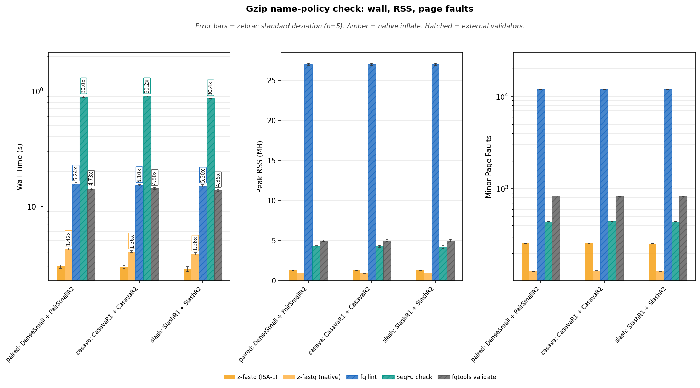

**Reading Figure 10**

- Facets: wall time (log y) | peak RSS (linear) | minor page faults (log y).
- X-axis: SRA-style paired names, Casava `1:N:0:`, then `@id/1` `/2`. Same sequences; only headers change.
- Gold bars are z-fastq ISA-L. Amber bars are native inflate on gzip. Hatched bars are external validators.

## Performance: concat gzip

Two gzip members of DenseSmall. Timed only for z-fastq ISA-L vs native. Member traversal is proven by record count, not by `check` exit 0. Peers were probed for the fixture matrix and are not timed here.

### Wall time

Zebrac mean wall time for one validation process. Vertical annotations are time relative to the z-fastq ISA-L lane where a peer lane exists.

**Table 35:** Mean ± standard deviation by workload and tool.

| Workload                | z-fastq (ISA-L)     | z-fastq (native)     |
| :---------------------- | :------------------ | :------------------- |
| gzip edge: ConcatGzip   | 0.013±0.000 s       | 0.018±0.000 s        |

<strong>Table 36:</strong> Time relative to z-fastq ISA-L.

| Workload                | z-fastq vs         | z-fastq     | Peer      | Time relative to z-fastq     |
| :---------------------- | :----------------- | :---------- | :-------- | :--------------------------- |
| gzip edge: ConcatGzip   | z-fastq (native)   | 0.0127s     | 0.0176s   | 1.39x                        |

### Peak memory

Peak RSS of the timed process. These are raw process measurements; validator implementations do not share one memory contract.

**Table 37:** Mean ± standard deviation by workload and tool.

| Workload                | z-fastq (ISA-L)     | z-fastq (native)     |
| :---------------------- | :------------------ | :------------------- |
| gzip edge: ConcatGzip   | 0.92±0.00 MB        | 0.92±0.00 MB         |

### Minor page faults

Minor page faults for the same direct commands. These are descriptive process measurements.

**Table 38:** Mean ± standard deviation by workload and tool.

| Workload                | z-fastq (ISA-L)     | z-fastq (native)     |
| :---------------------- | :------------------ | :------------------- |
| gzip edge: ConcatGzip   | 144±1               | 139±1                |

### Decoded throughput

Decoded FASTQ MiB/s is the uncompressed input size divided by wall time. It is the useful gzip unit for a validator; compressed on-disk throughput is supporting context.

**Table 39:** Decoded FASTQ MiB/s.

| Workload                | z-fastq (ISA-L)     | z-fastq (native)     |
| :---------------------- | :------------------ | :------------------- |
| gzip edge: ConcatGzip   | 1545.2 MiB/s        | 1109.4 MiB/s         |

<strong>Table 40:</strong> Compressed on-disk MiB/s.

| Workload                | z-fastq (ISA-L)     | z-fastq (native)     |
| :---------------------- | :------------------ | :------------------- |
| gzip edge: ConcatGzip   | 119.1 MiB/s         | 85.5 MiB/s           |

**Figure 11:** Wall time, peak RSS, and minor page faults for concatenated gzip.

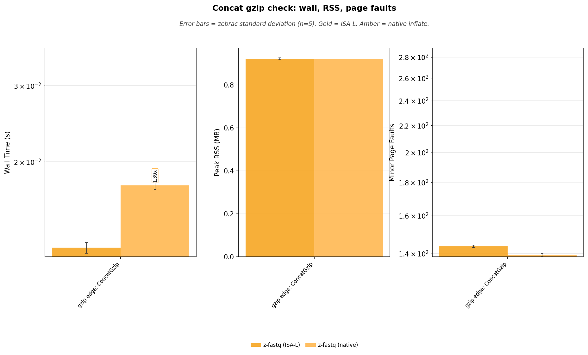

**Reading Figure 11**

- Facets: wall time (log y) | peak RSS (linear) | minor page faults (log y).
- X-axis: ConcatGzip, two gzip members of DenseSmall. Timed z-fastq ISA-L vs native only.
- Gold is ISA-L. Amber is native inflate. Peers were probed for the fixture matrix and are not timed here.

