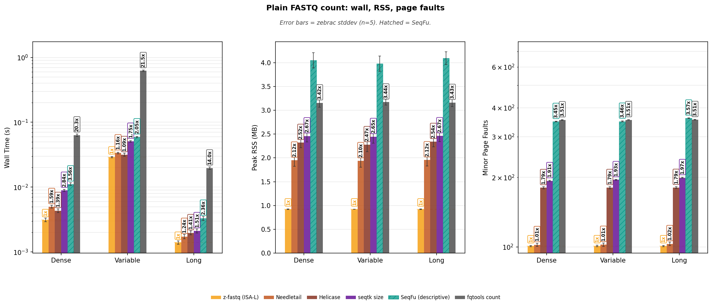
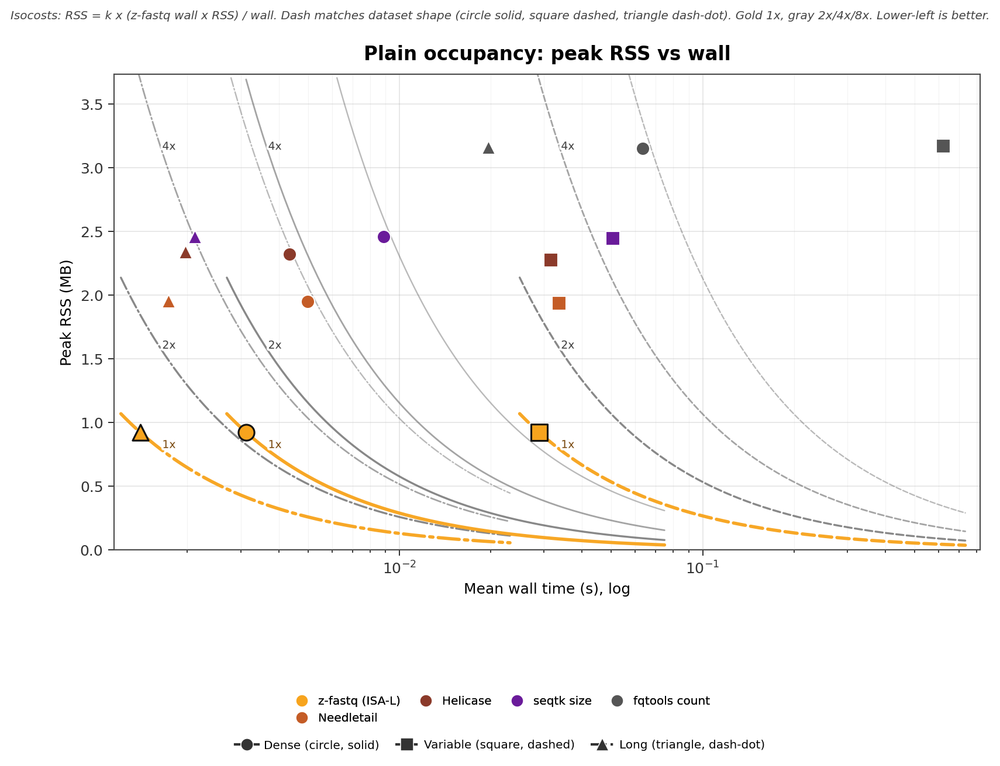
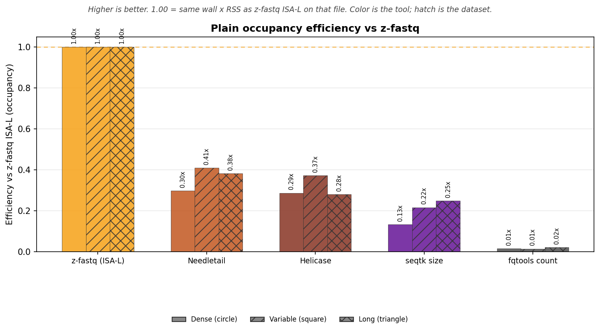
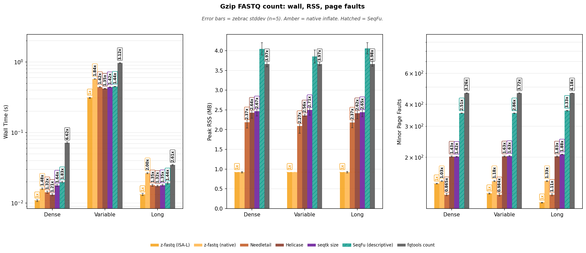
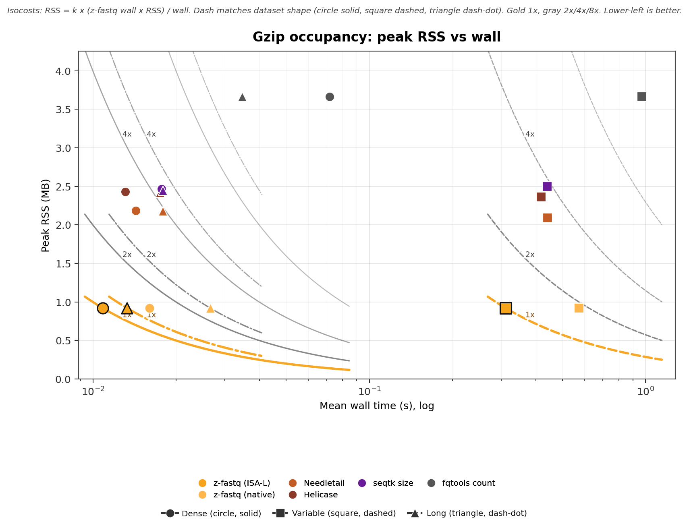
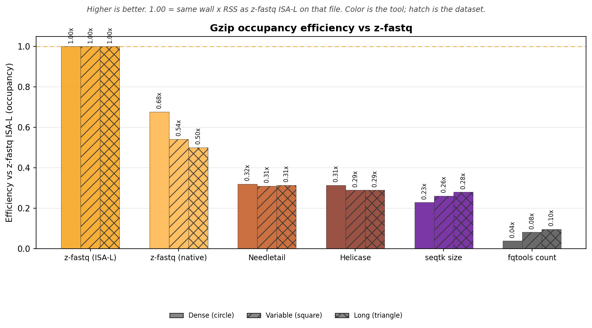

<!-- markdownlint-disable MD024 MD032 MD033 MD036 MD041 MD049 -->

# z-fastq Count Benchmark Report

_Generated by `bench/count/generate_report.py` from zebrac results._

_This is a bring-up measurement: Dense is MiniSeq R1, not SRR1810900; Long is PacBio CCS DRR054114, not MinION DRR217704; zebrac duration_ms=5000, runs=5, warmup=3 (published default is 5000 ms, 25 runs, 5 warmups). Read it as a check of the suite, not a published ranking._

## Overview

This report times `z-fastq count` on matched plain and gzip FASTQ. Count uses three shapes from the shared corpus: dense fixed-length Illumina, mixed-length 454, and a PacBio CCS long-read file. The same corpus also holds MiniSeq and trimmed MiSeq pairs for check, sample, interleave, and deinterleave; those files are not timed here. Dense is SRR10325788 MiniSeq RNA-seq R1, 60,910 x 153 bp. The R2 mate is PairSmallR2. Variable is ERR164407, 454 GS FLX Titanium, 282,806 reads, 40-631 bp (mean 345). Mixed length, not Illumina. Long is DRR054114, PacBio RS II CCS, 1,114 reads, 863-7274 bp (mean 2,818). Count agreement also includes a two-member concat gzip of the MiniSeq R1 file.

**What is timed**

- One process, one file. Zebrac starts that argv; it does not start a shell.
- Plain files use the ISA-L product binary only. Gzip files also time the native inflate binary (`-Disa-l=false`).
- seqtk `size`, Needletail, Helicase, and fqtools are complete count peers. SeqFu may launch helper processes; its wall time is shown and its RSS is not used for ratios.

seqtk `size`, Needletail, Helicase, fqtools, and both z-fastq binaries agreed on the record count for every timed file before any duration measurement. Details are in Count agreement below. I am not repeating those integers here.

## What each tool does

`z-fastq count` prints one decimal record count. That is the compared fact.

| Tool               | Command                      | Same count job                   | Timed as                              |
| :----------------- | :--------------------------- | :------------------------------- | :------------------------------------ |
| z-fastq (ISA-L)    | `z-fastq count`              | yes                              | product default                       |
| z-fastq (native)   | `z-fastq-native count`       | yes, gzip only                   | second inflate backend                |
| Needletail         | `needletail-adapter count`   | yes, same one-integer line       | equal-work wrapper                    |
| Helicase           | `helicase-adapter count`     | yes, same one-integer line       | equal-work wrapper                    |
| seqtk              | `seqtk size`                 | reads field; also prints bases   | well-known reference, complete peer   |
| SeqFu              | `seqfu count`                | numeric count on one file        | hatched; RSS not comparable           |
| fqtools            | `fqtools count`              | yes on four-line files           | complete peer                         |

seqtk stdout is `N` then a tab then bases. The agreement check parses `N`. It does not rewrite seqtk to look like z-fastq. SeqFu is not part of that check.

## Count agreement

Valid four-line FASTQ only. seqtk is not an error-status reference. Malformed fixtures are a separate z-fastq reject check.

Status: **ALL PASSED**. The check required byte-identical count lines from z-fastq, z-fastq native (gzip files), Needletail, Helicase, and the independent four-line counter, plus a matching seqtk reads field and fqtools integer. Timed files and the two-member concat-gzip fixture are in that check. The first mismatch would have stopped the run.

Log: `verify_20260915_130204.log`.

## Run provenance

- **Timestamp:** `20260915_130204`
- **Runner:** zebrac, warm page cache, runs=5, warmup=3, duration_ms=5000
- **zebrac:** zebrac 0.6.2
- **z-fastq ISA-L:** z-fastq 0.0.18 (754,560 bytes)
- **z-fastq native:** z-fastq 0.0.18 (535,088 bytes)
- **Count check:** ALL PASSED (`verify_20260915_130204.log`)

**Peer versions**

- **needletail:** needletail 0.7.3
- **helicase:** helicase 0.2.0
- **seqtk:** seqtk 1.5-r133
- **seqfu:** seqfu 1.27.1
- **fqtools:** fqtools 2.3 (HTSlib 1.24)

Dense is SRR10325788 MiniSeq RNA-seq R1, 60,910 x 153 bp. The R2 mate is PairSmallR2. Variable is ERR164407, 454 GS FLX Titanium, 282,806 reads, 40-631 bp (mean 345). Mixed length, not Illumina. Long is DRR054114, PacBio RS II CCS, 1,114 reads, 863-7274 bp (mean 2,818).

## Performance: plain FASTQ

Uncompressed siblings of the same records. One z-fastq lane (the ISA-L product binary). Ratios use z-fastq ISA-L as 1x.

## Wall time

Zebrac mean wall time for one `count` / peer process with stdout discarded.

**Table 1:** Mean ± stddev by dataset and tool.

| Dataset     | z-fastq (ISA-L)     | Needletail      | Helicase        | seqtk size      | SeqFu (descriptive)     | fqtools count     |
| :---------- | :------------------ | :-------------- | :-------------- | :-------------- | :---------------------- | :---------------- |
| Dense       | 0.003±0.000 s       | 0.005±0.000 s   | 0.004±0.000 s   | 0.009±0.000 s   | 0.011±0.000 s           | 0.063±0.003 s     |
| Variable    | 0.029±0.001 s       | 0.034±0.001 s   | 0.032±0.002 s   | 0.051±0.002 s   | 0.059±0.001 s           | 0.622±0.016 s     |
| Long        | 0.001±0.000 s       | 0.002±0.000 s   | 0.002±0.000 s   | 0.002±0.000 s   | 0.003±0.000 s           | 0.020±0.001 s     |

<strong>Table 2:</strong> Time x = lane wall / z-fastq ISA-L. Same ratios as bar labels.

| Dataset     | z-fastq vs            | z-fastq     | Peer      | Time x     |
| :---------- | :-------------------- | :---------- | :-------- | :--------- |
| Dense       | Needletail            | 0.0031s     | 0.0050s   | 1.59x      |
| Dense       | Helicase              | 0.0031s     | 0.0043s   | 1.39x      |
| Dense       | seqtk size            | 0.0031s     | 0.0089s   | 2.84x      |
| Dense       | SeqFu (descriptive)   | 0.0031s     | 0.0111s   | 3.56x      |
| Dense       | fqtools count         | 0.0031s     | 0.0634s   | 20.3x      |
| Variable    | Needletail            | 0.0289s     | 0.0336s   | 1.16x      |
| Variable    | Helicase              | 0.0289s     | 0.0315s   | 1.09x      |
| Variable    | seqtk size            | 0.0289s     | 0.0506s   | 1.75x      |
| Variable    | SeqFu (descriptive)   | 0.0289s     | 0.0592s   | 2.05x      |
| Variable    | fqtools count         | 0.0289s     | 0.6223s   | 21.5x      |
| Long        | Needletail            | 0.0014s     | 0.0017s   | 1.24x      |
| Long        | Helicase              | 0.0014s     | 0.0020s   | 1.41x      |
| Long        | seqtk size            | 0.0014s     | 0.0021s   | 1.51x      |
| Long        | SeqFu (descriptive)   | 0.0014s     | 0.0033s   | 2.36x      |
| Long        | fqtools count         | 0.0014s     | 0.0196s   | 14.0x      |

## Memory

Peak RSS of the timed process. Zebrac starts the tool directly and does not start a shell. Count streams, so RSS does not grow with file size. The scanner does not heap-allocate; remaining RSS is the process image plus a 256 KiB read buffer. SeqFu is omitted from RSS ratios because child RSS is not measured.

**Table 3:** Mean ± stddev by dataset and tool.

| Dataset     | z-fastq (ISA-L)     | Needletail     | Helicase       | seqtk size     | SeqFu (descriptive)     | fqtools count     |
| :---------- | :------------------ | :------------- | :------------- | :------------- | :---------------------- | :---------------- |
| Dense       | 0.92±0.01 MB        | 1.95±0.13 MB   | 2.32±0.11 MB   | 2.46±0.12 MB   | 4.05±0.16 MB            | 3.15±0.09 MB      |
| Variable    | 0.92±0.00 MB        | 1.94±0.13 MB   | 2.28±0.15 MB   | 2.44±0.14 MB   | 3.98±0.16 MB            | 3.17±0.06 MB      |
| Long        | 0.92±0.01 MB        | 1.96±0.13 MB   | 2.34±0.11 MB   | 2.46±0.12 MB   | 4.09±0.13 MB            | 3.16±0.09 MB      |

<strong>Table 4:</strong> RSS x = lane peak RSS / z-fastq ISA-L.

| Dataset     | z-fastq vs      | z-fastq     | Peer      | RSS x     |
| :---------- | :-------------- | :---------- | :-------- | :-------- |
| Dense       | Needletail      | 0.92 MB     | 1.95 MB   | 2.12x     |
| Dense       | Helicase        | 0.92 MB     | 2.32 MB   | 2.52x     |
| Dense       | seqtk size      | 0.92 MB     | 2.46 MB   | 2.67x     |
| Dense       | fqtools count   | 0.92 MB     | 3.15 MB   | 3.42x     |
| Variable    | Needletail      | 0.92 MB     | 1.94 MB   | 2.10x     |
| Variable    | Helicase        | 0.92 MB     | 2.28 MB   | 2.47x     |
| Variable    | seqtk size      | 0.92 MB     | 2.44 MB   | 2.65x     |
| Variable    | fqtools count   | 0.92 MB     | 3.17 MB   | 3.44x     |
| Long        | Needletail      | 0.92 MB     | 1.96 MB   | 2.12x     |
| Long        | Helicase        | 0.92 MB     | 2.34 MB   | 2.54x     |
| Long        | seqtk size      | 0.92 MB     | 2.46 MB   | 2.67x     |
| Long        | fqtools count   | 0.92 MB     | 3.16 MB   | 3.43x     |

## Page faults

Minor page faults for the same commands.

**Table 5:** Mean ± stddev by dataset and tool.

| Dataset     | z-fastq (ISA-L)     | Needletail     | Helicase     | seqtk size     | SeqFu (descriptive)     | fqtools count     |
| :---------- | :------------------ | :------------- | :----------- | :------------- | :---------------------- | :---------------- |
| Dense       | 101±1               | 102±2          | 180±2        | 193±1          | 348±1                   | 354±1             |
| Variable    | 101±1               | 102±2          | 180±2        | 195±1          | 349±1                   | 355±1             |
| Long        | 101±1               | 103±2          | 181±2        | 199±1          | 360±1                   | 355±1             |

<strong>Table 6:</strong> Faults x = lane minor faults / z-fastq ISA-L.

| Dataset     | z-fastq vs            | z-fastq     | Peer     | Faults x     |
| :---------- | :-------------------- | ----------: | -------: | :----------- |
| Dense       | Needletail            | 101         | 102      | 1.01x        |
| Dense       | Helicase              | 101         | 180      | 1.79x        |
| Dense       | seqtk size            | 101         | 193      | 1.91x        |
| Dense       | SeqFu (descriptive)   | 101         | 348      | 3.45x        |
| Dense       | fqtools count         | 101         | 354      | 3.51x        |
| Variable    | Needletail            | 101         | 102      | 1.01x        |
| Variable    | Helicase              | 101         | 180      | 1.79x        |
| Variable    | seqtk size            | 101         | 195      | 1.93x        |
| Variable    | SeqFu (descriptive)   | 101         | 349      | 3.46x        |
| Variable    | fqtools count         | 101         | 355      | 3.51x        |
| Long        | Needletail            | 101         | 103      | 1.02x        |
| Long        | Helicase              | 101         | 181      | 1.79x        |
| Long        | seqtk size            | 101         | 199      | 1.97x        |
| Long        | SeqFu (descriptive)   | 101         | 360      | 3.57x        |
| Long        | fqtools count         | 101         | 355      | 3.51x        |

**Figure 1:** Wall, peak RSS, and minor page faults for the real datasets.

**Reading Figure 1**

- Facets: wall time (log y) | peak RSS (linear) | minor page faults (log y).
- X-axis: Dense, Variable, Long.
- Gold bars: z-fastq ISA-L (1x). One z-fastq lane on plain FASTQ.
- Hatched bars: SeqFu (descriptive; helper processes). They are not dominance comparisons.
- Error bars show standard deviation.

## Occupancy (50/50 wall and RSS)

Occupancy is mean wall times peak RSS. SeqFu is omitted because child RSS is not measured. The scatter is peak RSS against mean wall, not a ratio plot. Each dataset has its own 1x/2x/4x/8x family through that file's z-fastq ISA-L. Curve dash matches the scatter shape: Dense solid, Variable dashed, Long dash-dot. Color is the tool. Shape is the dataset. Efficiency vs z-fastq is the next figure, not this one.

**Table 7:** Occupancy (MB·s) = mean wall x peak RSS. Equal 50/50 weight.

| Dataset     | z-fastq (ISA-L)     | Needletail     | Helicase     | seqtk size     | fqtools count     |
| :---------- | ------------------: | -------------: | -----------: | -------------: | ----------------: |
| Dense       | 0.0029              | 0.0097         | 0.0101       | 0.0219         | 0.2               |
| Variable    | 0.0267              | 0.065          | 0.0717       | 0.1237         | 1.9732            |
| Long        | 0.0013              | 0.0034         | 0.0046       | 0.0052         | 0.0621            |

**Table 8:** Occupancy efficiency vs z-fastq ISA-L. Higher is better.

| Dataset     | z-fastq (ISA-L)     | Needletail     | Helicase     | seqtk size     | fqtools count     |
| :---------- | :------------------ | :------------- | :----------- | :------------- | :---------------- |
| Dense       | 1x                  | 0.297x         | 0.286x       | 0.132x         | 0.014x            |
| Variable    | 1x                  | 0.410x         | 0.372x       | 0.216x         | 0.014x            |
| Long        | 1x                  | 0.381x         | 0.280x       | 0.248x         | 0.021x            |

**Figure 2:** Peak RSS vs mean wall. Per-dataset occupancy isocosts through z-fastq ISA-L.

**Reading Figure 2**

- X: mean wall (s, log). Y: peak RSS (MB, linear).
- Color = tool. Shape = dataset (Dense circle/solid, Variable square/dashed, Long triangle/dash-dot).
- Curves are 1x/2x/4x/8x memory-seconds of that dataset's z-fastq ISA-L. Dash matches the shape. Gold 1x, gray 2x/4x/8x.
- Lower-left is better. Native inflate appears on gzip only.

**Figure 3:** Occupancy efficiency vs z-fastq ISA-L. Higher is better. 1.00 matches z-fastq memory-seconds.

**Reading Figure 3**

- X-axis is the tool. Grouped bars are Dense / Variable / Long (hatch).
- Bar color is the tool. Gold dashed line is 1x.
- This is the inverse of occupancy cost on the scatter.

## Performance: gzip FASTQ

The same records as gzip. Gold bars are z-fastq ISA-L (product default, 1x). Amber bars are native Zig inflate (`-Disa-l=false`). Decoded FASTQ MiB/s (uncompressed sibling size / wall) is the gzip unit that matches inflate work.

## Wall time

Zebrac mean wall time for one `count` / peer process with stdout discarded.

**Table 9:** Mean ± stddev by dataset and tool.

| Dataset     | z-fastq (ISA-L)     | z-fastq (native)     | Needletail      | Helicase        | seqtk size      | SeqFu (descriptive)     | fqtools count     |
| :---------- | :------------------ | :------------------- | :-------------- | :-------------- | :-------------- | :---------------------- | :---------------- |
| Dense       | 0.011±0.000 s       | 0.016±0.000 s        | 0.014±0.000 s   | 0.013±0.000 s   | 0.018±0.001 s   | 0.020±0.000 s           | 0.072±0.002 s     |
| Variable    | 0.311±0.005 s       | 0.574±0.003 s        | 0.442±0.005 s   | 0.418±0.005 s   | 0.440±0.004 s   | 0.448±0.003 s           | 0.969±0.009 s     |
| Long        | 0.013±0.000 s       | 0.027±0.000 s        | 0.018±0.001 s   | 0.017±0.000 s   | 0.018±0.000 s   | 0.019±0.000 s           | 0.035±0.001 s     |

<strong>Table 10:</strong> Time x = lane wall / z-fastq ISA-L. Same ratios as bar labels.

| Dataset     | z-fastq vs            | z-fastq     | Peer      | Time x     |
| :---------- | :-------------------- | :---------- | :-------- | :--------- |
| Dense       | z-fastq (native)      | 0.0108s     | 0.0160s   | 1.48x      |
| Dense       | Needletail            | 0.0108s     | 0.0143s   | 1.32x      |
| Dense       | Helicase              | 0.0108s     | 0.0131s   | 1.21x      |
| Dense       | seqtk size            | 0.0108s     | 0.0177s   | 1.64x      |
| Dense       | SeqFu (descriptive)   | 0.0108s     | 0.0198s   | 1.83x      |
| Dense       | fqtools count         | 0.0108s     | 0.0717s   | 6.62x      |
| Variable    | z-fastq (native)      | 0.3110s     | 0.5737s   | 1.84x      |
| Variable    | Needletail            | 0.3110s     | 0.4417s   | 1.42x      |
| Variable    | Helicase              | 0.3110s     | 0.4184s   | 1.35x      |
| Variable    | seqtk size            | 0.3110s     | 0.4402s   | 1.42x      |
| Variable    | SeqFu (descriptive)   | 0.3110s     | 0.4477s   | 1.44x      |
| Variable    | fqtools count         | 0.3110s     | 0.9694s   | 3.12x      |
| Long        | z-fastq (native)      | 0.0133s     | 0.0265s   | 2.00x      |
| Long        | Needletail            | 0.0133s     | 0.0178s   | 1.35x      |
| Long        | Helicase              | 0.0133s     | 0.0175s   | 1.32x      |
| Long        | seqtk size            | 0.0133s     | 0.0179s   | 1.35x      |
| Long        | SeqFu (descriptive)   | 0.0133s     | 0.0191s   | 1.44x      |
| Long        | fqtools count         | 0.0133s     | 0.0346s   | 2.61x      |

## Decoded throughput

Decoded FASTQ MiB/s is uncompressed sibling size divided by mean wall. That is the gzip unit that matches inflate work. Compressed MiB/s (on-disk gzip size / wall) is under the fold.

**Table 11:** Decoded FASTQ MiB/s.

| Dataset     | z-fastq (ISA-L)     | z-fastq (native)     | Needletail     | Helicase       | seqtk size     | SeqFu (descriptive)     | fqtools count     |
| :---------- | :------------------ | :------------------- | :------------- | :------------- | :------------- | :---------------------- | :---------------- |
| Dense       | 1806.7 MiB/s        | 1222.9 MiB/s         | 1370.2 MiB/s   | 1494.6 MiB/s   | 1103.2 MiB/s   | 988.6 MiB/s             | 272.8 MiB/s       |
| Variable    | 632.2 MiB/s         | 342.7 MiB/s          | 445.1 MiB/s    | 470.0 MiB/s    | 446.7 MiB/s    | 439.2 MiB/s             | 202.8 MiB/s       |
| Long        | 453.9 MiB/s         | 226.7 MiB/s          | 337.0 MiB/s    | 343.9 MiB/s    | 336.0 MiB/s    | 315.4 MiB/s             | 173.6 MiB/s       |

<strong>Table 12:</strong> Compressed on-disk MiB/s (supporting column).

| Dataset     | z-fastq (ISA-L)     | z-fastq (native)     | Needletail     | Helicase      | seqtk size     | SeqFu (descriptive)     | fqtools count     |
| :---------- | :------------------ | :------------------- | :------------- | :------------ | :------------- | :---------------------- | :---------------- |
| Dense       | 139.3 MiB/s         | 94.3 MiB/s           | 105.7 MiB/s    | 115.3 MiB/s   | 85.1 MiB/s     | 76.2 MiB/s              | 21.0 MiB/s        |
| Variable    | 234.0 MiB/s         | 126.9 MiB/s          | 164.7 MiB/s    | 173.9 MiB/s   | 165.3 MiB/s    | 162.6 MiB/s             | 75.1 MiB/s        |
| Long        | 235.8 MiB/s         | 117.8 MiB/s          | 175.1 MiB/s    | 178.7 MiB/s   | 174.5 MiB/s    | 163.8 MiB/s             | 90.2 MiB/s        |

## Memory

Peak RSS of the timed process. Zebrac starts the tool directly and does not start a shell. Count streams, so RSS does not grow with file size. The scanner does not heap-allocate; remaining RSS is the process image plus a 256 KiB read buffer. SeqFu is omitted from RSS ratios because child RSS is not measured.

**Table 13:** Mean ± stddev by dataset and tool.

| Dataset     | z-fastq (ISA-L)     | z-fastq (native)     | Needletail     | Helicase       | seqtk size     | SeqFu (descriptive)     | fqtools count     |
| :---------- | :------------------ | :------------------- | :------------- | :------------- | :------------- | :---------------------- | :---------------- |
| Dense       | 0.92±0.00 MB        | 0.92±0.02 MB         | 2.19±0.15 MB   | 2.43±0.14 MB   | 2.47±0.12 MB   | 4.05±0.15 MB            | 3.66±0.07 MB      |
| Variable    | 0.92±0.00 MB        | 0.92±0.00 MB         | 2.09±0.19 MB   | 2.36±0.02 MB   | 2.50±0.13 MB   | 3.85±0.17 MB            | 3.66±0.04 MB      |
| Long        | 0.92±0.00 MB        | 0.92±0.02 MB         | 2.18±0.14 MB   | 2.42±0.14 MB   | 2.44±0.12 MB   | 4.06±0.14 MB            | 3.67±0.06 MB      |

<strong>Table 14:</strong> RSS x = lane peak RSS / z-fastq ISA-L.

| Dataset     | z-fastq vs         | z-fastq     | Peer      | RSS x     |
| :---------- | :----------------- | :---------- | :-------- | :-------- |
| Dense       | z-fastq (native)   | 0.92 MB     | 0.92 MB   | 0.999x    |
| Dense       | Needletail         | 0.92 MB     | 2.19 MB   | 2.37x     |
| Dense       | Helicase           | 0.92 MB     | 2.43 MB   | 2.64x     |
| Dense       | seqtk size         | 0.92 MB     | 2.47 MB   | 2.67x     |
| Dense       | fqtools count      | 0.92 MB     | 3.66 MB   | 3.97x     |
| Variable    | z-fastq (native)   | 0.92 MB     | 0.92 MB   | 1x        |
| Variable    | Needletail         | 0.92 MB     | 2.09 MB   | 2.27x     |
| Variable    | Helicase           | 0.92 MB     | 2.36 MB   | 2.56x     |
| Variable    | seqtk size         | 0.92 MB     | 2.50 MB   | 2.71x     |
| Variable    | fqtools count      | 0.92 MB     | 3.66 MB   | 3.97x     |
| Long        | z-fastq (native)   | 0.92 MB     | 0.92 MB   | 0.998x    |
| Long        | Needletail         | 0.92 MB     | 2.18 MB   | 2.37x     |
| Long        | Helicase           | 0.92 MB     | 2.42 MB   | 2.62x     |
| Long        | seqtk size         | 0.92 MB     | 2.44 MB   | 2.65x     |
| Long        | fqtools count      | 0.92 MB     | 3.67 MB   | 3.98x     |

## Page faults

Minor page faults for the same commands.

**Table 15:** Mean ± stddev by dataset and tool.

| Dataset     | z-fastq (ISA-L)     | z-fastq (native)     | Needletail     | Helicase     | seqtk size     | SeqFu (descriptive)     | fqtools count     |
| :---------- | :------------------ | :------------------- | :------------- | :----------- | :------------- | :---------------------- | :---------------- |
| Dense       | 141±1               | 146±1                | 122±2          | 202±2        | 201±1          | 355±1                   | 462±1             |
| Variable    | 124±1               | 146±1                | 122±2          | 202±1        | 203±1          | 355±1                   | 462±1             |
| Long        | 110±1               | 146±1                | 122±2          | 202±2        | 207±1          | 367±1                   | 462±1             |

<strong>Table 16:</strong> Faults x = lane minor faults / z-fastq ISA-L.

| Dataset     | z-fastq vs            | z-fastq     | Peer     | Faults x     |
| :---------- | :-------------------- | ----------: | -------: | :----------- |
| Dense       | z-fastq (native)      | 141         | 146      | 1.03x        |
| Dense       | Needletail            | 141         | 122      | 0.865x       |
| Dense       | Helicase              | 141         | 202      | 1.43x        |
| Dense       | seqtk size            | 141         | 201      | 1.42x        |
| Dense       | SeqFu (descriptive)   | 141         | 355      | 2.51x        |
| Dense       | fqtools count         | 141         | 462      | 3.26x        |
| Variable    | z-fastq (native)      | 124         | 146      | 1.18x        |
| Variable    | Needletail            | 124         | 122      | 0.984x       |
| Variable    | Helicase              | 124         | 202      | 1.63x        |
| Variable    | seqtk size            | 124         | 203      | 1.63x        |
| Variable    | SeqFu (descriptive)   | 124         | 355      | 2.86x        |
| Variable    | fqtools count         | 124         | 462      | 3.72x        |
| Long        | z-fastq (native)      | 110         | 146      | 1.33x        |
| Long        | Needletail            | 110         | 122      | 1.11x        |
| Long        | Helicase              | 110         | 202      | 1.83x        |
| Long        | seqtk size            | 110         | 207      | 1.88x        |
| Long        | SeqFu (descriptive)   | 110         | 367      | 3.33x        |
| Long        | fqtools count         | 110         | 462      | 4.18x        |

**Figure 4:** Wall, peak RSS, and minor page faults for the real datasets.

**Reading Figure 4**

- Facets: wall time (log y) | peak RSS (linear) | minor page faults (log y).
- X-axis: Dense, Variable, Long.
- Gold bars: z-fastq ISA-L (1x). Amber bars: native inflate.
- Hatched bars: SeqFu (descriptive; helper processes). They are not dominance comparisons.
- Error bars show standard deviation.

## Occupancy (50/50 wall and RSS)

Occupancy is mean wall times peak RSS. SeqFu is omitted because child RSS is not measured. The scatter is peak RSS against mean wall, not a ratio plot. Each dataset has its own 1x/2x/4x/8x family through that file's z-fastq ISA-L. Curve dash matches the scatter shape: Dense solid, Variable dashed, Long dash-dot. Color is the tool. Shape is the dataset. Efficiency vs z-fastq is the next figure, not this one.

**Table 17:** Occupancy (MB·s) = mean wall x peak RSS. Equal 50/50 weight.

| Dataset     | z-fastq (ISA-L)     | z-fastq (native)     | Needletail     | Helicase     | seqtk size     | fqtools count     |
| :---------- | ------------------: | -------------------: | -------------: | -----------: | -------------: | ----------------: |
| Dense       | 0.01                | 0.0147               | 0.0312         | 0.0318       | 0.0437         | 0.2625            |
| Variable    | 0.2867              | 0.5289               | 0.9242         | 0.9884       | 1.099          | 3.5518            |
| Long        | 0.0122              | 0.0244               | 0.0389         | 0.0423       | 0.0438         | 0.127             |

**Table 18:** Occupancy efficiency vs z-fastq ISA-L. Higher is better.

| Dataset     | z-fastq (ISA-L)     | z-fastq (native)     | Needletail     | Helicase     | seqtk size     | fqtools count     |
| :---------- | :------------------ | :------------------- | :------------- | :----------- | :------------- | :---------------- |
| Dense       | 1x                  | 0.678x               | 0.320x         | 0.314x       | 0.228x         | 0.038x            |
| Variable    | 1x                  | 0.542x               | 0.310x         | 0.290x       | 0.261x         | 0.081x            |
| Long        | 1x                  | 0.500x               | 0.314x         | 0.289x       | 0.279x         | 0.096x            |

**Figure 5:** Peak RSS vs mean wall. Per-dataset occupancy isocosts through z-fastq ISA-L.

**Reading Figure 5**

- X: mean wall (s, log). Y: peak RSS (MB, linear).
- Color = tool. Shape = dataset (Dense circle/solid, Variable square/dashed, Long triangle/dash-dot).
- Curves are 1x/2x/4x/8x memory-seconds of that dataset's z-fastq ISA-L. Dash matches the shape. Gold 1x, gray 2x/4x/8x.
- Lower-left is better. Native inflate appears on gzip only.

**Figure 6:** Occupancy efficiency vs z-fastq ISA-L. Higher is better. 1.00 matches z-fastq memory-seconds.

**Reading Figure 6**

- X-axis is the tool. Grouped bars are Dense / Variable / Long (hatch).
- Bar color is the tool. Gold dashed line is 1x.
- This is the inverse of occupancy cost on the scatter.

