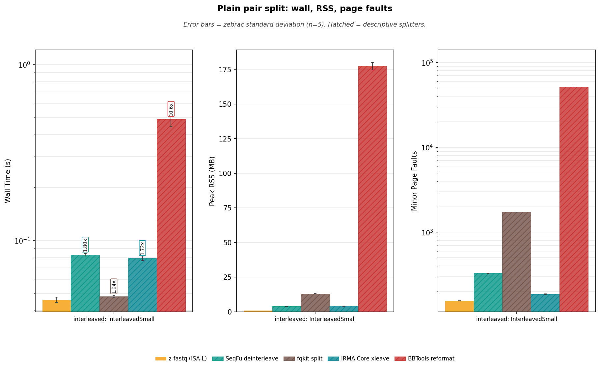
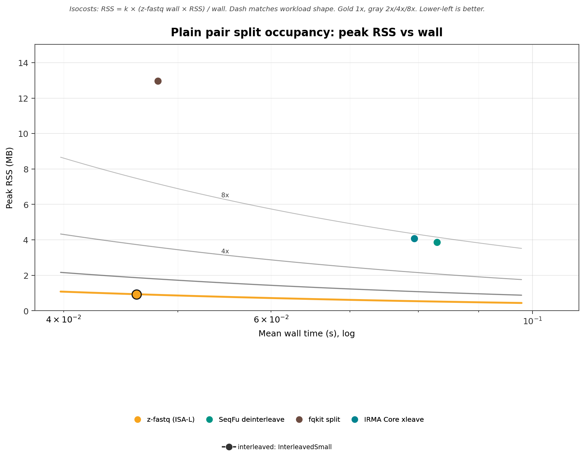
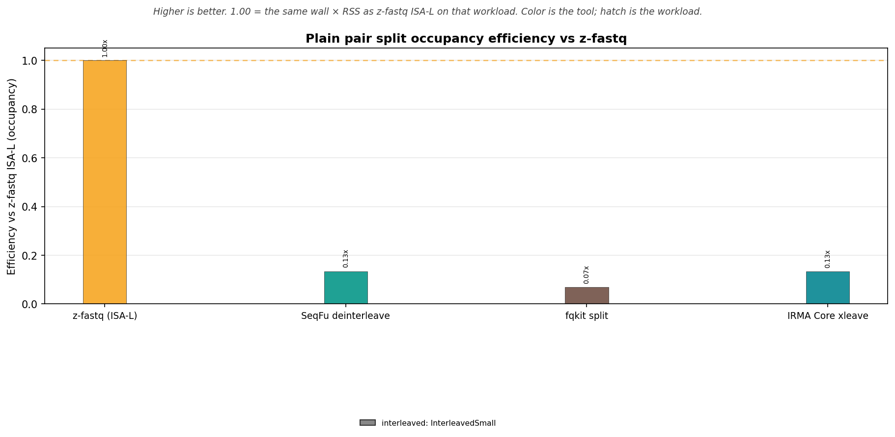
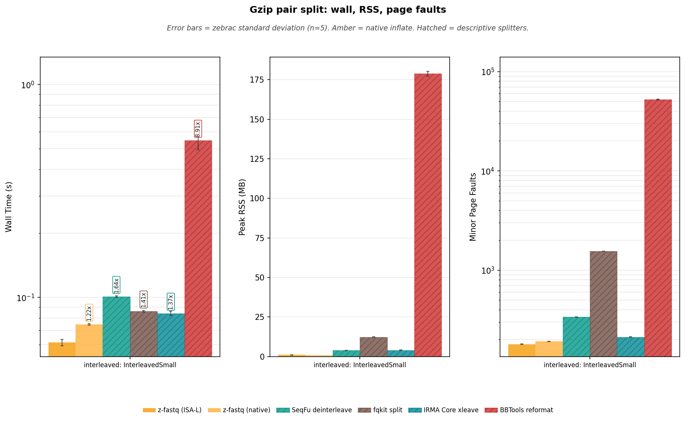
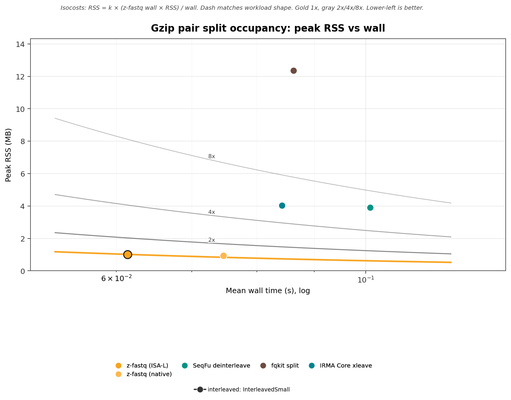
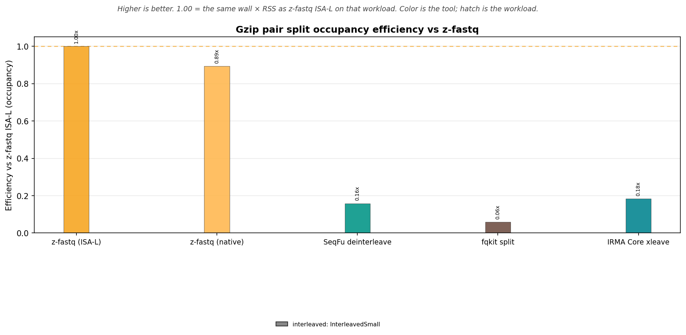

<!-- markdownlint-disable MD024 MD032 MD033 MD036 MD041 MD049 -->

# z-fastq Deinterleave Benchmark Report

_Generated by `bench/deinterleave/generate_report.py` from zebrac results._

_This is a bring-up measurement: zebrac duration_ms=5000, runs=5, warmup=3 (published default is 5000 ms, 25 runs, 5 warmups). Read it as a suite check, not a published ranking._

## Overview

This report times `z-fastq deinterleave` on the catalog interleaved file. Coverage is one suite and one family so Casava names and slash names are not a second race.

Set: **small**.

- **Pair split:** InterleavedSmall. One interleaved file → two mate files. Occupancy lives here.

**What is timed**

- One process, one deinterleave workload. Zebrac starts the argv directly; no shell or pipeline is measured. Every timed tool writes two files to tmpfs. A companion reaper unlinks the known output names so exclusive-create z-fastq can be sampled repeatedly; open file descriptors still complete write().
- Plain and gzip inputs are separate sections. Gzip includes native z-fastq only as the second inflate backend.
- seqtk `seq -l 0 -1`/`-2` is the screened positional layout reference and is not timed (two processes). Other splitters are descriptive peers and are hatched.
- SeqFu is timed with `-c`; that flag did not reject slash names or P001 mismatches here (unlike SeqFu interleave `-c` on slash). IRMA Core gzip is timed: layout split. IRMA does reject P001 stem mismatch.

## What each tool does

A valid z-fastq deinterleave reads one interleaved file, checks consecutive pair names (default `illumina`, optional `exact`), and writes R1 then R2 to two exclusive-create files as LF FASTQ. Empty input yields two empty files. On these small fixtures, P001 and P002 leave empty outputs because the write buffer is not flushed on failure. seqtk `seq -l 0 -1`/`-2` is the screened positional layout reference (byte-identical on LF, nonempty, bare plus) and is not timed. Other splitters are descriptive: they are timed only when they exit 0 on the catalog interleaved file they claim to support.

| Tool               | Command                                                         | Same deinterleave job                                                                                                                                                                   | Timed as                     |
| :----------------- | :-------------------------------------------------------------- | :-------------------------------------------------------------------------------------------------------------------------------------------------------------------------------------- | :--------------------------- |
| z-fastq (ISA-L)    | `z-fastq deinterleave --out1 R1 --out2 R2 interleaved`          | yes; consecutive records, name check, exclusive-create R1 and R2 files                                                                                                                  | contract reference           |
| z-fastq (native)   | `z-fastq-native deinterleave --out1 R1 --out2 R2 interleaved`   | yes; gzip is the timed inflate comparison                                                                                                                                               | second inflate backend       |
| seqtk              | `seqtk seq -l 0 -1` / `seqtk seq -l 0 -2`                       | positional odd/even records on screened LF/nonempty/bare-plus; two processes; does not check pair names                                                                                 | contract only; not timed     |
| SeqFu              | `seqfu deinterleave -c -o basename interleaved`                 | no; `-c` did not reject slash or P001 here; rewrites headers with a trailing space; drops a trailing odd record with exit 0. Not z-fastq illumina.                                      | hatched; descriptive         |
| fqkit              | `fqkit split -q -@ 1 -p demo -o DIR interleaved`                | no; positional split; keeps P001 mismatches; odd extra R1 makes unequal mate counts                                                                                                     | hatched; descriptive         |
| IRMA Core          | `irma-core xleave -1 R1 -2 R2 interleaved`                      | no; rejects P001 stem mismatch and odd count (not z-fastq illumina: Casava passed). Odd count writes the earlier pair; P001 leaves empty files. Gzip slash layout matched plain here.   | hatched; descriptive         |
| BBTools            | `reformat.sh int=t in= out= out2=`                              | no; JVM; positional split; `changequality=f` still rewrote R1 `!!`→`##` on these fixtures; silently dropped a trailing odd record                                                       | hatched; RSS not occupancy   |

**Mode coverage**

| Tool                 | interleaved file     |
| :------------------- | :------------------- |
| z-fastq (ISA-L)      | timed                |
| z-fastq (native)     | timed (gzip)         |
| SeqFu deinterleave   | timed                |
| fqkit split          | timed                |
| IRMA Core xleave     | timed                |
| BBTools reformat     | timed                |

**Not timed**

| Tool                                       | Why it is not here                                        |
| :----------------------------------------- | :-------------------------------------------------------- |
| seqtk `seq -l 0 -1`/`-2` as a timed lane   | two processes; contract layout reference only             |
| SeqKit `split2`                            | splits by size or parts, not R1/R2 deinterleave           |
| SeqKit `pair`                              | two mate inputs, not one interleaved file                 |
| Fasten / Needletail / Helicase             | no deinterleave command                                   |
| fastp / Rasusa / fq subsample              | QC or sampling, not pair split                            |
| Casava or slash timed families             | fixtures only; the catalog role is one interleaved file   |

<strong>Peer lane decisions</strong> (plain and gzip, every workload)

| Section     | Workload                        | Tool                   | Result      |
| :---------- | :------------------------------ | :--------------------- | :---------- |
| gzip        | interleaved: InterleavedSmall   | BBTools reformat       | timed       |
| gzip        | interleaved: InterleavedSmall   | fqkit split            | timed       |
| gzip        | interleaved: InterleavedSmall   | IRMA Core xleave       | timed       |
| gzip        | interleaved: InterleavedSmall   | SeqFu deinterleave     | timed       |
| gzip        | interleaved: InterleavedSmall   | seqtk seq -l 0 -1/-2   | not timed   |
| plain       | interleaved: InterleavedSmall   | BBTools reformat       | timed       |
| plain       | interleaved: InterleavedSmall   | fqkit split            | timed       |
| plain       | interleaved: InterleavedSmall   | IRMA Core xleave       | timed       |
| plain       | interleaved: InterleavedSmall   | SeqFu deinterleave     | timed       |
| plain       | interleaved: InterleavedSmall   | seqtk seq -l 0 -1/-2   | not timed   |

## Deinterleave agreement

Status: **ALL PASSED**. Both z-fastq binaries passed empty input, slash and Casava names, gzip, CRLF→LF, `--pair-names exact` on identical tokens, stdin, exact-on-slash exit 1 with empty outputs, arity, stdout `--out1`/`--out2`, identical output paths, `/dev/null` twice, `--json`, `--paired`, invalid `--pair-names` / `--alphabet`, existing `--out1` / `--out2` / input-as-output refusal, P001 empty outputs, and P002 empty outputs on these small fixtures (unflushed). CRLF, gzip slash, native gzip slash, and stdin were byte-compared to ISA-L LF slash mates. ISA-L matched seqtk `seq -l 0 -1`/`-2` on slash, CRLF slash, gzip slash, empty input, and the catalog file (this suite is bare plus). Catalog gzip mates matched catalog plain mates, which matched DenseSmall + PairSmallR2. Real files were required to emit `N/2` records per mate. ISA-L vs native gzip outputs were byte-compared when retained. Positive peer lanes were probed next; incompatible peer behavior was recorded rather than treated as a z-fastq failure.

Log: `verify_20260916_113021.log`.

**Peer fixture probes**

These rows are descriptive. A fail does not stop the run. `pass` is exit 0 and equal mate record counts; `fail` is a nonzero exit or unequal counts on a fixture z-fastq accepts; `unsupported` means that tool is not invoked. SeqFu `-c` passed slash `/1` `/2` (including CRLF), Casava, empty, P001, and odd (it dropped the extra R1). IRMA Core failed empty, P001 (ID mismatch, empty outputs), and odd (it wrote the earlier pair). seqtk and fqkit failed odd with unequal mate counts. BBTools passed P001 and odd (it dropped the extra R1).

| Fixture                       | seqtk seq -l 0 -1/-2     | SeqFu deinterleave     | fqkit split     | IRMA Core xleave     | BBTools reformat     |
| :---------------------------- | :----------------------- | :--------------------- | :-------------- | :------------------- | :------------------- |
| screened slash /1 /2 pair     | pass                     | pass                   | pass            | pass                 | pass                 |
| Casava 1:N:0: / 2:Y:0: pair   | pass                     | pass                   | pass            | pass                 | pass                 |
| CRLF slash /1 /2 pair         | pass                     | pass                   | pass            | pass                 | pass                 |
| empty interleaved file        | pass                     | pass                   | pass            | fail                 | pass                 |
| P001 slash stem mismatch      | pass                     | pass                   | pass            | fail                 | pass                 |
| odd record (extra R1)         | fail                     | pass                   | fail            | fail                 | pass                 |

## Run provenance

- **Timestamp:** `20260916_113021`
- **Runner:** zebrac, warm page cache, runs=5, warmup=3, duration_ms=5000
- **Catalog set:** small
- **zebrac:** zebrac 0.6.2
- **z-fastq ISA-L:** z-fastq 0.0.18 (754,560 bytes)
- **z-fastq native:** z-fastq 0.0.18 (535,088 bytes)

**Peer versions**

- **seqtk:** seqtk 1.5-r133
- **seqfu:** 1.27.1
- **fqkit:** FqKit 0.4.14
- **irma:** irma-core-cli 0.10.1
- **bbtools:** BBTools 40.02

## Performance: pair split

Catalog interleaved file split into two mate files on tmpfs. Small set: InterleavedSmall. Publication set: Interleaved. Occupancy lives here. seqtk `seq -l 0 -1`/`-2` is the screened positional layout reference and is not timed; other splitters are descriptive.

### Wall time

Zebrac mean wall time for one deinterleave process. Vertical annotations are wall time relative to z-fastq ISA-L, including hatched descriptive lanes. Hatched ratios are not a ranking.

**Table 1:** Mean ± standard deviation by workload and tool.

| Workload                        | z-fastq (ISA-L)     | SeqFu deinterleave     | fqkit split     | IRMA Core xleave     | BBTools reformat     |
| :------------------------------ | :------------------ | :--------------------- | :-------------- | :------------------- | :------------------- |
| interleaved: InterleavedSmall   | 0.046±0.002 s       | 0.083±0.001 s          | 0.048±0.001 s   | 0.079±0.002 s        | 0.490±0.046 s        |

<strong>Table 2:</strong> Time relative to z-fastq ISA-L.

| Workload                        | z-fastq vs           | z-fastq     | Peer      | Time relative to z-fastq     |
| :------------------------------ | :------------------- | :---------- | :-------- | :--------------------------- |
| interleaved: InterleavedSmall   | SeqFu deinterleave   | 0.0461s     | 0.0830s   | 1.80x                        |
| interleaved: InterleavedSmall   | fqkit split          | 0.0461s     | 0.0481s   | 1.04x                        |
| interleaved: InterleavedSmall   | IRMA Core xleave     | 0.0461s     | 0.0794s   | 1.72x                        |
| interleaved: InterleavedSmall   | BBTools reformat     | 0.0461s     | 0.4899s   | 10.6x                        |

### Peak memory

Peak RSS of the timed process. These are raw process measurements; splitter implementations do not share one memory contract.

**Table 3:** Mean ± standard deviation by workload and tool.

| Workload                        | z-fastq (ISA-L)     | SeqFu deinterleave     | fqkit split     | IRMA Core xleave     | BBTools reformat     |
| :------------------------------ | :------------------ | :--------------------- | :-------------- | :------------------- | :------------------- |
| interleaved: InterleavedSmall   | 0.93±0.00 MB        | 3.88±0.10 MB           | 12.96±0.12 MB   | 4.08±0.14 MB         | 177.38±2.81 MB       |

### Minor page faults

Minor page faults for the same direct commands. These are descriptive process measurements.

**Table 4:** Mean ± standard deviation by workload and tool.

| Workload                        | z-fastq (ISA-L)     | SeqFu deinterleave     | fqkit split     | IRMA Core xleave     | BBTools reformat     |
| :------------------------------ | :------------------ | :--------------------- | :-------------- | :------------------- | :------------------- |
| interleaved: InterleavedSmall   | 155±0               | 329±2                  | 1732±2          | 187±2                | 51999±735            |

**Figure 1:** Wall time, peak RSS, and minor page faults for pair split.

**Reading Figure 1**

- Facets: wall time (log y) | peak RSS (linear) | minor page faults (log y).
- X-axis: catalog interleaved file. One file is one workload. Occupancy follows this family.
- Gold bars are z-fastq ISA-L. Hatched bars are descriptive splitters. seqtk `seq -l 0 -1`/`-2` is the screened positional layout reference and is not timed. BBTools JVM RSS dominates the memory facet; occupancy omits it.

### Occupancy (50/50 wall and RSS)

Occupancy is mean wall time × peak RSS on the timed pair-split family. BBTools stays on the wall/RSS facets and is omitted here because its RSS is a JVM image. SeqFu deinterleave is a single process (threads share RSS) and is included. Occupancy is descriptive resource accounting, not a semantic-equivalence ranking.

**Table 5:** Occupancy (MB·s) = mean wall × peak RSS.

| Workload                        | z-fastq (ISA-L)     | SeqFu deinterleave     | fqkit split     | IRMA Core xleave     |
| :------------------------------ | ------------------: | ---------------------: | --------------: | -------------------: |
| interleaved: InterleavedSmall   | 0.0431              | 0.3216                 | 0.6231          | 0.3235               |

**Table 6:** Occupancy efficiency vs z-fastq ISA-L. Higher is better.

| Workload                        | z-fastq (ISA-L)     | SeqFu deinterleave     | fqkit split     | IRMA Core xleave     |
| :------------------------------ | :------------------ | :--------------------- | :-------------- | :------------------- |
| interleaved: InterleavedSmall   | 1x                  | 0.134x                 | 0.069x          | 0.133x               |

**Figure 2:** Peak RSS vs mean wall. Per-workload occupancy isocosts through z-fastq ISA-L.

**Reading Figure 2**

- X: mean wall (s, log). Y: peak RSS (MB, linear).
- Color = tool. One catalog interleaved file.
- Curves are 1x/2x/4x/8x memory-seconds of that workload's z-fastq ISA-L lane. Gold 1x, gray 2x/4x/8x.
- Lower-left is better. Missing points are not treated as zero. BBTools is omitted (JVM RSS).

**Figure 3:** Occupancy efficiency vs z-fastq ISA-L. Higher is better. 1.00 matches z-fastq memory-seconds.

**Reading Figure 3**

- X-axis is the tool. One catalog interleaved file.
- Bar color is the tool. Gold dashed line is 1x.
- This is the inverse of occupancy cost on the scatter and is descriptive for accepted positive pair-split lanes.

## Performance: pair split (gzip)

The same catalog interleaved file as the plain section. Gold is z-fastq ISA-L; amber is native Zig inflate. Decoded FASTQ MiB/s uses the uncompressed interleaved size divided by wall time. IRMA Core gzip is timed: layout split, not a sampler RNG.

### Wall time

Zebrac mean wall time for one deinterleave process. Vertical annotations are wall time relative to z-fastq ISA-L, including hatched descriptive lanes. Hatched ratios are not a ranking.

**Table 7:** Mean ± standard deviation by workload and tool.

| Workload                        | z-fastq (ISA-L)     | z-fastq (native)     | SeqFu deinterleave     | fqkit split     | IRMA Core xleave     | BBTools reformat     |
| :------------------------------ | :------------------ | :------------------- | :--------------------- | :-------------- | :------------------- | :------------------- |
| interleaved: InterleavedSmall   | 0.061±0.002 s       | 0.075±0.001 s        | 0.101±0.001 s          | 0.086±0.001 s   | 0.084±0.002 s        | 0.547±0.054 s        |

<strong>Table 8:</strong> Time relative to z-fastq ISA-L.

| Workload                        | z-fastq vs           | z-fastq     | Peer      | Time relative to z-fastq     |
| :------------------------------ | :------------------- | :---------- | :-------- | :--------------------------- |
| interleaved: InterleavedSmall   | z-fastq (native)     | 0.0614s     | 0.0747s   | 1.22x                        |
| interleaved: InterleavedSmall   | SeqFu deinterleave   | 0.0614s     | 0.1009s   | 1.64x                        |
| interleaved: InterleavedSmall   | fqkit split          | 0.0614s     | 0.0862s   | 1.41x                        |
| interleaved: InterleavedSmall   | IRMA Core xleave     | 0.0614s     | 0.0842s   | 1.37x                        |
| interleaved: InterleavedSmall   | BBTools reformat     | 0.0614s     | 0.5466s   | 8.91x                        |

### Peak memory

Peak RSS of the timed process. These are raw process measurements; splitter implementations do not share one memory contract.

**Table 9:** Mean ± standard deviation by workload and tool.

| Workload                        | z-fastq (ISA-L)     | z-fastq (native)     | SeqFu deinterleave     | fqkit split     | IRMA Core xleave     | BBTools reformat     |
| :------------------------------ | :------------------ | :------------------- | :--------------------- | :-------------- | :------------------- | :------------------- |
| interleaved: InterleavedSmall   | 1.01±0.04 MB        | 0.93±0.00 MB         | 3.90±0.11 MB           | 12.35±0.14 MB   | 4.03±0.17 MB         | 178.80±1.57 MB       |

### Minor page faults

Minor page faults for the same direct commands. These are descriptive process measurements.

**Table 10:** Mean ± standard deviation by workload and tool.

| Workload                        | z-fastq (ISA-L)     | z-fastq (native)     | SeqFu deinterleave     | fqkit split     | IRMA Core xleave     | BBTools reformat     |
| :------------------------------ | :------------------ | :------------------- | :--------------------- | :-------------- | :------------------- | :------------------- |
| interleaved: InterleavedSmall   | 180±0               | 192±0                | 337±2                  | 1555±2          | 212±1                | 52343±471            |

### Decoded throughput

Decoded FASTQ MiB/s is the uncompressed input size divided by wall time. That is the gzip unit that matches inflate work; compressed on-disk throughput is supporting context.

**Table 11:** Decoded FASTQ MiB/s.

| Workload                        | z-fastq (ISA-L)     | z-fastq (native)     | SeqFu deinterleave     | fqkit split     | IRMA Core xleave     | BBTools reformat     |
| :------------------------------ | :------------------ | :------------------- | :--------------------- | :-------------- | :------------------- | :------------------- |
| interleaved: InterleavedSmall   | 637.3 MiB/s         | 523.5 MiB/s          | 387.6 MiB/s            | 453.4 MiB/s     | 464.4 MiB/s          | 71.6 MiB/s           |

<strong>Table 12:</strong> Compressed on-disk MiB/s.

| Workload                        | z-fastq (ISA-L)     | z-fastq (native)     | SeqFu deinterleave     | fqkit split     | IRMA Core xleave     | BBTools reformat     |
| :------------------------------ | :------------------ | :------------------- | :--------------------- | :-------------- | :------------------- | :------------------- |
| interleaved: InterleavedSmall   | 51.8 MiB/s          | 42.5 MiB/s           | 31.5 MiB/s             | 36.8 MiB/s      | 37.7 MiB/s           | 5.8 MiB/s            |

**Figure 4:** Wall time, peak RSS, and minor page faults for gzip pair split.

**Reading Figure 4**

- Facets: wall time (log y) | peak RSS (linear) | minor page faults (log y).
- X-axis: catalog interleaved file. One file is one workload. Occupancy follows this family.
- Gold bars are z-fastq ISA-L. Amber bars are native inflate. Hatched bars are descriptive splitters. seqtk `seq -l 0 -1`/`-2` is the screened positional layout reference and is not timed. BBTools JVM RSS dominates the memory facet; occupancy omits it.

### Occupancy (50/50 wall and RSS)

Occupancy is mean wall time × peak RSS on the timed pair-split family. BBTools stays on the wall/RSS facets and is omitted here because its RSS is a JVM image. SeqFu deinterleave is a single process (threads share RSS) and is included. Occupancy is descriptive resource accounting, not a semantic-equivalence ranking.

**Table 13:** Occupancy (MB·s) = mean wall × peak RSS.

| Workload                        | z-fastq (ISA-L)     | z-fastq (native)     | SeqFu deinterleave     | fqkit split     | IRMA Core xleave     |
| :------------------------------ | ------------------: | -------------------: | ---------------------: | --------------: | -------------------: |
| interleaved: InterleavedSmall   | 0.0623              | 0.0697               | 0.3933                 | 1.0652          | 0.3396               |

**Table 14:** Occupancy efficiency vs z-fastq ISA-L. Higher is better.

| Workload                        | z-fastq (ISA-L)     | z-fastq (native)     | SeqFu deinterleave     | fqkit split     | IRMA Core xleave     |
| :------------------------------ | :------------------ | :------------------- | :--------------------- | :-------------- | :------------------- |
| interleaved: InterleavedSmall   | 1x                  | 0.893x               | 0.158x                 | 0.058x          | 0.183x               |

**Figure 5:** Peak RSS vs mean wall. Per-workload occupancy isocosts through z-fastq ISA-L.

**Reading Figure 5**

- X: mean wall (s, log). Y: peak RSS (MB, linear).
- Color = tool. One catalog interleaved file.
- Curves are 1x/2x/4x/8x memory-seconds of that workload's z-fastq ISA-L lane. Gold 1x, gray 2x/4x/8x.
- Lower-left is better. Missing points are not treated as zero. BBTools is omitted (JVM RSS).

**Figure 6:** Occupancy efficiency vs z-fastq ISA-L. Higher is better. 1.00 matches z-fastq memory-seconds.

**Reading Figure 6**

- X-axis is the tool. One catalog interleaved file.
- Bar color is the tool. Gold dashed line is 1x.
- This is the inverse of occupancy cost on the scatter and is descriptive for accepted positive pair-split lanes.

