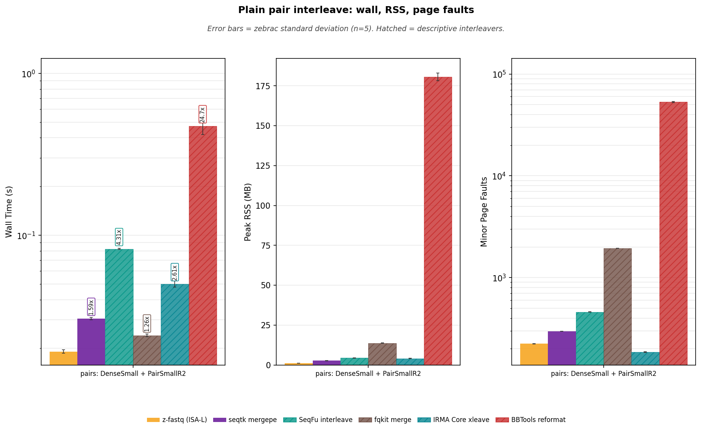
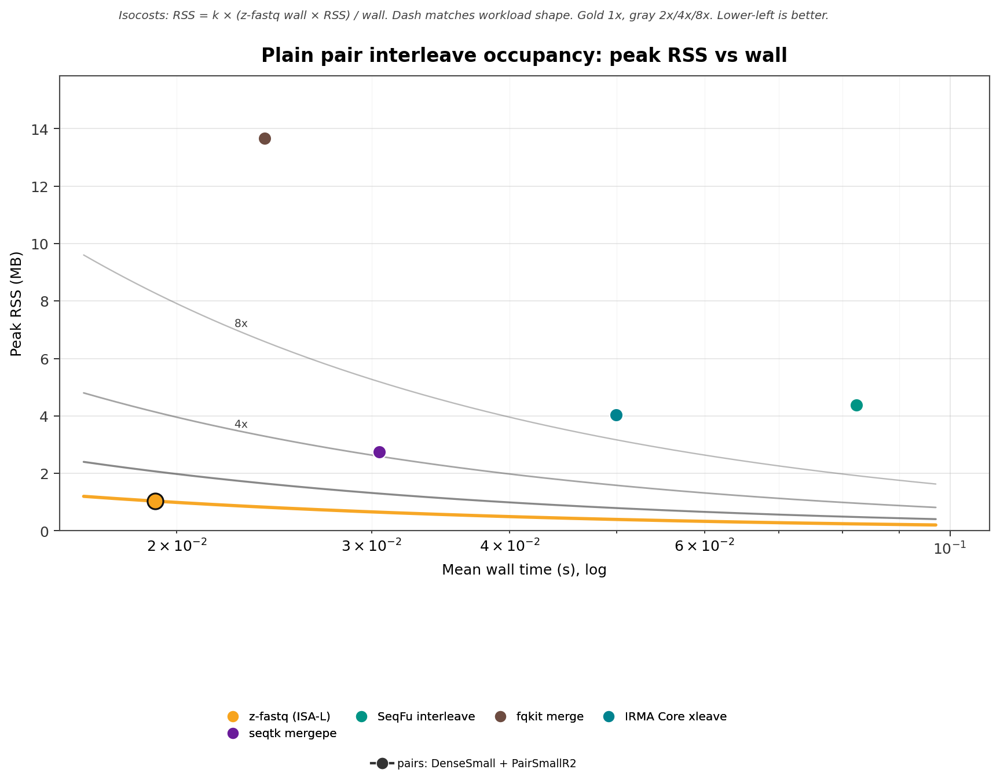
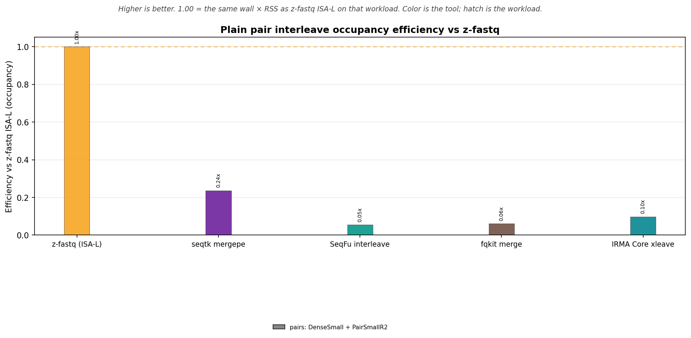
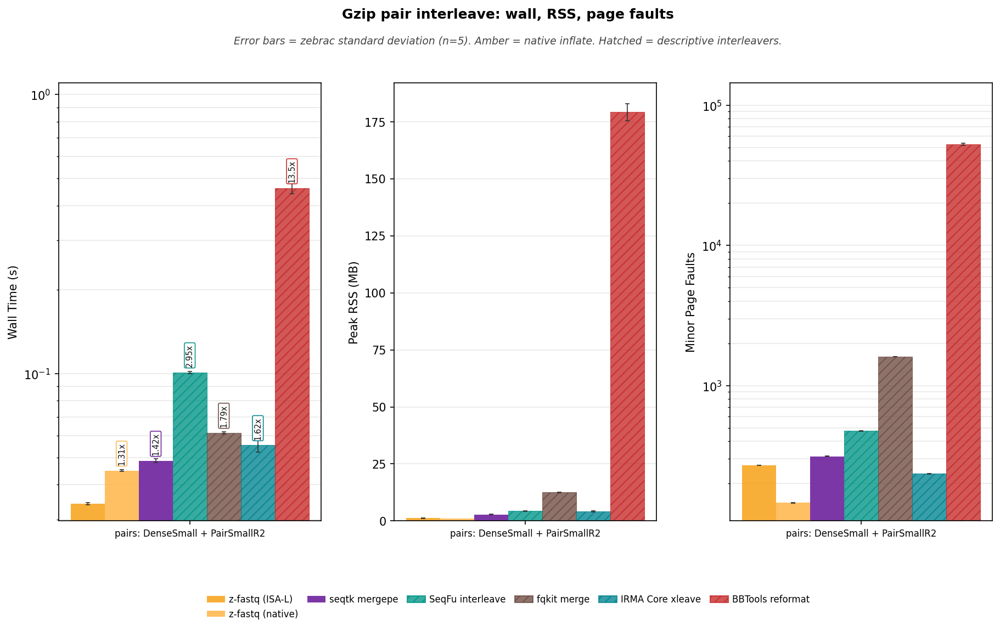
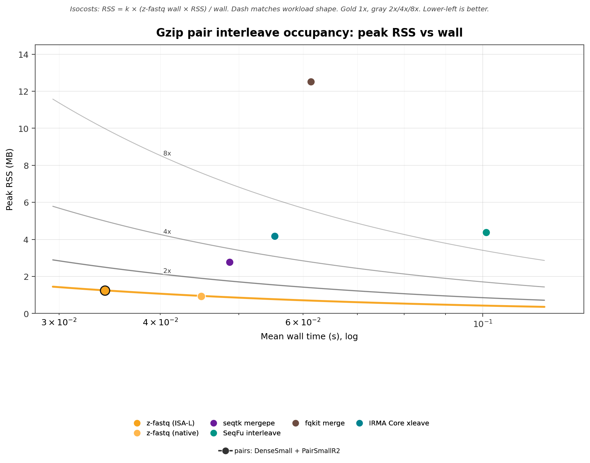
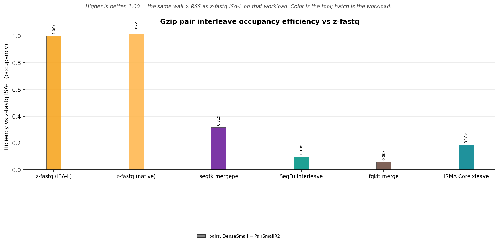

<!-- markdownlint-disable MD024 MD032 MD033 MD036 MD041 MD049 -->

# z-fastq Interleave Benchmark Report

_Generated by `bench/interleave/generate_report.py` from zebrac results._

_This is a bring-up measurement: zebrac duration_ms=5000, runs=5, warmup=3 (published default is 5000 ms, 25 runs, 5 warmups). Read it as a suite check, not a published ranking._

## Overview

This report times `z-fastq interleave` on the catalog mate pair. Coverage is one suite and one family so Casava names, slash names, and mixed gzip are not a second race.

Set: **small**.

- **Pair interleave:** DenseSmall + PairSmallR2. Two mate files → validated interleaved stdout. Occupancy lives here.

**What is timed**

- One process, one interleave workload. Zebrac starts the argv directly; no shell or pipeline is measured. Stdout writers are discarded by zebrac. BBTools is timed with `out=/dev/null`.
- Plain and gzip inputs are separate sections. Gzip includes native z-fastq only as the second inflate backend.
- seqtk `mergepe` is timed as the screened exact layout reference. Other interleavers are descriptive peers and are hatched.
- SeqFu is timed with `-c` so it compares first tokens; that is not z-fastq illumina (slash `/1` `/2` fixtures fail; Casava first tokens match). IRMA Core gzip is timed: layout zip, not a sampler RNG. Mixed gzip is contract-only.

## What each tool does

A valid z-fastq interleave reads two mate files lockstep, checks pair names (default `illumina`, optional `exact`), and writes R1 then R2 to stdout as LF FASTQ. Gzip and mixed gzip/plain are accepted. Empty mates yield empty stdout. P001 writes no records; P002 may write complete earlier pairs. seqtk `mergepe` is the screened exact-layout peer (byte-identical on LF, nonempty, bare plus). It does not check pair names. Other interleavers are descriptive: they are timed only when they exit 0 on the catalog pair they claim to support.

| Tool               | Command                                       | Same interleave job                                                                                                              | Timed as                     |
| :----------------- | :-------------------------------------------- | :------------------------------------------------------------------------------------------------------------------------------- | :--------------------------- |
| z-fastq (ISA-L)    | `z-fastq interleave R1 R2`                    | yes; lockstep mates, name check, R1 then R2 stdout                                                                               | contract reference           |
| z-fastq (native)   | `z-fastq-native interleave R1 R2`             | yes, gzip only                                                                                                                   | second inflate backend       |
| seqtk              | `seqtk mergepe R1 R2`                         | layout zip on screened LF/nonempty/bare-plus inputs; zips name mismatches                                                        | exact layout reference       |
| SeqFu              | `seqfu interleave -c -1 R1 -2 R2`             | partial; `-c` compares first tokens (`cluster1/1` ≠ `cluster1/2`; Casava first token `cluster` matches). Not z-fastq illumina.   | hatched; descriptive         |
| fqkit              | `fqkit merge -q -@ 1 --read1 R1 --read2 R2`   | no; layout zip, not a name validator                                                                                             | hatched; descriptive         |
| IRMA Core          | `irma-core xleave R1 R2`                      | no; layout zip; gzip layout matches plain                                                                                        | hatched; descriptive         |
| BBTools            | `reformat.sh in= in2= out=/dev/null`          | no; JVM; `changequality=f` still rewrote R1 `!!`→`##` (Phred 0 to 2) on these fixtures                                           | hatched; RSS not occupancy   |

**Mode coverage**

| Tool               | mate pair      |
| :----------------- | :------------- |
| z-fastq (ISA-L)    | timed          |
| z-fastq (native)   | timed (gzip)   |
| seqtk mergepe      | timed          |
| SeqFu interleave   | timed          |
| fqkit merge        | timed          |
| IRMA Core xleave   | timed          |
| BBTools reformat   | timed          |

**Not timed**

| Tool                                          | Why it is not here                                      |
| :-------------------------------------------- | :------------------------------------------------------ |
| SeqKit `pair`                                 | writes two mate files, not interleaved stdout           |
| Fasten                                        | no interleave binary                                    |
| Needletail / Helicase adapters                | count and stats wrappers; no interleave command         |
| fastp / Rasusa / fq subsample / fqkit subfq   | QC or sampling, not pair interleave                     |
| Casava or slash timed families                | fixtures only; the catalog role is one mate pair        |
| mixed gzip as a second race                   | contract-only; one timed family stays pair interleave   |

<strong>Peer lane decisions</strong> (plain and gzip, every workload)

| Section     | Workload                          | Tool               | Result     |
| :---------- | :-------------------------------- | :----------------- | :--------- |
| gzip        | pairs: DenseSmall + PairSmallR2   | BBTools reformat   | timed      |
| gzip        | pairs: DenseSmall + PairSmallR2   | fqkit merge        | timed      |
| gzip        | pairs: DenseSmall + PairSmallR2   | IRMA Core xleave   | timed      |
| gzip        | pairs: DenseSmall + PairSmallR2   | SeqFu interleave   | timed      |
| gzip        | pairs: DenseSmall + PairSmallR2   | seqtk mergepe      | timed      |
| plain       | pairs: DenseSmall + PairSmallR2   | BBTools reformat   | timed      |
| plain       | pairs: DenseSmall + PairSmallR2   | fqkit merge        | timed      |
| plain       | pairs: DenseSmall + PairSmallR2   | IRMA Core xleave   | timed      |
| plain       | pairs: DenseSmall + PairSmallR2   | SeqFu interleave   | timed      |
| plain       | pairs: DenseSmall + PairSmallR2   | seqtk mergepe      | timed      |

## Interleave agreement

Status: **ALL PASSED**. Both z-fastq binaries passed empty mates, slash and Casava names, gzip and mixed gzip, CRLF→LF, `--pair-names exact` on identical tokens, stdin R1 and stdin R2, exact-on-slash exit 1 with empty stdout, arity, double stdin, `--json`, `--paired`, invalid `--pair-names` / `--alphabet`, P001 empty stdout, P002 keeping the complete earlier pair when R1 or R2 has leftovers, and P002 empty R1 with leftover R2. Mixed gzip, stdin, CRLF, native gzip slash, and native plain slash were byte-compared to ISA-L LF slash. ISA-L matched seqtk `mergepe` on slash, CRLF slash, gzip slash, empty mates, and the catalog pair (this suite is bare plus). Catalog gzip output matched catalog plain. Real files were required to emit `2 × N` records. ISA-L vs native gzip outputs were byte-compared when retained. Positive peer lanes were probed next; incompatible peer behavior was recorded rather than treated as a z-fastq failure.

Log: `verify_20260916_104629.log`.

**Peer fixture probes**

These rows are descriptive. A fail does not stop the run. `pass` is exit 0, and for stdout writers (and BBTools fixture files) an even pair-complete record count; `fail` is a nonzero exit or an odd count on a fixture z-fastq accepts; `unsupported` means that tool is not invoked. SeqFu `-c` failed slash `/1` `/2` (including CRLF) with a first-token mismatch on stdout, not FASTQ records, and passed Casava and empty; IRMA Core failed empty mates.

| Fixture                       | seqtk mergepe     | SeqFu interleave     | fqkit merge     | IRMA Core xleave     | BBTools reformat     |
| :---------------------------- | :---------------- | :------------------- | :-------------- | :------------------- | :------------------- |
| screened slash /1 /2 pair     | pass              | fail                 | pass            | pass                 | pass                 |
| Casava 1:N:0: / 2:N:0: pair   | pass              | pass                 | pass            | pass                 | pass                 |
| CRLF slash /1 /2 pair         | pass              | fail                 | pass            | pass                 | pass                 |
| empty mate files              | pass              | pass                 | pass            | fail                 | pass                 |

## Run provenance

- **Timestamp:** `20260916_104629`
- **Runner:** zebrac, warm page cache, runs=5, warmup=3, duration_ms=5000
- **Catalog set:** small
- **zebrac:** zebrac 0.6.2
- **z-fastq ISA-L:** z-fastq 0.0.18 (754,560 bytes)
- **z-fastq native:** z-fastq 0.0.18 (535,088 bytes)

**Peer versions**

- **seqtk:** seqtk 1.5-r133
- **seqfu:** 1.27.1
- **fqkit:** FqKit 0.4.14
- **irma:** irma-core-cli 0.10.1
- **bbtools:** BBTools 40.02

## Performance: pair interleave

Catalog mate pair as interleaved stdout. Small set: DenseSmall + PairSmallR2. Publication set: PairR1 + PairR2. Occupancy lives here. seqtk `mergepe` is the screened exact layout reference; other interleavers are descriptive.

### Wall time

Zebrac mean wall time for one interleave process. Vertical annotations are wall time relative to z-fastq ISA-L, including hatched descriptive lanes. Hatched ratios are not a ranking.

**Table 1:** Mean ± standard deviation by workload and tool.

| Workload                          | z-fastq (ISA-L)     | seqtk mergepe     | SeqFu interleave     | fqkit merge     | IRMA Core xleave     | BBTools reformat     |
| :-------------------------------- | :------------------ | :---------------- | :------------------- | :-------------- | :------------------- | :------------------- |
| pairs: DenseSmall + PairSmallR2   | 0.019±0.000 s       | 0.030±0.000 s     | 0.082±0.001 s        | 0.024±0.000 s   | 0.050±0.002 s        | 0.472±0.053 s        |

<strong>Table 2:</strong> Time relative to z-fastq ISA-L.

| Workload                          | z-fastq vs         | z-fastq     | Peer      | Time relative to z-fastq     |
| :-------------------------------- | :----------------- | :---------- | :-------- | :--------------------------- |
| pairs: DenseSmall + PairSmallR2   | seqtk mergepe      | 0.0191s     | 0.0305s   | 1.59x                        |
| pairs: DenseSmall + PairSmallR2   | SeqFu interleave   | 0.0191s     | 0.0823s   | 4.31x                        |
| pairs: DenseSmall + PairSmallR2   | fqkit merge        | 0.0191s     | 0.0240s   | 1.26x                        |
| pairs: DenseSmall + PairSmallR2   | IRMA Core xleave   | 0.0191s     | 0.0499s   | 2.61x                        |
| pairs: DenseSmall + PairSmallR2   | BBTools reformat   | 0.0191s     | 0.4717s   | 24.7x                        |

### Peak memory

Peak RSS of the timed process. These are raw process measurements; interleaver implementations do not share one memory contract.

**Table 3:** Mean ± standard deviation by workload and tool.

| Workload                          | z-fastq (ISA-L)     | seqtk mergepe     | SeqFu interleave     | fqkit merge     | IRMA Core xleave     | BBTools reformat     |
| :-------------------------------- | :------------------ | :---------------- | :------------------- | :-------------- | :------------------- | :------------------- |
| pairs: DenseSmall + PairSmallR2   | 1.03±0.01 MB        | 2.75±0.13 MB      | 4.38±0.10 MB         | 13.66±0.13 MB   | 4.03±0.14 MB         | 180.70±2.44 MB       |

### Minor page faults

Minor page faults for the same direct commands. These are descriptive process measurements.

**Table 4:** Mean ± standard deviation by workload and tool.

| Workload                          | z-fastq (ISA-L)     | seqtk mergepe     | SeqFu interleave     | fqkit merge     | IRMA Core xleave     | BBTools reformat     |
| :-------------------------------- | :------------------ | :---------------- | :------------------- | :-------------- | :------------------- | :------------------- |
| pairs: DenseSmall + PairSmallR2   | 224±1               | 297±1             | 459±1                | 1935±2          | 185±1                | 53076±647            |

**Figure 1:** Wall time, peak RSS, and minor page faults for pair interleave.

**Reading Figure 1**

- Facets: wall time (log y) | peak RSS (linear) | minor page faults (log y).
- X-axis: catalog mate pair. Two files are one workload. Occupancy follows this family.
- Gold bars are z-fastq ISA-L. Hatched bars are descriptive interleavers. seqtk `mergepe` is the screened exact layout reference and is not hatched. BBTools JVM RSS dominates the memory facet; occupancy omits it.

### Occupancy (50/50 wall and RSS)

Occupancy is mean wall time × peak RSS on the timed pair-interleave family. BBTools stays on the wall/RSS facets and is omitted here because its RSS is a JVM image. SeqFu interleave is a single process (threads share RSS) and is included. Occupancy is descriptive resource accounting, not a semantic-equivalence ranking.

**Table 5:** Occupancy (MB·s) = mean wall × peak RSS.

| Workload                          | z-fastq (ISA-L)     | seqtk mergepe     | SeqFu interleave     | fqkit merge     | IRMA Core xleave     |
| :-------------------------------- | ------------------: | ----------------: | -------------------: | --------------: | -------------------: |
| pairs: DenseSmall + PairSmallR2   | 0.0198              | 0.0838            | 0.3601               | 0.3281          | 0.2011               |

**Table 6:** Occupancy efficiency vs z-fastq ISA-L. Higher is better.

| Workload                          | z-fastq (ISA-L)     | seqtk mergepe     | SeqFu interleave     | fqkit merge     | IRMA Core xleave     |
| :-------------------------------- | :------------------ | :---------------- | :------------------- | :-------------- | :------------------- |
| pairs: DenseSmall + PairSmallR2   | 1x                  | 0.236x            | 0.055x               | 0.060x          | 0.098x               |

**Figure 2:** Peak RSS vs mean wall. Per-workload occupancy isocosts through z-fastq ISA-L.

**Reading Figure 2**

- X: mean wall (s, log). Y: peak RSS (MB, linear).
- Color = tool. One catalog mate pair.
- Curves are 1x/2x/4x/8x memory-seconds of that workload's z-fastq ISA-L lane. Gold 1x, gray 2x/4x/8x.
- Lower-left is better. Missing points are not treated as zero. BBTools is omitted (JVM RSS).

**Figure 3:** Occupancy efficiency vs z-fastq ISA-L. Higher is better. 1.00 matches z-fastq memory-seconds.

**Reading Figure 3**

- X-axis is the tool. One catalog mate pair.
- Bar color is the tool. Gold dashed line is 1x.
- This is the inverse of occupancy cost on the scatter and is descriptive for accepted positive pair-interleave lanes.

## Performance: pair interleave (gzip)

The same catalog mate pair as the plain section. Gold is z-fastq ISA-L; amber is native Zig inflate. Decoded FASTQ MiB/s uses the sum of uncompressed sibling sizes divided by wall time. IRMA Core gzip is timed: layout zip, not a sampler RNG.

### Wall time

Zebrac mean wall time for one interleave process. Vertical annotations are wall time relative to z-fastq ISA-L, including hatched descriptive lanes. Hatched ratios are not a ranking.

**Table 7:** Mean ± standard deviation by workload and tool.

| Workload                          | z-fastq (ISA-L)     | z-fastq (native)     | seqtk mergepe     | SeqFu interleave     | fqkit merge     | IRMA Core xleave     | BBTools reformat     |
| :-------------------------------- | :------------------ | :------------------- | :---------------- | :------------------- | :-------------- | :------------------- | :------------------- |
| pairs: DenseSmall + PairSmallR2   | 0.034±0.000 s       | 0.045±0.000 s        | 0.049±0.001 s     | 0.101±0.001 s        | 0.061±0.001 s   | 0.055±0.003 s        | 0.461±0.020 s        |

<strong>Table 8:</strong> Time relative to z-fastq ISA-L.

| Workload                          | z-fastq vs         | z-fastq     | Peer      | Time relative to z-fastq     |
| :-------------------------------- | :----------------- | :---------- | :-------- | :--------------------------- |
| pairs: DenseSmall + PairSmallR2   | z-fastq (native)   | 0.0342s     | 0.0449s   | 1.31x                        |
| pairs: DenseSmall + PairSmallR2   | seqtk mergepe      | 0.0342s     | 0.0487s   | 1.42x                        |
| pairs: DenseSmall + PairSmallR2   | SeqFu interleave   | 0.0342s     | 0.1010s   | 2.95x                        |
| pairs: DenseSmall + PairSmallR2   | fqkit merge        | 0.0342s     | 0.0614s   | 1.79x                        |
| pairs: DenseSmall + PairSmallR2   | IRMA Core xleave   | 0.0342s     | 0.0554s   | 1.62x                        |
| pairs: DenseSmall + PairSmallR2   | BBTools reformat   | 0.0342s     | 0.4614s   | 13.5x                        |

### Peak memory

Peak RSS of the timed process. These are raw process measurements; interleaver implementations do not share one memory contract.

**Table 9:** Mean ± standard deviation by workload and tool.

| Workload                          | z-fastq (ISA-L)     | z-fastq (native)     | seqtk mergepe     | SeqFu interleave     | fqkit merge     | IRMA Core xleave     | BBTools reformat     |
| :-------------------------------- | :------------------ | :------------------- | :---------------- | :------------------- | :-------------- | :------------------- | :------------------- |
| pairs: DenseSmall + PairSmallR2   | 1.25±0.09 MB        | 0.93±0.00 MB         | 2.78±0.14 MB      | 4.38±0.11 MB         | 12.51±0.16 MB   | 4.18±0.17 MB         | 179.22±3.66 MB       |

### Minor page faults

Minor page faults for the same direct commands. These are descriptive process measurements.

**Table 10:** Mean ± standard deviation by workload and tool.

| Workload                          | z-fastq (ISA-L)     | z-fastq (native)     | seqtk mergepe     | SeqFu interleave     | fqkit merge     | IRMA Core xleave     | BBTools reformat     |
| :-------------------------------- | :------------------ | :------------------- | :---------------- | :------------------- | :-------------- | :------------------- | :------------------- |
| pairs: DenseSmall + PairSmallR2   | 271±0               | 146±1                | 313±1             | 475±1                | 1603±2          | 235±1                | 52611±901            |

### Decoded throughput

Decoded FASTQ MiB/s is the uncompressed input size divided by wall time. That is the gzip unit that matches inflate work; compressed on-disk throughput is supporting context.

**Table 11:** Decoded FASTQ MiB/s.

| Workload                          | z-fastq (ISA-L)     | z-fastq (native)     | seqtk mergepe     | SeqFu interleave     | fqkit merge     | IRMA Core xleave     | BBTools reformat     |
| :-------------------------------- | :------------------ | :------------------- | :---------------- | :------------------- | :-------------- | :------------------- | :------------------- |
| pairs: DenseSmall + PairSmallR2   | 1143.9 MiB/s        | 870.4 MiB/s          | 802.9 MiB/s       | 387.3 MiB/s          | 637.4 MiB/s     | 706.1 MiB/s          | 84.8 MiB/s           |

<strong>Table 12:</strong> Compressed on-disk MiB/s.

| Workload                          | z-fastq (ISA-L)     | z-fastq (native)     | seqtk mergepe     | SeqFu interleave     | fqkit merge     | IRMA Core xleave     | BBTools reformat     |
| :-------------------------------- | :------------------ | :------------------- | :---------------- | :------------------- | :-------------- | :------------------- | :------------------- |
| pairs: DenseSmall + PairSmallR2   | 94.3 MiB/s          | 71.7 MiB/s           | 66.2 MiB/s        | 31.9 MiB/s           | 52.5 MiB/s      | 58.2 MiB/s           | 7.0 MiB/s            |

**Figure 4:** Wall time, peak RSS, and minor page faults for gzip pair interleave.

**Reading Figure 4**

- Facets: wall time (log y) | peak RSS (linear) | minor page faults (log y).
- X-axis: catalog mate pair. Two files are one workload. Occupancy follows this family.
- Gold bars are z-fastq ISA-L. Amber bars are native inflate. Hatched bars are descriptive interleavers. seqtk `mergepe` is the screened exact layout reference and is not hatched. BBTools JVM RSS dominates the memory facet; occupancy omits it.

### Occupancy (50/50 wall and RSS)

Occupancy is mean wall time × peak RSS on the timed pair-interleave family. BBTools stays on the wall/RSS facets and is omitted here because its RSS is a JVM image. SeqFu interleave is a single process (threads share RSS) and is included. Occupancy is descriptive resource accounting, not a semantic-equivalence ranking.

**Table 13:** Occupancy (MB·s) = mean wall × peak RSS.

| Workload                          | z-fastq (ISA-L)     | z-fastq (native)     | seqtk mergepe     | SeqFu interleave     | fqkit merge     | IRMA Core xleave     |
| :-------------------------------- | ------------------: | -------------------: | ----------------: | -------------------: | --------------: | -------------------: |
| pairs: DenseSmall + PairSmallR2   | 0.0426              | 0.0419               | 0.1355            | 0.4423               | 0.7676          | 0.2317               |

**Table 14:** Occupancy efficiency vs z-fastq ISA-L. Higher is better.

| Workload                          | z-fastq (ISA-L)     | z-fastq (native)     | seqtk mergepe     | SeqFu interleave     | fqkit merge     | IRMA Core xleave     |
| :-------------------------------- | :------------------ | :------------------- | :---------------- | :------------------- | :-------------- | :------------------- |
| pairs: DenseSmall + PairSmallR2   | 1x                  | 1.02x                | 0.315x            | 0.096x               | 0.056x          | 0.184x               |

**Figure 5:** Peak RSS vs mean wall. Per-workload occupancy isocosts through z-fastq ISA-L.

**Reading Figure 5**

- X: mean wall (s, log). Y: peak RSS (MB, linear).
- Color = tool. One catalog mate pair.
- Curves are 1x/2x/4x/8x memory-seconds of that workload's z-fastq ISA-L lane. Gold 1x, gray 2x/4x/8x.
- Lower-left is better. Missing points are not treated as zero. BBTools is omitted (JVM RSS).

**Figure 6:** Occupancy efficiency vs z-fastq ISA-L. Higher is better. 1.00 matches z-fastq memory-seconds.

**Reading Figure 6**

- X-axis is the tool. One catalog mate pair.
- Bar color is the tool. Gold dashed line is 1x.
- This is the inverse of occupancy cost on the scatter and is descriptive for accepted positive pair-interleave lanes.

