<!-- markdownlint-disable MD024 MD032 MD033 MD036 MD041 MD049 -->

# z-fastq Sample Benchmark Report

_Generated by `bench/sample/generate_report.py` from zebrac results._

_This is a bring-up measurement: zebrac duration_ms=5000, runs=5, warmup=3 (published default is 5000 ms, 25 runs, 5 warmups). Read it as a suite check, not a published ranking._

## Overview

This report times `z-fastq sample` on the shared FASTQ corpus. Coverage is kept in one suite; the showcase is four families so SE fraction, SE exact-count, pair-layout fraction, and pair-layout count are not one race.

Set: **small**. Parameters: **fraction 0.1**, **count 1000**, **seed 11**.

- **SE fraction:** DenseSmall, Variable, HiFi. One-pass Bernoulli. Occupancy lives here.
- **SE count:** DenseSmall, Variable, HiFi. Two-pass reservoir, `min(K, N)` records. Occupancy lives here separately; it is not mixed with fraction.
- **Pair layout, fraction:** DenseSmall + PairSmallR2, InterleavedSmall. `--paired` vs `--interleaved` on the matching mates. SE is half the records and is not on this plot.
- **Pair layout, count:** DenseSmall + PairSmallR2, InterleavedSmall. Exact `min(K, M)` complete pairs. Tables and 3-facet only.

**What is timed**

- One process, one sampling workload. Zebrac starts the argv directly; no shell or pipeline is measured. Stdout is discarded by zebrac; file-writing peers sink to `/dev/null`.
- Plain and gzip inputs are separate sections. Gzip includes native z-fastq only as the second inflate backend.
- seqtk is timed as the screened SE exact reference. Other samplers are descriptive peers and are hatched.
- IRMA Core gzip is probed and not timed: gzip and plain select different records. Fasten is not timed: stdin-only, no seed. IRMA interleaved is not timed: one file is SE records, not pair units.

## What each tool does

A valid z-fastq sample writes a source-ordered FASTQ subset to stdout and exits 0. `--fraction` is one pass and approximate; `--count` is two passes over a regular file and emits `min(K, N)` units. `--paired` and `--interleaved` sample the pair, never a lone mate, and emit interleaved stdout. seqtk is the screened SE exact-reference peer. Other samplers are descriptive: they are timed only when they exit 0 on a positive workload they claim to support as the same sampling unit.

| Tool             | Command                                                                        | Same sample job                                                                                  | Timed as                           |
|:-----------------|:-------------------------------------------------------------------------------|:-------------------------------------------------------------------------------------------------|:-----------------------------------|
| z-fastq (ISA-L)  | `z-fastq sample --fraction P|--count K --seed 11`                              | yes; source-ordered subset, pair as unit                                                         | contract reference                 |
| z-fastq (native) | `z-fastq-native sample ...`                                                    | yes, gzip only                                                                                   | second inflate backend             |
| seqtk            | `seqtk sample -s 11` and `seqtk sample -2 -s 11` for exact count               | SE only, on screened LF/nonempty/bare-plus inputs                                                | exact SE reference                 |
| SeqKit           | `seqkit sample -j 1 -p P -s 11` / `seqkit sample2 -j 1 -2 -n K -s 11`          | no; different RNG; SE only                                                                       | hatched; descriptive               |
| Rasusa           | `rasusa reads -p P|-n K -s 11` (SE stdout; two `-o /dev/null` when paired)     | no; `-p` is one-pass probability; paired writes split files                                      | hatched; descriptive               |
| fq               | `fq subsample -p P|-n K -s 11 --r1-dst /dev/null` (and `--r2-dst` when paired) | no; split outputs, different RNG; no interleaved input                                           | hatched; paired behavior reference |
| fqkit            | `fqkit subfq -@ 1 -2 -n K -s 11`                                               | no; exact SE only, no fraction or pairs                                                          | hatched; descriptive               |
| IRMA Core        | `irma-core sampler -s 11 -p 10|-t K`                                           | no; integer percent; gzip and plain select different records; one interleaved file is SE records | hatched; plain SE and paired only  |
| BBTools          | `reformat.sh samplerate=P|samplereadstarget=K sampleseed=11 out=/dev/null`     | no; JVM; can rewrite qualities                                                                   | hatched; RSS not occupancy         |

**Mode coverage**

| Tool                | SE fraction     | SE count        | paired fraction     | paired count     | interleaved fraction     | interleaved count     |
| :------------------ | :-------------- | :-------------- | :------------------ | :--------------- | :----------------------- | :-------------------- |
| z-fastq (ISA-L)     | timed           | timed           | timed               | timed            | timed                    | timed                 |
| z-fastq (native)    | timed (gzip)    | timed (gzip)    | timed (gzip)        | timed (gzip)     | timed (gzip)             | timed (gzip)          |
| seqtk sample        | timed           | timed           | unsupported         | unsupported      | unsupported              | unsupported           |
| SeqKit sample       | timed           | timed           | unsupported         | unsupported      | unsupported              | unsupported           |
| Rasusa reads        | timed           | timed           | timed               | timed            | unsupported              | unsupported           |
| fq subsample        | timed           | timed           | timed               | timed            | unsupported              | unsupported           |
| fqkit subfq         | unsupported     | timed           | unsupported         | unsupported      | unsupported              | unsupported           |
| IRMA Core sampler   | timed (plain)   | timed (plain)   | timed (plain)       | timed (plain)    | unsupported              | unsupported           |
| BBTools reformat    | timed           | timed           | timed               | timed            | timed                    | timed                 |

**Not timed**

| Tool                             | Why it is not here                                                        |
| :------------------------------- | :------------------------------------------------------------------------ |
| IRMA Core on interleaved         | one-file sampler treats interleaved FASTQ as SE records, not pair units   |
| Fasten `fasten_sample`           | stdin-only, no seed, no gzip; zebrac cannot feed it without a shell       |
| SeqFu                            | no sample command                                                         |
| seqtk on pairs                   | record-independent, not a pair unit                                       |
| Needletail / Helicase adapters   | count and stats wrappers; no sample command                               |
| fastp                            | QC and transformation, not a sampler                                      |

<strong>Peer lane decisions</strong> (plain and gzip, every workload)

| Section     | Workload                                    | Tool                | Result              |
| :---------- | :------------------------------------------ | :------------------ | :------------------ |
| gzip        | interleaved count: InterleavedSmall         | BBTools reformat    | timed               |
| gzip        | interleaved count: InterleavedSmall         | fq subsample        | unsupported         |
| gzip        | interleaved count: InterleavedSmall         | fqkit subfq         | unsupported         |
| gzip        | interleaved count: InterleavedSmall         | IRMA Core sampler   | unsupported         |
| gzip        | interleaved count: InterleavedSmall         | Rasusa reads        | unsupported         |
| gzip        | interleaved count: InterleavedSmall         | SeqKit sample       | unsupported         |
| gzip        | interleaved count: InterleavedSmall         | seqtk sample        | unsupported         |
| gzip        | interleaved fraction: InterleavedSmall      | BBTools reformat    | timed               |
| gzip        | interleaved fraction: InterleavedSmall      | fq subsample        | unsupported         |
| gzip        | interleaved fraction: InterleavedSmall      | fqkit subfq         | unsupported         |
| gzip        | interleaved fraction: InterleavedSmall      | IRMA Core sampler   | unsupported         |
| gzip        | interleaved fraction: InterleavedSmall      | Rasusa reads        | unsupported         |
| gzip        | interleaved fraction: InterleavedSmall      | SeqKit sample       | unsupported         |
| gzip        | interleaved fraction: InterleavedSmall      | seqtk sample        | unsupported         |
| gzip        | paired count: DenseSmall + PairSmallR2      | BBTools reformat    | timed               |
| gzip        | paired count: DenseSmall + PairSmallR2      | fq subsample        | timed               |
| gzip        | paired count: DenseSmall + PairSmallR2      | fqkit subfq         | unsupported         |
| gzip        | paired count: DenseSmall + PairSmallR2      | IRMA Core sampler   | probed, not timed   |
| gzip        | paired count: DenseSmall + PairSmallR2      | Rasusa reads        | timed               |
| gzip        | paired count: DenseSmall + PairSmallR2      | SeqKit sample       | unsupported         |
| gzip        | paired count: DenseSmall + PairSmallR2      | seqtk sample        | unsupported         |
| gzip        | paired fraction: DenseSmall + PairSmallR2   | BBTools reformat    | timed               |
| gzip        | paired fraction: DenseSmall + PairSmallR2   | fq subsample        | timed               |
| gzip        | paired fraction: DenseSmall + PairSmallR2   | fqkit subfq         | unsupported         |
| gzip        | paired fraction: DenseSmall + PairSmallR2   | IRMA Core sampler   | probed, not timed   |
| gzip        | paired fraction: DenseSmall + PairSmallR2   | Rasusa reads        | timed               |
| gzip        | paired fraction: DenseSmall + PairSmallR2   | SeqKit sample       | unsupported         |
| gzip        | paired fraction: DenseSmall + PairSmallR2   | seqtk sample        | unsupported         |
| gzip        | SE count: DenseSmall                        | BBTools reformat    | timed               |
| gzip        | SE count: DenseSmall                        | fq subsample        | timed               |
| gzip        | SE count: DenseSmall                        | fqkit subfq         | timed               |
| gzip        | SE count: DenseSmall                        | IRMA Core sampler   | probed, not timed   |
| gzip        | SE count: DenseSmall                        | Rasusa reads        | timed               |
| gzip        | SE count: DenseSmall                        | SeqKit sample       | timed               |
| gzip        | SE count: DenseSmall                        | seqtk sample        | timed               |
| gzip        | SE count: HiFi                              | BBTools reformat    | timed               |
| gzip        | SE count: HiFi                              | fq subsample        | timed               |
| gzip        | SE count: HiFi                              | fqkit subfq         | timed               |
| gzip        | SE count: HiFi                              | IRMA Core sampler   | probed, not timed   |
| gzip        | SE count: HiFi                              | Rasusa reads        | timed               |
| gzip        | SE count: HiFi                              | SeqKit sample       | timed               |
| gzip        | SE count: HiFi                              | seqtk sample        | timed               |
| gzip        | SE count: Variable                          | BBTools reformat    | timed               |
| gzip        | SE count: Variable                          | fq subsample        | timed               |
| gzip        | SE count: Variable                          | fqkit subfq         | timed               |
| gzip        | SE count: Variable                          | IRMA Core sampler   | probed, not timed   |
| gzip        | SE count: Variable                          | Rasusa reads        | timed               |
| gzip        | SE count: Variable                          | SeqKit sample       | timed               |
| gzip        | SE count: Variable                          | seqtk sample        | timed               |
| gzip        | SE fraction: DenseSmall                     | BBTools reformat    | timed               |
| gzip        | SE fraction: DenseSmall                     | fq subsample        | timed               |
| gzip        | SE fraction: DenseSmall                     | fqkit subfq         | unsupported         |
| gzip        | SE fraction: DenseSmall                     | IRMA Core sampler   | probed, not timed   |
| gzip        | SE fraction: DenseSmall                     | Rasusa reads        | timed               |
| gzip        | SE fraction: DenseSmall                     | SeqKit sample       | timed               |
| gzip        | SE fraction: DenseSmall                     | seqtk sample        | timed               |
| gzip        | SE fraction: HiFi                           | BBTools reformat    | timed               |
| gzip        | SE fraction: HiFi                           | fq subsample        | timed               |
| gzip        | SE fraction: HiFi                           | fqkit subfq         | unsupported         |
| gzip        | SE fraction: HiFi                           | IRMA Core sampler   | probed, not timed   |
| gzip        | SE fraction: HiFi                           | Rasusa reads        | timed               |
| gzip        | SE fraction: HiFi                           | SeqKit sample       | timed               |
| gzip        | SE fraction: HiFi                           | seqtk sample        | timed               |
| gzip        | SE fraction: Variable                       | BBTools reformat    | timed               |
| gzip        | SE fraction: Variable                       | fq subsample        | timed               |
| gzip        | SE fraction: Variable                       | fqkit subfq         | unsupported         |
| gzip        | SE fraction: Variable                       | IRMA Core sampler   | probed, not timed   |
| gzip        | SE fraction: Variable                       | Rasusa reads        | timed               |
| gzip        | SE fraction: Variable                       | SeqKit sample       | timed               |
| gzip        | SE fraction: Variable                       | seqtk sample        | timed               |
| plain       | interleaved count: InterleavedSmall         | BBTools reformat    | timed               |
| plain       | interleaved count: InterleavedSmall         | fq subsample        | unsupported         |
| plain       | interleaved count: InterleavedSmall         | fqkit subfq         | unsupported         |
| plain       | interleaved count: InterleavedSmall         | IRMA Core sampler   | unsupported         |
| plain       | interleaved count: InterleavedSmall         | Rasusa reads        | unsupported         |
| plain       | interleaved count: InterleavedSmall         | SeqKit sample       | unsupported         |
| plain       | interleaved count: InterleavedSmall         | seqtk sample        | unsupported         |
| plain       | interleaved fraction: InterleavedSmall      | BBTools reformat    | timed               |
| plain       | interleaved fraction: InterleavedSmall      | fq subsample        | unsupported         |
| plain       | interleaved fraction: InterleavedSmall      | fqkit subfq         | unsupported         |
| plain       | interleaved fraction: InterleavedSmall      | IRMA Core sampler   | unsupported         |
| plain       | interleaved fraction: InterleavedSmall      | Rasusa reads        | unsupported         |
| plain       | interleaved fraction: InterleavedSmall      | SeqKit sample       | unsupported         |
| plain       | interleaved fraction: InterleavedSmall      | seqtk sample        | unsupported         |
| plain       | paired count: DenseSmall + PairSmallR2      | BBTools reformat    | timed               |
| plain       | paired count: DenseSmall + PairSmallR2      | fq subsample        | timed               |
| plain       | paired count: DenseSmall + PairSmallR2      | fqkit subfq         | unsupported         |
| plain       | paired count: DenseSmall + PairSmallR2      | IRMA Core sampler   | timed               |
| plain       | paired count: DenseSmall + PairSmallR2      | Rasusa reads        | timed               |
| plain       | paired count: DenseSmall + PairSmallR2      | SeqKit sample       | unsupported         |
| plain       | paired count: DenseSmall + PairSmallR2      | seqtk sample        | unsupported         |
| plain       | paired fraction: DenseSmall + PairSmallR2   | BBTools reformat    | timed               |
| plain       | paired fraction: DenseSmall + PairSmallR2   | fq subsample        | timed               |
| plain       | paired fraction: DenseSmall + PairSmallR2   | fqkit subfq         | unsupported         |
| plain       | paired fraction: DenseSmall + PairSmallR2   | IRMA Core sampler   | timed               |
| plain       | paired fraction: DenseSmall + PairSmallR2   | Rasusa reads        | timed               |
| plain       | paired fraction: DenseSmall + PairSmallR2   | SeqKit sample       | unsupported         |
| plain       | paired fraction: DenseSmall + PairSmallR2   | seqtk sample        | unsupported         |
| plain       | SE count: DenseSmall                        | BBTools reformat    | timed               |
| plain       | SE count: DenseSmall                        | fq subsample        | timed               |
| plain       | SE count: DenseSmall                        | fqkit subfq         | timed               |
| plain       | SE count: DenseSmall                        | IRMA Core sampler   | timed               |
| plain       | SE count: DenseSmall                        | Rasusa reads        | timed               |
| plain       | SE count: DenseSmall                        | SeqKit sample       | timed               |
| plain       | SE count: DenseSmall                        | seqtk sample        | timed               |
| plain       | SE count: HiFi                              | BBTools reformat    | timed               |
| plain       | SE count: HiFi                              | fq subsample        | timed               |
| plain       | SE count: HiFi                              | fqkit subfq         | timed               |
| plain       | SE count: HiFi                              | IRMA Core sampler   | timed               |
| plain       | SE count: HiFi                              | Rasusa reads        | timed               |
| plain       | SE count: HiFi                              | SeqKit sample       | timed               |
| plain       | SE count: HiFi                              | seqtk sample        | timed               |
| plain       | SE count: Variable                          | BBTools reformat    | timed               |
| plain       | SE count: Variable                          | fq subsample        | timed               |
| plain       | SE count: Variable                          | fqkit subfq         | timed               |
| plain       | SE count: Variable                          | IRMA Core sampler   | timed               |
| plain       | SE count: Variable                          | Rasusa reads        | timed               |
| plain       | SE count: Variable                          | SeqKit sample       | timed               |
| plain       | SE count: Variable                          | seqtk sample        | timed               |
| plain       | SE fraction: DenseSmall                     | BBTools reformat    | timed               |
| plain       | SE fraction: DenseSmall                     | fq subsample        | timed               |
| plain       | SE fraction: DenseSmall                     | fqkit subfq         | unsupported         |
| plain       | SE fraction: DenseSmall                     | IRMA Core sampler   | timed               |
| plain       | SE fraction: DenseSmall                     | Rasusa reads        | timed               |
| plain       | SE fraction: DenseSmall                     | SeqKit sample       | timed               |
| plain       | SE fraction: DenseSmall                     | seqtk sample        | timed               |
| plain       | SE fraction: HiFi                           | BBTools reformat    | timed               |
| plain       | SE fraction: HiFi                           | fq subsample        | timed               |
| plain       | SE fraction: HiFi                           | fqkit subfq         | unsupported         |
| plain       | SE fraction: HiFi                           | IRMA Core sampler   | timed               |
| plain       | SE fraction: HiFi                           | Rasusa reads        | timed               |
| plain       | SE fraction: HiFi                           | SeqKit sample       | timed               |
| plain       | SE fraction: HiFi                           | seqtk sample        | timed               |
| plain       | SE fraction: Variable                       | BBTools reformat    | timed               |
| plain       | SE fraction: Variable                       | fq subsample        | timed               |
| plain       | SE fraction: Variable                       | fqkit subfq         | unsupported         |
| plain       | SE fraction: Variable                       | IRMA Core sampler   | timed               |
| plain       | SE fraction: Variable                       | Rasusa reads        | timed               |
| plain       | SE fraction: Variable                       | SeqKit sample       | timed               |
| plain       | SE fraction: Variable                       | seqtk sample        | timed               |

## Sample agreement

Status: **ALL PASSED**. Both z-fastq binaries passed fraction 0/1 and count 0/1 fixtures, stdin fraction, screened seqtk byte identity (fraction 0.5 and count 3, seed 11), paired vs interleaved identical pair indexes on fixtures and retained real outputs, even pair-complete output, stdin exact-count rejection, and `--json` rejection. Exact-count real files were required to emit `min(K, N)` records (or `2 × min(K, M)` pairs). ISA-L vs native gzip outputs were byte-compared when retained. seqtk byte identity on real SE files is required except Dense (named plus). Positive peer lanes were probed next; incompatible peer behavior was recorded rather than treated as a z-fastq failure.

Log: `verify_20260916_095709.log`.

**Peer fixture probes**

These rows are descriptive. A fail does not stop the run. `pass` is exit 0, and for stdout writers a matching record count on count fixtures or even pair output on pair-fraction fixtures; `fail` is a nonzero exit or a cardinality mismatch on a fixture z-fastq accepts; `unsupported` means that tool is not invoked for that mode. File-writing peers (`fq`, Rasusa paired, BBTools) are exit 0 only.

| Fixture                         | seqtk sample     | SeqKit sample     | Rasusa reads     | fq subsample     | fqkit subfq     | IRMA Core sampler     | BBTools reformat     |
| :------------------------------ | :--------------- | :---------------- | :--------------- | :--------------- | :-------------- | :-------------------- | :------------------- |
| screened SE fraction 0.5        | pass             | pass              | pass             | pass             | unsupported     | pass                  | pass                 |
| screened SE count 3             | pass             | pass              | pass             | pass             | pass            | pass                  | pass                 |
| slash /1 /2 pair fraction 0.5   | unsupported      | unsupported       | pass             | pass             | unsupported     | pass                  | pass                 |
| slash /1 /2 pair count 3        | unsupported      | unsupported       | pass             | pass             | unsupported     | pass                  | pass                 |
| interleaved pair fraction 0.5   | unsupported      | unsupported       | unsupported      | unsupported      | unsupported     | unsupported           | pass                 |
| interleaved pair count 3        | unsupported      | unsupported       | unsupported      | unsupported      | unsupported     | unsupported           | pass                 |

## Run provenance

- **Timestamp:** `20260916_095709`
- **Runner:** zebrac, warm page cache, runs=5, warmup=3, duration_ms=5000
- **Parameters:** fraction=0.1, count=1000, seed=11
- **zebrac:** zebrac 0.6.2
- **z-fastq ISA-L:** z-fastq 0.0.18 (754,560 bytes)
- **z-fastq native:** z-fastq 0.0.18 (535,088 bytes)

**Peer versions**

- **seqtk:** seqtk 1.5-r133
- **seqkit:** seqkit v2.13.0
- **rasusa:** rasusa 5.1.0
- **fq:** fq v0.12.0 (51779f50e 2024-07-08)
- **fqkit:** FqKit 0.4.14
- **irma:** irma-core-cli 0.10.1
- **bbtools:** BBTools 40.02

## Performance: SE fraction

Single-end `--fraction` on catalog SE shapes. Small set: DenseSmall, Variable, HiFi. Publication set: Dense, Variable, Long. Occupancy lives only here among fraction workloads. seqtk is the screened exact reference; other samplers are descriptive.

### Wall time

Zebrac mean wall time for one sample process. Vertical annotations are wall time relative to z-fastq ISA-L, including hatched descriptive lanes. Hatched ratios are not a ranking.

**Table 1:** Mean ± standard deviation by workload and tool.

| Workload                  | z-fastq (ISA-L)     | seqtk sample     | SeqKit sample     | Rasusa reads     | fq subsample     | IRMA Core sampler     | BBTools reformat     |
| :------------------------ | :------------------ | :--------------- | :---------------- | :--------------- | :--------------- | :-------------------- | :------------------- |
| SE fraction: DenseSmall   | 0.008±0.000 s       | 0.010±0.000 s    | 0.035±0.002 s     | 0.007±0.000 s    | 0.011±0.001 s    | 0.031±0.001 s         | 0.481±0.061 s        |
| SE fraction: Variable     | 0.061±0.001 s       | 0.058±0.001 s    | 0.147±0.004 s     | 0.042±0.001 s    | 0.082±0.004 s    | 0.235±0.003 s         | 0.657±0.046 s        |
| SE fraction: HiFi         | 0.002±0.000 s       | 0.002±0.000 s    | 0.022±0.003 s     | 0.002±0.000 s    | 0.003±0.000 s    | 0.006±0.000 s         | 0.474±0.006 s        |

<strong>Table 2:</strong> Time relative to z-fastq ISA-L.

| Workload                  | z-fastq vs          | z-fastq     | Peer      | Time relative to z-fastq     |
| :------------------------ | :------------------ | :---------- | :-------- | :--------------------------- |
| SE fraction: DenseSmall   | seqtk sample        | 0.0080s     | 0.0099s   | 1.24x                        |
| SE fraction: DenseSmall   | SeqKit sample       | 0.0080s     | 0.0354s   | 4.40x                        |
| SE fraction: DenseSmall   | Rasusa reads        | 0.0080s     | 0.0070s   | 0.866x                       |
| SE fraction: DenseSmall   | fq subsample        | 0.0080s     | 0.0110s   | 1.37x                        |
| SE fraction: DenseSmall   | IRMA Core sampler   | 0.0080s     | 0.0313s   | 3.89x                        |
| SE fraction: DenseSmall   | BBTools reformat    | 0.0080s     | 0.4814s   | 59.9x                        |
| SE fraction: Variable     | seqtk sample        | 0.0606s     | 0.0578s   | 0.955x                       |
| SE fraction: Variable     | SeqKit sample       | 0.0606s     | 0.1471s   | 2.43x                        |
| SE fraction: Variable     | Rasusa reads        | 0.0606s     | 0.0415s   | 0.686x                       |
| SE fraction: Variable     | fq subsample        | 0.0606s     | 0.0820s   | 1.35x                        |
| SE fraction: Variable     | IRMA Core sampler   | 0.0606s     | 0.2347s   | 3.87x                        |
| SE fraction: Variable     | BBTools reformat    | 0.0606s     | 0.6567s   | 10.8x                        |
| SE fraction: HiFi         | seqtk sample        | 0.0020s     | 0.0022s   | 1.06x                        |
| SE fraction: HiFi         | SeqKit sample       | 0.0020s     | 0.0215s   | 10.5x                        |
| SE fraction: HiFi         | Rasusa reads        | 0.0020s     | 0.0022s   | 1.09x                        |
| SE fraction: HiFi         | fq subsample        | 0.0020s     | 0.0031s   | 1.50x                        |
| SE fraction: HiFi         | IRMA Core sampler   | 0.0020s     | 0.0056s   | 2.75x                        |
| SE fraction: HiFi         | BBTools reformat    | 0.0020s     | 0.4742s   | 232x                         |

### Peak memory

Peak RSS of the timed process. These are raw process measurements; sampler implementations do not share one memory contract.

**Table 3:** Mean ± standard deviation by workload and tool.

| Workload                  | z-fastq (ISA-L)     | seqtk sample     | SeqKit sample     | Rasusa reads     | fq subsample     | IRMA Core sampler     | BBTools reformat     |
| :------------------------ | :------------------ | :--------------- | :---------------- | :--------------- | :--------------- | :-------------------- | :------------------- |
| SE fraction: DenseSmall   | 0.93±0.00 MB        | 2.66±0.07 MB     | 20.96±4.40 MB     | 4.21±0.12 MB     | 3.96±0.16 MB     | 4.31±0.17 MB          | 136.85±5.06 MB       |
| SE fraction: Variable     | 0.93±0.03 MB        | 2.65±0.09 MB     | 22.38±4.94 MB     | 4.16±0.15 MB     | 3.90±0.14 MB     | 4.49±0.31 MB          | 203.88±3.13 MB       |
| SE fraction: HiFi         | 0.93±0.01 MB        | 2.66±0.08 MB     | 21.50±4.47 MB     | 4.23±0.12 MB     | 3.98±0.15 MB     | 4.36±0.13 MB          | 173.32±2.55 MB       |

### Minor page faults

Minor page faults for the same direct commands. These are descriptive process measurements.

**Table 4:** Mean ± standard deviation by workload and tool.

| Workload                  | z-fastq (ISA-L)     | seqtk sample     | SeqKit sample     | Rasusa reads     | fq subsample     | IRMA Core sampler     | BBTools reformat     |
| :------------------------ | :------------------ | :--------------- | :---------------- | :--------------- | :--------------- | :-------------------- | :------------------- |
| SE fraction: DenseSmall   | 140±1               | 195±1            | 3461±1097         | 219±1            | 194±2            | 192±2                 | 41576±1300           |
| SE fraction: Variable     | 140±1               | 196±1            | 3769±1223         | 218±1            | 194±2            | 296±2                 | 58856±874            |
| SE fraction: HiFi         | 143±1               | 200±1            | 3591±1174         | 218±1            | 198±2            | 192±2                 | 50910±682            |

**Figure 1:** Wall time, peak RSS, and minor page faults for SE fraction sampling.

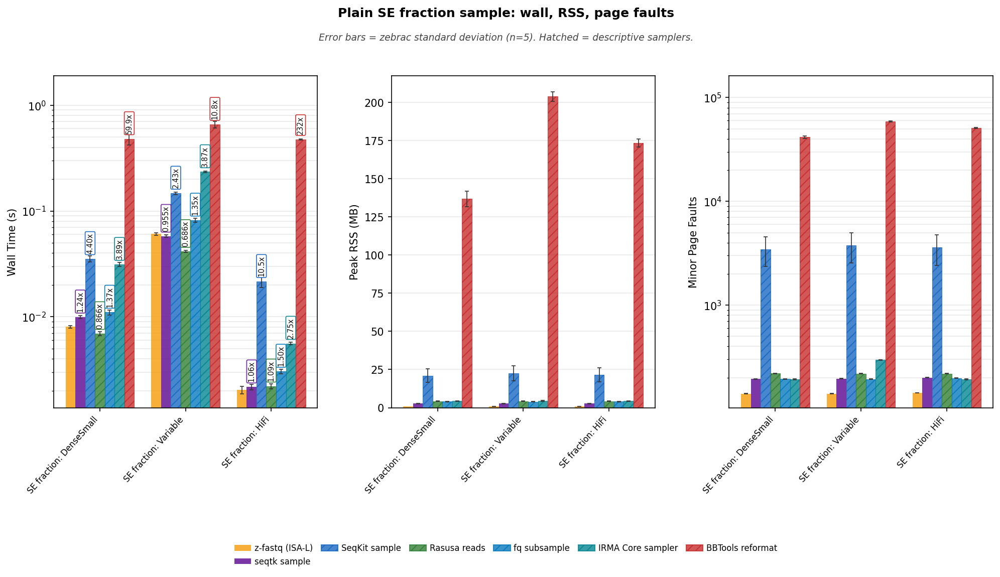

**Reading Figure 1**

- Facets: wall time (log y) | peak RSS (linear) | minor page faults (log y).
- X-axis: SE catalog shapes. One-pass `--fraction`. Occupancy follows this family.
- Gold bars are z-fastq ISA-L. Hatched bars are descriptive samplers. seqtk is the screened exact SE reference and is not hatched.

### Occupancy (50/50 wall and RSS)

Occupancy is mean wall time × peak RSS, and only SE families use it (fraction and count separately). These figures use accepted positive lanes; blank cells mean unsupported or rejected. BBTools stays on the wall/RSS facets and is omitted here because its RSS is a JVM image, not a single sampler process. SeqKit stays on the wall/RSS facets and is omitted here because its RSS is the Go image. Occupancy is descriptive resource accounting, not a semantic-equivalence ranking.

**Table 5:** Occupancy (MB·s) = mean wall × peak RSS.

| Workload                  | z-fastq (ISA-L)     | seqtk sample     | Rasusa reads     | fq subsample     | IRMA Core sampler     |
| :------------------------ | ------------------: | ---------------: | ---------------: | ---------------: | --------------------: |
| SE fraction: DenseSmall   | 0.0075              | 0.0265           | 0.0293           | 0.0437           | 0.1349                |
| SE fraction: Variable     | 0.0563              | 0.1535           | 0.1729           | 0.3196           | 1.0528                |
| SE fraction: HiFi         | 0.0019              | 0.0058           | 0.0094           | 0.0122           | 0.0244                |

**Table 6:** Occupancy efficiency vs z-fastq ISA-L. Higher is better.

| Workload                  | z-fastq (ISA-L)     | seqtk sample     | Rasusa reads     | fq subsample     | IRMA Core sampler     |
| :------------------------ | :------------------ | :--------------- | :--------------- | :--------------- | :-------------------- |
| SE fraction: DenseSmall   | 1x                  | 0.284x           | 0.256x           | 0.172x           | 0.056x                |
| SE fraction: Variable     | 1x                  | 0.367x           | 0.326x           | 0.176x           | 0.054x                |
| SE fraction: HiFi         | 1x                  | 0.330x           | 0.203x           | 0.157x           | 0.078x                |

**Figure 2:** Peak RSS vs mean wall. Per-workload occupancy isocosts through z-fastq ISA-L.

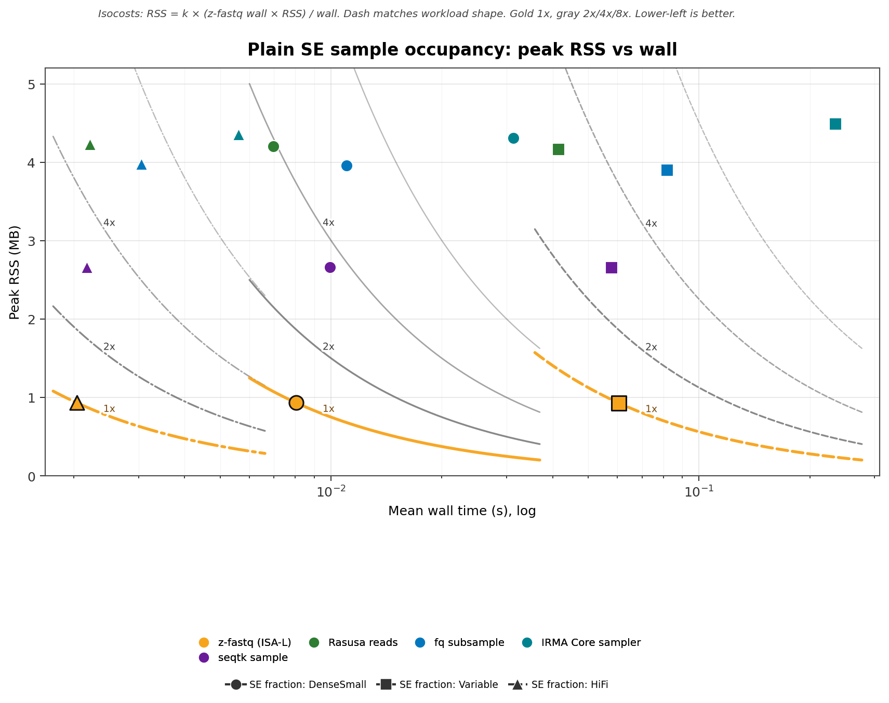

**Reading Figure 2**

- X: mean wall (s, log). Y: peak RSS (MB, linear).
- Color = tool. Shape and line dash = workload; the legend names every SE shape.
- Curves are 1x/2x/4x/8x memory-seconds of that workload's z-fastq ISA-L lane. Gold 1x, gray 2x/4x/8x.
- Lower-left is better. Missing points are not treated as zero.

**Figure 3:** Occupancy efficiency vs z-fastq ISA-L. Higher is better. 1.00 matches z-fastq memory-seconds.

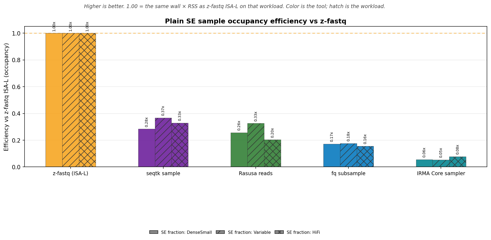

**Reading Figure 3**

- X-axis is the tool. Grouped bars are SE fraction: DenseSmall / SE fraction: Variable / SE fraction: HiFi; hatches identify workloads.
- Bar color is the tool. Gold dashed line is 1x.
- This is the inverse of occupancy cost on the scatter and is descriptive for accepted positive SE sample lanes.

## Performance: SE count

Single-end `--count` on the same SE shapes. Two-pass reservoir; output is `min(K, N)` records in source order. HiFi has 1,114 records, so K=1000 keeps almost every record. Occupancy is separate from fraction because the jobs are not the same.

### Wall time

Zebrac mean wall time for one sample process. Vertical annotations are wall time relative to z-fastq ISA-L, including hatched descriptive lanes. Hatched ratios are not a ranking.

**Table 7:** Mean ± standard deviation by workload and tool.

| Workload               | z-fastq (ISA-L)     | seqtk sample     | SeqKit sample     | Rasusa reads     | fq subsample     | fqkit subfq     | IRMA Core sampler     | BBTools reformat     |
| :--------------------- | :------------------ | :--------------- | :---------------- | :--------------- | :--------------- | :-------------- | :-------------------- | :------------------- |
| SE count: DenseSmall   | 0.011±0.000 s       | 0.018±0.001 s    | 0.040±0.004 s     | 0.012±0.000 s    | 0.013±0.000 s    | 0.019±0.001 s   | 0.030±0.001 s         | 0.521±0.049 s        |
| SE count: Variable     | 0.081±0.002 s       | 0.102±0.002 s    | 0.256±0.004 s     | 0.073±0.002 s    | 0.110±0.002 s    | 0.093±0.002 s   | 0.231±0.011 s         | 0.859±0.059 s        |
| SE count: HiFi         | 0.003±0.000 s       | 0.004±0.000 s    | 0.025±0.003 s     | 0.004±0.000 s    | 0.005±0.000 s    | 0.015±0.000 s   | 0.006±0.000 s         | 0.565±0.053 s        |

<strong>Table 8:</strong> Time relative to z-fastq ISA-L.

| Workload               | z-fastq vs          | z-fastq     | Peer      | Time relative to z-fastq     |
| :--------------------- | :------------------ | :---------- | :-------- | :--------------------------- |
| SE count: DenseSmall   | seqtk sample        | 0.0109s     | 0.0178s   | 1.62x                        |
| SE count: DenseSmall   | SeqKit sample       | 0.0109s     | 0.0398s   | 3.64x                        |
| SE count: DenseSmall   | Rasusa reads        | 0.0109s     | 0.0118s   | 1.08x                        |
| SE count: DenseSmall   | fq subsample        | 0.0109s     | 0.0133s   | 1.21x                        |
| SE count: DenseSmall   | fqkit subfq         | 0.0109s     | 0.0187s   | 1.71x                        |
| SE count: DenseSmall   | IRMA Core sampler   | 0.0109s     | 0.0302s   | 2.76x                        |
| SE count: DenseSmall   | BBTools reformat    | 0.0109s     | 0.5215s   | 47.7x                        |
| SE count: Variable     | seqtk sample        | 0.0814s     | 0.1020s   | 1.25x                        |
| SE count: Variable     | SeqKit sample       | 0.0814s     | 0.2563s   | 3.15x                        |
| SE count: Variable     | Rasusa reads        | 0.0814s     | 0.0727s   | 0.894x                       |
| SE count: Variable     | fq subsample        | 0.0814s     | 0.1098s   | 1.35x                        |
| SE count: Variable     | fqkit subfq         | 0.0814s     | 0.0935s   | 1.15x                        |
| SE count: Variable     | IRMA Core sampler   | 0.0814s     | 0.2312s   | 2.84x                        |
| SE count: Variable     | BBTools reformat    | 0.0814s     | 0.8594s   | 10.6x                        |
| SE count: HiFi         | seqtk sample        | 0.0028s     | 0.0039s   | 1.42x                        |
| SE count: HiFi         | SeqKit sample       | 0.0028s     | 0.0254s   | 9.19x                        |
| SE count: HiFi         | Rasusa reads        | 0.0028s     | 0.0043s   | 1.56x                        |
| SE count: HiFi         | fq subsample        | 0.0028s     | 0.0046s   | 1.65x                        |
| SE count: HiFi         | fqkit subfq         | 0.0028s     | 0.0155s   | 5.60x                        |
| SE count: HiFi         | IRMA Core sampler   | 0.0028s     | 0.0063s   | 2.29x                        |
| SE count: HiFi         | BBTools reformat    | 0.0028s     | 0.5654s   | 204x                         |

### Peak memory

Peak RSS of the timed process. These are raw process measurements; sampler implementations do not share one memory contract.

**Table 9:** Mean ± standard deviation by workload and tool.

| Workload               | z-fastq (ISA-L)     | seqtk sample     | SeqKit sample     | Rasusa reads     | fq subsample     | fqkit subfq     | IRMA Core sampler     | BBTools reformat     |
| :--------------------- | :------------------ | :--------------- | :---------------- | :--------------- | :--------------- | :-------------- | :-------------------- | :------------------- |
| SE count: DenseSmall   | 0.93±0.01 MB        | 2.66±0.11 MB     | 21.31±4.48 MB     | 5.62±0.07 MB     | 3.94±0.16 MB     | 13.65±0.15 MB   | 4.31±0.18 MB          | 169.91±3.07 MB       |
| SE count: Variable     | 0.93±0.00 MB        | 2.61±0.10 MB     | 21.04±4.06 MB     | 5.62±0.08 MB     | 3.96±0.15 MB     | 12.84±0.16 MB   | 4.48±0.22 MB          | 207.34±4.52 MB       |
| SE count: HiFi         | 0.93±0.00 MB        | 2.69±0.10 MB     | 20.92±4.18 MB     | 5.62±0.08 MB     | 3.96±0.16 MB     | 21.42±0.13 MB   | 4.36±0.13 MB          | 178.79±3.97 MB       |

### Minor page faults

Minor page faults for the same direct commands. These are descriptive process measurements.

**Table 10:** Mean ± standard deviation by workload and tool.

| Workload               | z-fastq (ISA-L)     | seqtk sample     | SeqKit sample     | Rasusa reads     | fq subsample     | fqkit subfq     | IRMA Core sampler     | BBTools reformat     |
| :--------------------- | :------------------ | :--------------- | :---------------- | :--------------- | :--------------- | :-------------- | :-------------------- | :------------------- |
| SE count: DenseSmall   | 163±1               | 299±2            | 3556±1141         | 401±1            | 194±2            | 1919±2          | 191±2                 | 50155±771            |
| SE count: Variable     | 163±1               | 299±2            | 3455±1061         | 412±2            | 203±2            | 1731±2          | 296±2                 | 59813±1126           |
| SE count: HiFi         | 166±1               | 304±2            | 3490±1087         | 359±1            | 198±2            | 3944±2          | 192±2                 | 52393±964            |

**Figure 4:** Wall time, peak RSS, and minor page faults for SE exact-count sampling.

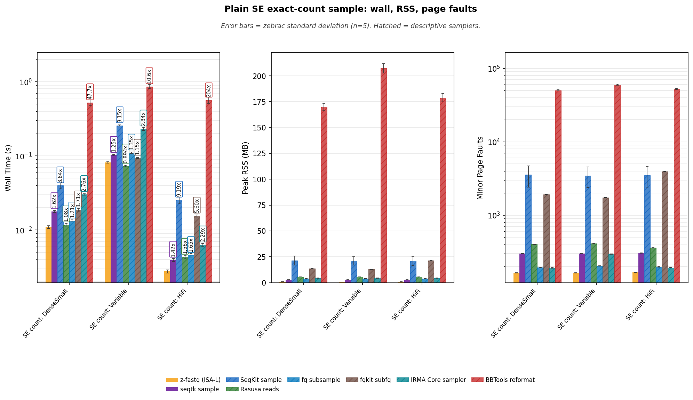

**Reading Figure 4**

- Facets: wall time (log y) | peak RSS (linear) | minor page faults (log y).
- X-axis: SE catalog shapes. Two-pass `--count`. Occupancy follows this family and is not mixed with fraction.
- Gold bars are z-fastq ISA-L. Hatched bars are descriptive samplers. seqtk `sample -2` is the screened exact SE reference.

### Occupancy (50/50 wall and RSS)

Occupancy is mean wall time × peak RSS, and only SE families use it (fraction and count separately). These figures use accepted positive lanes; blank cells mean unsupported or rejected. BBTools stays on the wall/RSS facets and is omitted here because its RSS is a JVM image, not a single sampler process. SeqKit stays on the wall/RSS facets and is omitted here because its RSS is the Go image. Occupancy is descriptive resource accounting, not a semantic-equivalence ranking.

**Table 11:** Occupancy (MB·s) = mean wall × peak RSS.

| Workload               | z-fastq (ISA-L)     | seqtk sample     | Rasusa reads     | fq subsample     | fqkit subfq     | IRMA Core sampler     |
| :--------------------- | ------------------: | ---------------: | ---------------: | ---------------: | --------------: | --------------------: |
| SE count: DenseSmall   | 0.0102              | 0.0474           | 0.0664           | 0.0524           | 0.2558          | 0.1302                |
| SE count: Variable     | 0.076               | 0.2667           | 0.4089           | 0.4344           | 1.201           | 1.0348                |
| SE count: HiFi         | 0.0026              | 0.0106           | 0.0243           | 0.0181           | 0.3318          | 0.0276                |

**Table 12:** Occupancy efficiency vs z-fastq ISA-L. Higher is better.

| Workload               | z-fastq (ISA-L)     | seqtk sample     | Rasusa reads     | fq subsample     | fqkit subfq     | IRMA Core sampler     |
| :--------------------- | :------------------ | :--------------- | :--------------- | :--------------- | :-------------- | :-------------------- |
| SE count: DenseSmall   | 1x                  | 0.216x           | 0.154x           | 0.195x           | 0.040x          | 0.078x                |
| SE count: Variable     | 1x                  | 0.285x           | 0.186x           | 0.175x           | 0.063x          | 0.073x                |
| SE count: HiFi         | 1x                  | 0.244x           | 0.106x           | 0.143x           | 0.008x          | 0.094x                |

**Figure 5:** Peak RSS vs mean wall. Per-workload occupancy isocosts through z-fastq ISA-L.

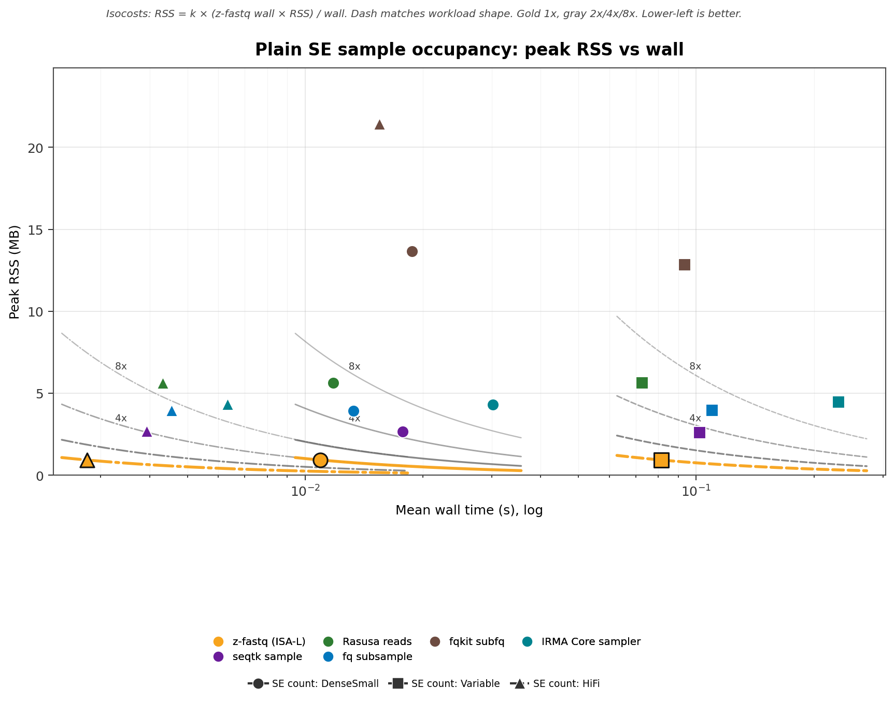

**Reading Figure 5**

- X: mean wall (s, log). Y: peak RSS (MB, linear).
- Color = tool. Shape and line dash = workload; the legend names every SE shape.
- Curves are 1x/2x/4x/8x memory-seconds of that workload's z-fastq ISA-L lane. Gold 1x, gray 2x/4x/8x.
- Lower-left is better. Missing points are not treated as zero.

**Figure 6:** Occupancy efficiency vs z-fastq ISA-L. Higher is better. 1.00 matches z-fastq memory-seconds.

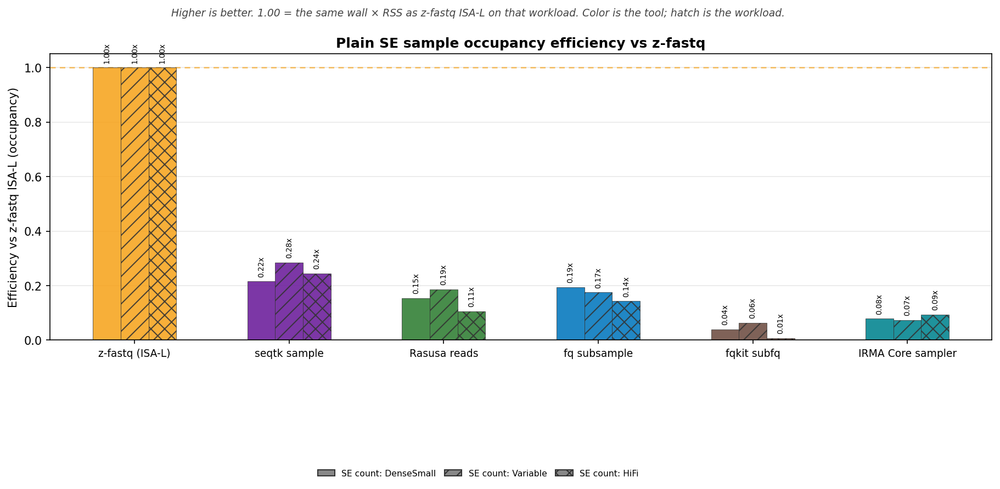

**Reading Figure 6**

- X-axis is the tool. Grouped bars are SE count: DenseSmall / SE count: Variable / SE count: HiFi; hatches identify workloads.
- Bar color is the tool. Gold dashed line is 1x.
- This is the inverse of occupancy cost on the scatter and is descriptive for accepted positive SE sample lanes.

## Performance: SE fraction (gzip)

The same SE `--fraction` shapes as the plain section. Gold is z-fastq ISA-L; amber is native Zig inflate. IRMA Core is not timed on gzip because gzip and plain select different records. Decoded FASTQ MiB/s uses the uncompressed sibling size divided by wall time.

### Wall time

Zebrac mean wall time for one sample process. Vertical annotations are wall time relative to z-fastq ISA-L, including hatched descriptive lanes. Hatched ratios are not a ranking.

**Table 13:** Mean ± standard deviation by workload and tool.

| Workload                  | z-fastq (ISA-L)     | z-fastq (native)     | seqtk sample     | SeqKit sample     | Rasusa reads     | fq subsample     | BBTools reformat     |
| :------------------------ | :------------------ | :------------------- | :--------------- | :---------------- | :--------------- | :--------------- | :------------------- |
| SE fraction: DenseSmall   | 0.015±0.000 s       | 0.021±0.001 s        | 0.019±0.001 s    | 0.060±0.003 s     | 0.016±0.000 s    | 0.029±0.001 s    | 0.468±0.036 s        |
| SE fraction: Variable     | 0.338±0.004 s       | 0.610±0.004 s        | 0.463±0.013 s    | 1.356±0.019 s     | 0.455±0.004 s    | 0.761±0.004 s    | 1.405±0.066 s        |
| SE fraction: HiFi         | 0.014±0.000 s       | 0.027±0.000 s        | 0.018±0.000 s    | 0.070±0.002 s     | 0.019±0.000 s    | 0.028±0.001 s    | 0.506±0.011 s        |

<strong>Table 14:</strong> Time relative to z-fastq ISA-L.

| Workload                  | z-fastq vs         | z-fastq     | Peer      | Time relative to z-fastq     |
| :------------------------ | :----------------- | :---------- | :-------- | :--------------------------- |
| SE fraction: DenseSmall   | z-fastq (native)   | 0.0151s     | 0.0209s   | 1.38x                        |
| SE fraction: DenseSmall   | seqtk sample       | 0.0151s     | 0.0185s   | 1.23x                        |
| SE fraction: DenseSmall   | SeqKit sample      | 0.0151s     | 0.0605s   | 4.01x                        |
| SE fraction: DenseSmall   | Rasusa reads       | 0.0151s     | 0.0163s   | 1.08x                        |
| SE fraction: DenseSmall   | fq subsample       | 0.0151s     | 0.0287s   | 1.90x                        |
| SE fraction: DenseSmall   | BBTools reformat   | 0.0151s     | 0.4678s   | 31.0x                        |
| SE fraction: Variable     | z-fastq (native)   | 0.3376s     | 0.6099s   | 1.81x                        |
| SE fraction: Variable     | seqtk sample       | 0.3376s     | 0.4632s   | 1.37x                        |
| SE fraction: Variable     | SeqKit sample      | 0.3376s     | 1.3556s   | 4.01x                        |
| SE fraction: Variable     | Rasusa reads       | 0.3376s     | 0.4555s   | 1.35x                        |
| SE fraction: Variable     | fq subsample       | 0.3376s     | 0.7608s   | 2.25x                        |
| SE fraction: Variable     | BBTools reformat   | 0.3376s     | 1.4045s   | 4.16x                        |
| SE fraction: HiFi         | z-fastq (native)   | 0.0137s     | 0.0272s   | 1.99x                        |
| SE fraction: HiFi         | seqtk sample       | 0.0137s     | 0.0178s   | 1.30x                        |
| SE fraction: HiFi         | SeqKit sample      | 0.0137s     | 0.0701s   | 5.13x                        |
| SE fraction: HiFi         | Rasusa reads       | 0.0137s     | 0.0186s   | 1.36x                        |
| SE fraction: HiFi         | fq subsample       | 0.0137s     | 0.0276s   | 2.02x                        |
| SE fraction: HiFi         | BBTools reformat   | 0.0137s     | 0.5062s   | 37.0x                        |

### Peak memory

Peak RSS of the timed process. These are raw process measurements; sampler implementations do not share one memory contract.

**Table 15:** Mean ± standard deviation by workload and tool.

| Workload                  | z-fastq (ISA-L)     | z-fastq (native)     | seqtk sample     | SeqKit sample     | Rasusa reads     | fq subsample     | BBTools reformat     |
| :------------------------ | :------------------ | :------------------- | :--------------- | :---------------- | :--------------- | :--------------- | :------------------- |
| SE fraction: DenseSmall   | 1.04±0.01 MB        | 0.93±0.02 MB         | 2.66±0.07 MB     | 22.72±0.67 MB     | 4.65±0.11 MB     | 3.96±0.14 MB     | 137.39±4.87 MB       |
| SE fraction: Variable     | 1.04±0.00 MB        | 0.93±0.00 MB         | 2.66±0.07 MB     | 23.01±0.81 MB     | 4.54±0.10 MB     | 3.92±0.20 MB     | 202.62±2.33 MB       |
| SE fraction: HiFi         | 1.04±0.02 MB        | 0.93±0.02 MB         | 2.66±0.08 MB     | 22.62±0.76 MB     | 4.61±0.13 MB     | 3.97±0.16 MB     | 173.90±3.28 MB       |

### Minor page faults

Minor page faults for the same direct commands. These are descriptive process measurements.

**Table 16:** Mean ± standard deviation by workload and tool.

| Workload                  | z-fastq (ISA-L)     | z-fastq (native)     | seqtk sample     | SeqKit sample     | Rasusa reads     | fq subsample     | BBTools reformat     |
| :------------------------ | :------------------ | :------------------- | :--------------- | :---------------- | :--------------- | :--------------- | :------------------- |
| SE fraction: DenseSmall   | 165±0               | 111±1                | 204±1            | 3821±144          | 242±1            | 205±2            | 41872±1254           |
| SE fraction: Variable     | 164±1               | 115±0                | 204±1            | 3777±96           | 241±1            | 205±2            | 58492±703            |
| SE fraction: HiFi         | 167±0               | 117±1                | 209±1            | 3832±147          | 241±1            | 215±2            | 51077±840            |

### Decoded throughput

Decoded FASTQ MiB/s is the uncompressed input size divided by wall time. That is the gzip unit that matches inflate work; compressed on-disk throughput is supporting context.

**Table 17:** Decoded FASTQ MiB/s.

| Workload                  | z-fastq (ISA-L)     | z-fastq (native)     | seqtk sample     | SeqKit sample     | Rasusa reads     | fq subsample     | BBTools reformat     |
| :------------------------ | :------------------ | :------------------- | :--------------- | :---------------- | :--------------- | :--------------- | :------------------- |
| SE fraction: DenseSmall   | 1295.4 MiB/s        | 937.3 MiB/s          | 1055.8 MiB/s     | 323.3 MiB/s       | 1196.0 MiB/s     | 682.3 MiB/s      | 41.8 MiB/s           |
| SE fraction: Variable     | 582.4 MiB/s         | 322.4 MiB/s          | 424.5 MiB/s      | 145.1 MiB/s       | 431.7 MiB/s      | 258.4 MiB/s      | 140.0 MiB/s          |
| SE fraction: HiFi         | 440.0 MiB/s         | 221.4 MiB/s          | 337.4 MiB/s      | 85.8 MiB/s        | 323.2 MiB/s      | 218.1 MiB/s      | 11.9 MiB/s           |

<strong>Table 18:</strong> Compressed on-disk MiB/s.

| Workload                  | z-fastq (ISA-L)     | z-fastq (native)     | seqtk sample     | SeqKit sample     | Rasusa reads     | fq subsample     | BBTools reformat     |
| :------------------------ | :------------------ | :------------------- | :--------------- | :---------------- | :--------------- | :--------------- | :------------------- |
| SE fraction: DenseSmall   | 99.9 MiB/s          | 72.3 MiB/s           | 81.4 MiB/s       | 24.9 MiB/s        | 92.2 MiB/s       | 52.6 MiB/s       | 3.2 MiB/s            |
| SE fraction: Variable     | 215.5 MiB/s         | 119.3 MiB/s          | 157.1 MiB/s      | 53.7 MiB/s        | 159.8 MiB/s      | 95.7 MiB/s       | 51.8 MiB/s           |
| SE fraction: HiFi         | 228.6 MiB/s         | 115.0 MiB/s          | 175.3 MiB/s      | 44.6 MiB/s        | 167.9 MiB/s      | 113.3 MiB/s      | 6.2 MiB/s            |

**Figure 7:** Wall time, peak RSS, and minor page faults for gzip SE fraction sampling.

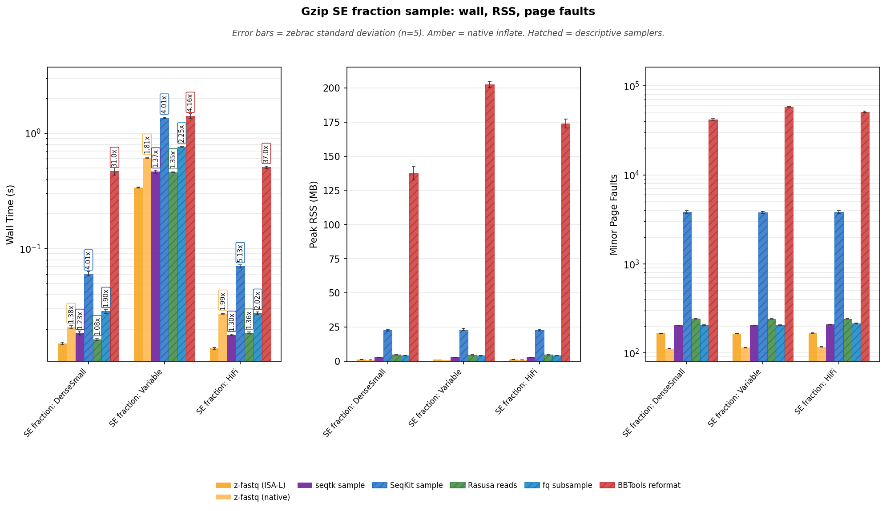

**Reading Figure 7**

- Facets: wall time (log y) | peak RSS (linear) | minor page faults (log y).
- X-axis: SE catalog shapes. One-pass `--fraction`. Occupancy follows this family.
- Gold bars are z-fastq ISA-L. Amber bars are native inflate. Hatched bars are descriptive samplers. seqtk is the screened exact SE reference and is not hatched.

### Occupancy (50/50 wall and RSS)

Occupancy is mean wall time × peak RSS, and only SE families use it (fraction and count separately). These figures use accepted positive lanes; blank cells mean unsupported or rejected. BBTools stays on the wall/RSS facets and is omitted here because its RSS is a JVM image, not a single sampler process. SeqKit stays on the wall/RSS facets and is omitted here because its RSS is the Go image. Occupancy is descriptive resource accounting, not a semantic-equivalence ranking.

**Table 19:** Occupancy (MB·s) = mean wall × peak RSS.

| Workload                  | z-fastq (ISA-L)     | z-fastq (native)     | seqtk sample     | Rasusa reads     | fq subsample     |
| :------------------------ | ------------------: | -------------------: | ---------------: | ---------------: | ---------------: |
| SE fraction: DenseSmall   | 0.0157              | 0.0195               | 0.0493           | 0.076            | 0.1136           |
| SE fraction: Variable     | 0.3522              | 0.5694               | 1.2312           | 2.0701           | 2.9805           |
| SE fraction: HiFi         | 0.0142              | 0.0253               | 0.0474           | 0.0858           | 0.1094           |

**Table 20:** Occupancy efficiency vs z-fastq ISA-L. Higher is better.

| Workload                  | z-fastq (ISA-L)     | z-fastq (native)     | seqtk sample     | Rasusa reads     | fq subsample     |
| :------------------------ | :------------------ | :------------------- | :--------------- | :--------------- | :--------------- |
| SE fraction: DenseSmall   | 1x                  | 0.808x               | 0.319x           | 0.207x           | 0.138x           |
| SE fraction: Variable     | 1x                  | 0.618x               | 0.286x           | 0.170x           | 0.118x           |
| SE fraction: HiFi         | 1x                  | 0.562x               | 0.300x           | 0.166x           | 0.130x           |

**Figure 8:** Peak RSS vs mean wall. Per-workload occupancy isocosts through z-fastq ISA-L.

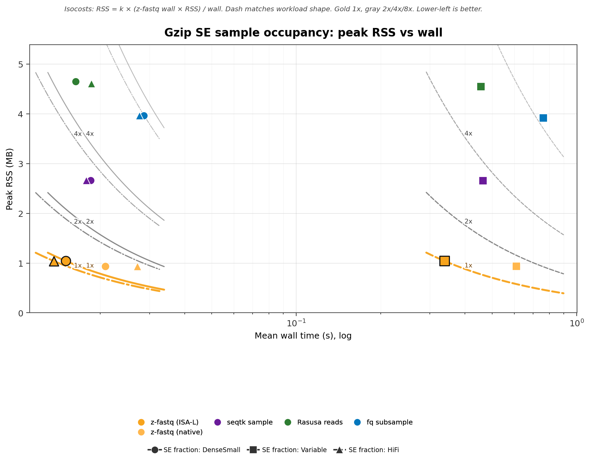

**Reading Figure 8**

- X: mean wall (s, log). Y: peak RSS (MB, linear).
- Color = tool. Shape and line dash = workload; the legend names every SE shape.
- Curves are 1x/2x/4x/8x memory-seconds of that workload's z-fastq ISA-L lane. Gold 1x, gray 2x/4x/8x.
- Lower-left is better. Missing points are not treated as zero.

**Figure 9:** Occupancy efficiency vs z-fastq ISA-L. Higher is better. 1.00 matches z-fastq memory-seconds.

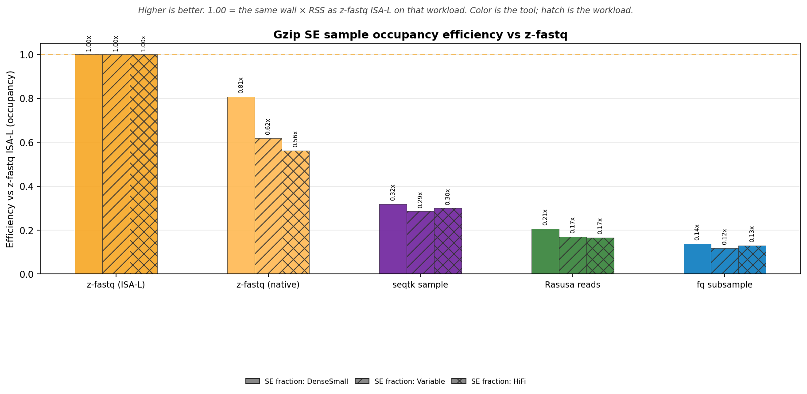

**Reading Figure 9**

- X-axis is the tool. Grouped bars are SE fraction: DenseSmall / SE fraction: Variable / SE fraction: HiFi; hatches identify workloads.
- Bar color is the tool. Gold dashed line is 1x.
- This is the inverse of occupancy cost on the scatter and is descriptive for accepted positive SE sample lanes.

## Performance: SE count (gzip)

The same SE `--count` shapes as the plain section. Gold is z-fastq ISA-L; amber is native Zig inflate. HiFi has 1,114 records, so K=1000 keeps almost every record.

### Wall time

Zebrac mean wall time for one sample process. Vertical annotations are wall time relative to z-fastq ISA-L, including hatched descriptive lanes. Hatched ratios are not a ranking.

**Table 21:** Mean ± standard deviation by workload and tool.

| Workload               | z-fastq (ISA-L)     | z-fastq (native)     | seqtk sample     | SeqKit sample     | Rasusa reads     | fq subsample     | fqkit subfq     | BBTools reformat     |
| :--------------------- | :------------------ | :------------------- | :--------------- | :---------------- | :--------------- | :--------------- | :-------------- | :------------------- |
| SE count: DenseSmall   | 0.026±0.001 s       | 0.038±0.001 s        | 0.035±0.001 s    | 0.099±0.002 s     | 0.031±0.001 s    | 0.049±0.001 s    | 0.054±0.001 s   | 0.535±0.040 s        |
| SE count: Variable     | 0.644±0.005 s       | 1.193±0.011 s        | 0.875±0.001 s    | 2.690±0.035 s     | 0.926±0.039 s    | 1.480±0.024 s    | 1.421±0.013 s   | 2.273±0.054 s        |
| SE count: HiFi         | 0.026±0.001 s       | 0.053±0.001 s        | 0.035±0.001 s    | 0.121±0.002 s     | 0.036±0.001 s    | 0.053±0.001 s    | 0.064±0.001 s   | 0.577±0.059 s        |

<strong>Table 22:</strong> Time relative to z-fastq ISA-L.

| Workload               | z-fastq vs         | z-fastq     | Peer      | Time relative to z-fastq     |
| :--------------------- | :----------------- | :---------- | :-------- | :--------------------------- |
| SE count: DenseSmall   | z-fastq (native)   | 0.0257s     | 0.0379s   | 1.47x                        |
| SE count: DenseSmall   | seqtk sample       | 0.0257s     | 0.0350s   | 1.36x                        |
| SE count: DenseSmall   | SeqKit sample      | 0.0257s     | 0.0987s   | 3.85x                        |
| SE count: DenseSmall   | Rasusa reads       | 0.0257s     | 0.0305s   | 1.19x                        |
| SE count: DenseSmall   | fq subsample       | 0.0257s     | 0.0490s   | 1.91x                        |
| SE count: DenseSmall   | fqkit subfq        | 0.0257s     | 0.0538s   | 2.09x                        |
| SE count: DenseSmall   | BBTools reformat   | 0.0257s     | 0.5351s   | 20.8x                        |
| SE count: Variable     | z-fastq (native)   | 0.6435s     | 1.1930s   | 1.85x                        |
| SE count: Variable     | seqtk sample       | 0.6435s     | 0.8748s   | 1.36x                        |
| SE count: Variable     | SeqKit sample      | 0.6435s     | 2.6896s   | 4.18x                        |
| SE count: Variable     | Rasusa reads       | 0.6435s     | 0.9260s   | 1.44x                        |
| SE count: Variable     | fq subsample       | 0.6435s     | 1.4797s   | 2.30x                        |
| SE count: Variable     | fqkit subfq        | 0.6435s     | 1.4207s   | 2.21x                        |
| SE count: Variable     | BBTools reformat   | 0.6435s     | 2.2732s   | 3.53x                        |
| SE count: HiFi         | z-fastq (native)   | 0.0265s     | 0.0535s   | 2.02x                        |
| SE count: HiFi         | seqtk sample       | 0.0265s     | 0.0352s   | 1.33x                        |
| SE count: HiFi         | SeqKit sample      | 0.0265s     | 0.1209s   | 4.57x                        |
| SE count: HiFi         | Rasusa reads       | 0.0265s     | 0.0364s   | 1.38x                        |
| SE count: HiFi         | fq subsample       | 0.0265s     | 0.0528s   | 1.99x                        |
| SE count: HiFi         | fqkit subfq        | 0.0265s     | 0.0641s   | 2.42x                        |
| SE count: HiFi         | BBTools reformat   | 0.0265s     | 0.5772s   | 21.8x                        |

### Peak memory

Peak RSS of the timed process. These are raw process measurements; sampler implementations do not share one memory contract.

**Table 23:** Mean ± standard deviation by workload and tool.

| Workload               | z-fastq (ISA-L)     | z-fastq (native)     | seqtk sample     | SeqKit sample     | Rasusa reads     | fq subsample     | fqkit subfq     | BBTools reformat     |
| :--------------------- | :------------------ | :------------------- | :--------------- | :---------------- | :--------------- | :--------------- | :-------------- | :------------------- |
| SE count: DenseSmall   | 1.04±0.00 MB        | 0.93±0.00 MB         | 2.66±0.11 MB     | 26.80±0.52 MB     | 5.73±0.13 MB     | 3.96±0.16 MB     | 12.48±0.18 MB   | 169.34±2.76 MB       |
| SE count: Variable     | 1.04±0.00 MB        | 0.93±0.00 MB         | 2.68±0.13 MB     | 25.92±1.14 MB     | 5.76±0.14 MB     | 3.81±0.18 MB     | 12.33±0.23 MB   | 205.01±5.73 MB       |
| SE count: HiFi         | 1.04±0.01 MB        | 0.93±0.00 MB         | 2.67±0.12 MB     | 26.76±0.65 MB     | 5.71±0.14 MB     | 3.95±0.16 MB     | 21.50±0.18 MB   | 178.76±3.00 MB       |

### Minor page faults

Minor page faults for the same direct commands. These are descriptive process measurements.

**Table 24:** Mean ± standard deviation by workload and tool.

| Workload               | z-fastq (ISA-L)     | z-fastq (native)     | seqtk sample     | SeqKit sample     | Rasusa reads     | fq subsample     | fqkit subfq     | BBTools reformat     |
| :--------------------- | :------------------ | :------------------- | :--------------- | :---------------- | :--------------- | :--------------- | :-------------- | :------------------- |
| SE count: DenseSmall   | 186±1               | 198±1                | 311±2            | 4896±154          | 403±1            | 207±2            | 1613±2          | 50112±681            |
| SE count: Variable     | 186±1               | 200±0                | 312±1            | 4858±282          | 432±1            | 214±2            | 1623±1          | 59226±1511           |
| SE count: HiFi         | 189±1               | 202±1                | 313±2            | 4898±132          | 365±1            | 214±2            | 3939±2          | 52323±839            |

### Decoded throughput

Decoded FASTQ MiB/s is the uncompressed input size divided by wall time. That is the gzip unit that matches inflate work; compressed on-disk throughput is supporting context.

**Table 25:** Decoded FASTQ MiB/s.

| Workload               | z-fastq (ISA-L)     | z-fastq (native)     | seqtk sample     | SeqKit sample     | Rasusa reads     | fq subsample     | fqkit subfq     | BBTools reformat     |
| :--------------------- | :------------------ | :------------------- | :--------------- | :---------------- | :--------------- | :--------------- | :-------------- | :------------------- |
| SE count: DenseSmall   | 761.5 MiB/s         | 516.5 MiB/s          | 559.4 MiB/s      | 198.0 MiB/s       | 640.5 MiB/s      | 399.3 MiB/s      | 363.6 MiB/s     | 36.5 MiB/s           |
| SE count: Variable     | 305.5 MiB/s         | 164.8 MiB/s          | 224.8 MiB/s      | 73.1 MiB/s        | 212.4 MiB/s      | 132.9 MiB/s      | 138.4 MiB/s     | 86.5 MiB/s           |
| SE count: HiFi         | 227.1 MiB/s         | 112.5 MiB/s          | 171.0 MiB/s      | 49.7 MiB/s        | 165.1 MiB/s      | 114.0 MiB/s      | 93.8 MiB/s      | 10.4 MiB/s           |

<strong>Table 26:</strong> Compressed on-disk MiB/s.

| Workload               | z-fastq (ISA-L)     | z-fastq (native)     | seqtk sample     | SeqKit sample     | Rasusa reads     | fq subsample     | fqkit subfq     | BBTools reformat     |
| :--------------------- | :------------------ | :------------------- | :--------------- | :---------------- | :--------------- | :--------------- | :-------------- | :------------------- |
| SE count: DenseSmall   | 58.7 MiB/s          | 39.8 MiB/s           | 43.1 MiB/s       | 15.3 MiB/s        | 49.4 MiB/s       | 30.8 MiB/s       | 28.0 MiB/s      | 2.8 MiB/s            |
| SE count: Variable     | 113.1 MiB/s         | 61.0 MiB/s           | 83.2 MiB/s       | 27.1 MiB/s        | 78.6 MiB/s       | 49.2 MiB/s       | 51.2 MiB/s      | 32.0 MiB/s           |
| SE count: HiFi         | 118.0 MiB/s         | 58.4 MiB/s           | 88.8 MiB/s       | 25.8 MiB/s        | 85.8 MiB/s       | 59.2 MiB/s       | 48.7 MiB/s      | 5.4 MiB/s            |

**Figure 10:** Wall time, peak RSS, and minor page faults for gzip SE exact-count sampling.

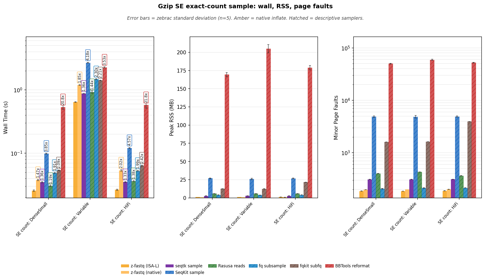

**Reading Figure 10**

- Facets: wall time (log y) | peak RSS (linear) | minor page faults (log y).
- X-axis: SE catalog shapes. Two-pass `--count`. Occupancy follows this family and is not mixed with fraction.
- Gold bars are z-fastq ISA-L. Amber bars are native inflate. Hatched bars are descriptive samplers. seqtk `sample -2` is the screened exact SE reference.

### Occupancy (50/50 wall and RSS)

Occupancy is mean wall time × peak RSS, and only SE families use it (fraction and count separately). These figures use accepted positive lanes; blank cells mean unsupported or rejected. BBTools stays on the wall/RSS facets and is omitted here because its RSS is a JVM image, not a single sampler process. SeqKit stays on the wall/RSS facets and is omitted here because its RSS is the Go image. Occupancy is descriptive resource accounting, not a semantic-equivalence ranking.

**Table 27:** Occupancy (MB·s) = mean wall × peak RSS.

| Workload               | z-fastq (ISA-L)     | z-fastq (native)     | seqtk sample     | Rasusa reads     | fq subsample     | fqkit subfq     |
| :--------------------- | ------------------: | -------------------: | ---------------: | ---------------: | ---------------: | --------------: |
| SE count: DenseSmall   | 0.0268              | 0.0353               | 0.0929           | 0.175            | 0.1938           | 0.671           |
| SE count: Variable     | 0.6712              | 1.1138               | 2.3476           | 5.3296           | 5.6368           | 17.5122         |
| SE count: HiFi         | 0.0276              | 0.0499               | 0.0939           | 0.208            | 0.2084           | 1.3789          |

**Table 28:** Occupancy efficiency vs z-fastq ISA-L. Higher is better.

| Workload               | z-fastq (ISA-L)     | z-fastq (native)     | seqtk sample     | Rasusa reads     | fq subsample     | fqkit subfq     |
| :--------------------- | :------------------ | :------------------- | :--------------- | :--------------- | :--------------- | :-------------- |
| SE count: DenseSmall   | 1x                  | 0.758x               | 0.288x           | 0.153x           | 0.138x           | 0.040x          |
| SE count: Variable     | 1x                  | 0.603x               | 0.286x           | 0.126x           | 0.119x           | 0.038x          |
| SE count: HiFi         | 1x                  | 0.553x               | 0.294x           | 0.133x           | 0.132x           | 0.020x          |

**Figure 11:** Peak RSS vs mean wall. Per-workload occupancy isocosts through z-fastq ISA-L.

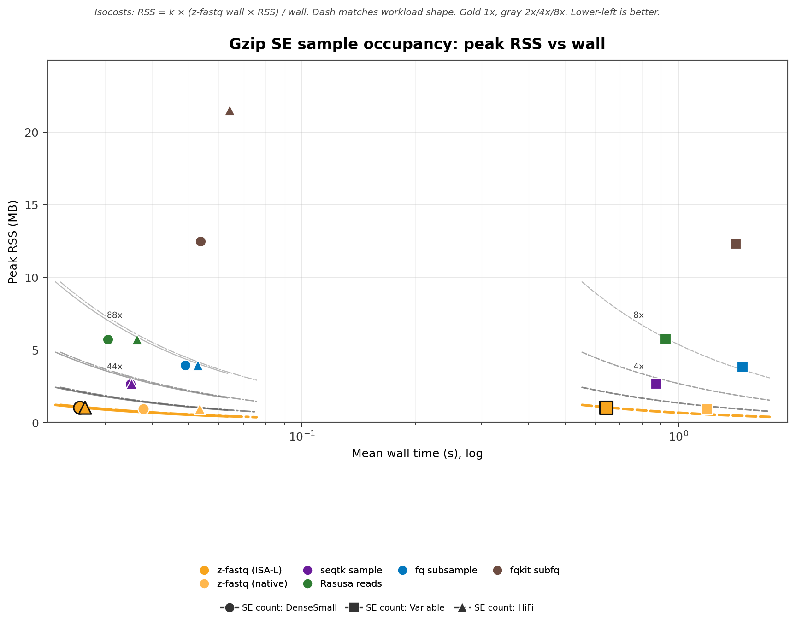

**Reading Figure 11**

- X: mean wall (s, log). Y: peak RSS (MB, linear).
- Color = tool. Shape and line dash = workload; the legend names every SE shape.
- Curves are 1x/2x/4x/8x memory-seconds of that workload's z-fastq ISA-L lane. Gold 1x, gray 2x/4x/8x.
- Lower-left is better. Missing points are not treated as zero.

**Figure 12:** Occupancy efficiency vs z-fastq ISA-L. Higher is better. 1.00 matches z-fastq memory-seconds.

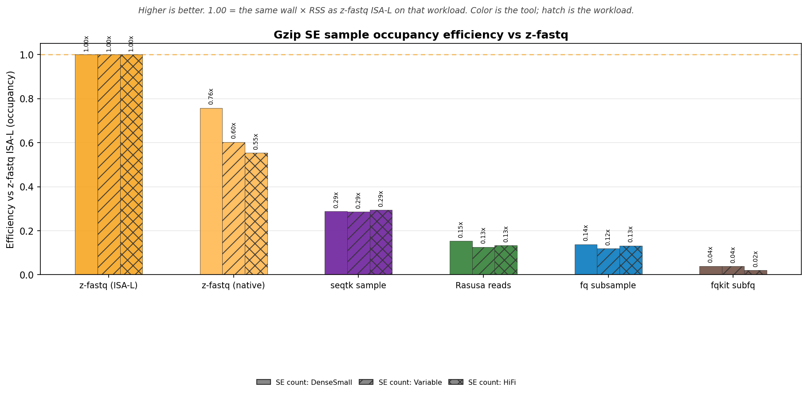

**Reading Figure 12**

- X-axis is the tool. Grouped bars are SE count: DenseSmall / SE count: Variable / SE count: HiFi; hatches identify workloads.
- Bar color is the tool. Gold dashed line is 1x.
- This is the inverse of occupancy cost on the scatter and is descriptive for accepted positive SE sample lanes.

## Performance: pair layout, fraction

`--paired --fraction` vs `--interleaved --fraction` on the matching mates (same pair count). SE is half the records of this pair and is not plotted here as pair overhead. Tables and a 3-facet only; no occupancy. Blank cells mean that tool is not invoked for that layout.

### Wall time

Zebrac mean wall time for one sample process. Vertical annotations are wall time relative to z-fastq ISA-L, including hatched descriptive lanes. Hatched ratios are not a ranking.

**Table 29:** Mean ± standard deviation by workload and tool.

| Workload                                    | z-fastq (ISA-L)     | Rasusa reads     | fq subsample     | IRMA Core sampler     | BBTools reformat     |
| :------------------------------------------ | :------------------ | :--------------- | :--------------- | :-------------------- | :------------------- |
| paired fraction: DenseSmall + PairSmallR2   | 0.019±0.000 s       | 0.012±0.000 s    | 0.020±0.001 s    | 0.054±0.001 s         | 0.468±0.041 s        |
| interleaved fraction: InterleavedSmall      | 0.017±0.000 s       |                  |                  |                       | 0.491±0.051 s        |

<strong>Table 30:</strong> Time relative to z-fastq ISA-L.

| Workload                                    | z-fastq vs          | z-fastq     | Peer      | Time relative to z-fastq     |
| :------------------------------------------ | :------------------ | :---------- | :-------- | :--------------------------- |
| paired fraction: DenseSmall + PairSmallR2   | Rasusa reads        | 0.0185s     | 0.0123s   | 0.666x                       |
| paired fraction: DenseSmall + PairSmallR2   | fq subsample        | 0.0185s     | 0.0200s   | 1.08x                        |
| paired fraction: DenseSmall + PairSmallR2   | IRMA Core sampler   | 0.0185s     | 0.0537s   | 2.90x                        |
| paired fraction: DenseSmall + PairSmallR2   | BBTools reformat    | 0.0185s     | 0.4677s   | 25.3x                        |
| interleaved fraction: InterleavedSmall      | BBTools reformat    | 0.0172s     | 0.4913s   | 28.6x                        |

### Peak memory

Peak RSS of the timed process. These are raw process measurements; sampler implementations do not share one memory contract.

**Table 31:** Mean ± standard deviation by workload and tool.

| Workload                                    | z-fastq (ISA-L)     | Rasusa reads     | fq subsample     | IRMA Core sampler     | BBTools reformat     |
| :------------------------------------------ | :------------------ | :--------------- | :--------------- | :-------------------- | :------------------- |
| paired fraction: DenseSmall + PairSmallR2   | 1.03±0.01 MB        | 4.53±0.14 MB     | 3.94±0.15 MB     | 4.32±0.18 MB          | 175.07±1.89 MB       |
| interleaved fraction: InterleavedSmall      | 0.93±0.00 MB        |                  |                  |                       | 171.78±2.69 MB       |

### Minor page faults

Minor page faults for the same direct commands. These are descriptive process measurements.

**Table 32:** Mean ± standard deviation by workload and tool.

| Workload                                    | z-fastq (ISA-L)     | Rasusa reads     | fq subsample     | IRMA Core sampler     | BBTools reformat     |
| :------------------------------------------ | :------------------ | :--------------- | :--------------- | :-------------------- | :------------------- |
| paired fraction: DenseSmall + PairSmallR2   | 232±1               | 241±1            | 197±2            | 192±2                 | 51609±535            |
| interleaved fraction: InterleavedSmall      | 145±1               |                  |                  |                       | 50681±658            |

**Figure 13:** Wall time, peak RSS, and minor page faults for paired vs interleaved fraction sampling.

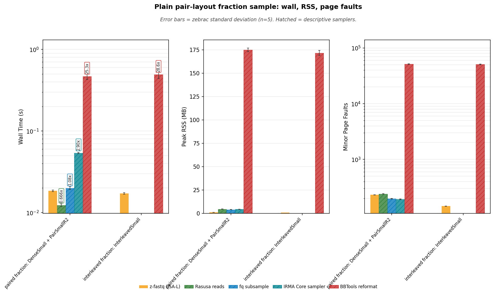

**Reading Figure 13**

- Facets: wall time (log y) | peak RSS (linear) | minor page faults (log y).
- X-axis: `--paired` then `--interleaved` on the matching mates. SE is not on this plot.
- Gold bars are z-fastq ISA-L. Hatched bars are descriptive samplers. Blank cells are unsupported for that layout.

## Performance: pair layout, count

`--paired --count` vs `--interleaved --count` on the matching mates. Output is `min(K, M)` complete pairs as interleaved records. Tables and a 3-facet only; no occupancy. Blank cells mean that tool is not invoked for that layout.

### Wall time

Zebrac mean wall time for one sample process. Vertical annotations are wall time relative to z-fastq ISA-L, including hatched descriptive lanes. Hatched ratios are not a ranking.

**Table 33:** Mean ± standard deviation by workload and tool.

| Workload                                 | z-fastq (ISA-L)     | Rasusa reads     | fq subsample     | IRMA Core sampler     | BBTools reformat     |
| :--------------------------------------- | :------------------ | :--------------- | :--------------- | :-------------------- | :------------------- |
| paired count: DenseSmall + PairSmallR2   | 0.025±0.000 s       | 0.021±0.001 s    | 0.022±0.001 s    | 0.052±0.001 s         | 0.524±0.042 s        |
| interleaved count: InterleavedSmall      | 0.026±0.000 s       |                  |                  |                       | 0.540±0.046 s        |

<strong>Table 34:</strong> Time relative to z-fastq ISA-L.

| Workload                                 | z-fastq vs          | z-fastq     | Peer      | Time relative to z-fastq     |
| :--------------------------------------- | :------------------ | :---------- | :-------- | :--------------------------- |
| paired count: DenseSmall + PairSmallR2   | Rasusa reads        | 0.0248s     | 0.0210s   | 0.846x                       |
| paired count: DenseSmall + PairSmallR2   | fq subsample        | 0.0248s     | 0.0220s   | 0.887x                       |
| paired count: DenseSmall + PairSmallR2   | IRMA Core sampler   | 0.0248s     | 0.0521s   | 2.10x                        |
| paired count: DenseSmall + PairSmallR2   | BBTools reformat    | 0.0248s     | 0.5242s   | 21.2x                        |
| interleaved count: InterleavedSmall      | BBTools reformat    | 0.0262s     | 0.5396s   | 20.6x                        |

### Peak memory

Peak RSS of the timed process. These are raw process measurements; sampler implementations do not share one memory contract.

**Table 35:** Mean ± standard deviation by workload and tool.

| Workload                                 | z-fastq (ISA-L)     | Rasusa reads     | fq subsample     | IRMA Core sampler     | BBTools reformat     |
| :--------------------------------------- | :------------------ | :--------------- | :--------------- | :-------------------- | :------------------- |
| paired count: DenseSmall + PairSmallR2   | 1.28±0.10 MB        | 5.66±0.11 MB     | 3.97±0.15 MB     | 4.34±0.16 MB          | 185.63±13.32 MB      |
| interleaved count: InterleavedSmall      | 1.05±0.05 MB        |                  |                  |                       | 174.66±3.51 MB       |

### Minor page faults

Minor page faults for the same direct commands. These are descriptive process measurements.

**Table 36:** Mean ± standard deviation by workload and tool.

| Workload                                 | z-fastq (ISA-L)     | Rasusa reads     | fq subsample     | IRMA Core sampler     | BBTools reformat     |
| :--------------------------------------- | :------------------ | :--------------- | :--------------- | :-------------------- | :------------------- |
| paired count: DenseSmall + PairSmallR2   | 267±1               | 402±1            | 199±2            | 193±2                 | 54280±3505           |
| interleaved count: InterleavedSmall      | 172±1               |                  |                  |                       | 51464±898            |

**Figure 14:** Wall time, peak RSS, and minor page faults for paired vs interleaved exact-count sampling.

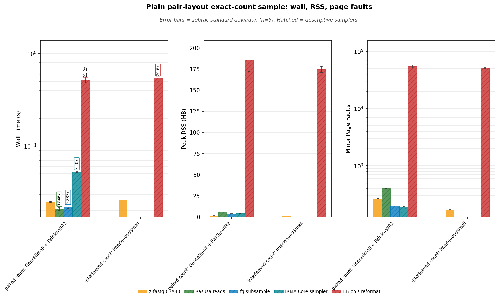

**Reading Figure 14**

- Facets: wall time (log y) | peak RSS (linear) | minor page faults (log y).
- X-axis: `--paired --count` then `--interleaved --count` on the matching mates.
- Gold bars are z-fastq ISA-L. Hatched bars are descriptive samplers. Blank cells are unsupported for that layout.

## Performance: pair layout, fraction (gzip)

The same paired vs interleaved `--fraction` mates as the plain section. Gold is z-fastq ISA-L; amber is native Zig inflate. IRMA Core is not timed on gzip. Blank cells mean that tool is not invoked for that layout.

### Wall time

Zebrac mean wall time for one sample process. Vertical annotations are wall time relative to z-fastq ISA-L, including hatched descriptive lanes. Hatched ratios are not a ranking.

**Table 37:** Mean ± standard deviation by workload and tool.

| Workload                                    | z-fastq (ISA-L)     | z-fastq (native)     | Rasusa reads     | fq subsample     | BBTools reformat     |
| :------------------------------------------ | :------------------ | :------------------- | :--------------- | :--------------- | :------------------- |
| paired fraction: DenseSmall + PairSmallR2   | 0.034±0.001 s       | 0.044±0.001 s        | 0.032±0.001 s    | 0.058±0.001 s    | 0.481±0.013 s        |
| interleaved fraction: InterleavedSmall      | 0.033±0.002 s       | 0.045±0.002 s        |                  |                  | 0.527±0.015 s        |

<strong>Table 38:</strong> Time relative to z-fastq ISA-L.

| Workload                                    | z-fastq vs         | z-fastq     | Peer      | Time relative to z-fastq     |
| :------------------------------------------ | :----------------- | :---------- | :-------- | :--------------------------- |
| paired fraction: DenseSmall + PairSmallR2   | z-fastq (native)   | 0.0339s     | 0.0442s   | 1.30x                        |
| paired fraction: DenseSmall + PairSmallR2   | Rasusa reads       | 0.0339s     | 0.0320s   | 0.945x                       |
| paired fraction: DenseSmall + PairSmallR2   | fq subsample       | 0.0339s     | 0.0580s   | 1.71x                        |
| paired fraction: DenseSmall + PairSmallR2   | BBTools reformat   | 0.0339s     | 0.4806s   | 14.2x                        |
| interleaved fraction: InterleavedSmall      | z-fastq (native)   | 0.0326s     | 0.0454s   | 1.39x                        |
| interleaved fraction: InterleavedSmall      | BBTools reformat   | 0.0326s     | 0.5269s   | 16.2x                        |

### Peak memory

Peak RSS of the timed process. These are raw process measurements; sampler implementations do not share one memory contract.

**Table 39:** Mean ± standard deviation by workload and tool.

| Workload                                    | z-fastq (ISA-L)     | z-fastq (native)     | Rasusa reads     | fq subsample     | BBTools reformat     |
| :------------------------------------------ | :------------------ | :------------------- | :--------------- | :--------------- | :------------------- |
| paired fraction: DenseSmall + PairSmallR2   | 1.42±0.15 MB        | 0.93±0.00 MB         | 4.68±0.16 MB     | 4.18±0.17 MB     | 173.92±2.60 MB       |
| interleaved fraction: InterleavedSmall      | 1.03±0.03 MB        | 0.93±0.01 MB         |                  |                  | 170.97±2.46 MB       |

### Minor page faults

Minor page faults for the same direct commands. These are descriptive process measurements.

**Table 40:** Mean ± standard deviation by workload and tool.

| Workload                                    | z-fastq (ISA-L)     | z-fastq (native)     | Rasusa reads     | fq subsample     | BBTools reformat     |
| :------------------------------------------ | :------------------ | :------------------- | :--------------- | :--------------- | :------------------- |
| paired fraction: DenseSmall + PairSmallR2   | 278±1               | 155±1                | 283±1            | 222±2            | 51270±694            |
| interleaved fraction: InterleavedSmall      | 169±1               | 182±1                |                  |                  | 50446±576            |

### Decoded throughput

Decoded FASTQ MiB/s is the uncompressed input size divided by wall time. That is the gzip unit that matches inflate work; compressed on-disk throughput is supporting context.

**Table 41:** Decoded FASTQ MiB/s.

| Workload                                    | z-fastq (ISA-L)     | z-fastq (native)     | Rasusa reads     | fq subsample     | BBTools reformat     |
| :------------------------------------------ | :------------------ | :------------------- | :--------------- | :--------------- | :------------------- |
| paired fraction: DenseSmall + PairSmallR2   | 1153.7 MiB/s        | 885.7 MiB/s          | 1221.2 MiB/s     | 674.0 MiB/s      | 81.4 MiB/s           |
| interleaved fraction: InterleavedSmall      | 1199.0 MiB/s        | 862.3 MiB/s          |                  |                  | 74.2 MiB/s           |

<strong>Table 42:</strong> Compressed on-disk MiB/s.

| Workload                                    | z-fastq (ISA-L)     | z-fastq (native)     | Rasusa reads     | fq subsample     | BBTools reformat     |
| :------------------------------------------ | :------------------ | :------------------- | :--------------- | :--------------- | :------------------- |
| paired fraction: DenseSmall + PairSmallR2   | 95.1 MiB/s          | 73.0 MiB/s           | 100.6 MiB/s      | 55.5 MiB/s       | 6.7 MiB/s            |
| interleaved fraction: InterleavedSmall      | 97.4 MiB/s          | 70.0 MiB/s           |                  |                  | 6.0 MiB/s            |

**Figure 15:** Wall time, peak RSS, and minor page faults for gzip paired vs interleaved fraction sampling.

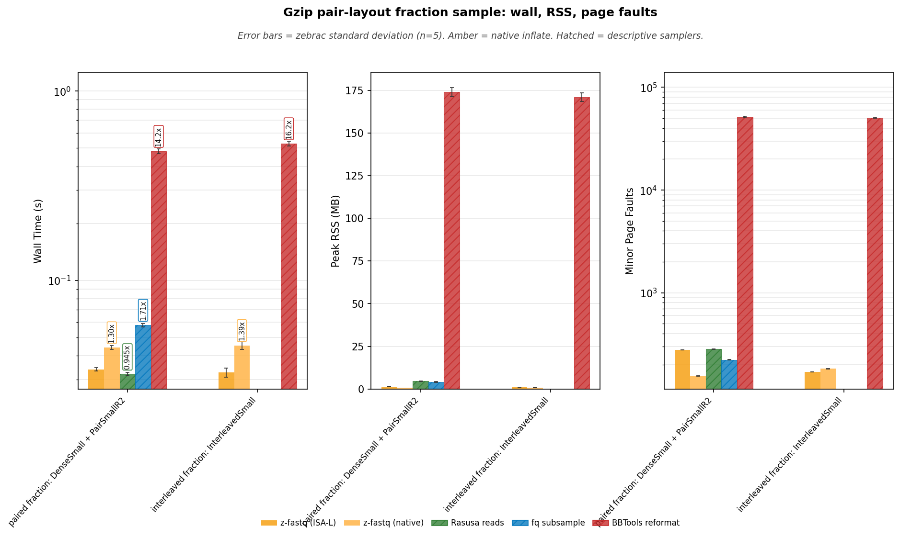

**Reading Figure 15**

- Facets: wall time (log y) | peak RSS (linear) | minor page faults (log y).
- X-axis: `--paired` then `--interleaved` on the matching mates. SE is not on this plot.
- Gold bars are z-fastq ISA-L. Amber bars are native inflate. Hatched bars are descriptive samplers. Blank cells are unsupported for that layout.

## Performance: pair layout, count (gzip)

The same paired vs interleaved `--count` mates as the plain section. Gold is z-fastq ISA-L; amber is native Zig inflate. Blank cells mean that tool is not invoked for that layout.

### Wall time

Zebrac mean wall time for one sample process. Vertical annotations are wall time relative to z-fastq ISA-L, including hatched descriptive lanes. Hatched ratios are not a ranking.

**Table 43:** Mean ± standard deviation by workload and tool.

| Workload                                 | z-fastq (ISA-L)     | z-fastq (native)     | Rasusa reads     | fq subsample     | BBTools reformat     |
| :--------------------------------------- | :------------------ | :------------------- | :--------------- | :--------------- | :------------------- |
| paired count: DenseSmall + PairSmallR2   | 0.056±0.002 s       | 0.084±0.002 s        | 0.061±0.003 s    | 0.078±0.001 s    | 0.564±0.049 s        |
| interleaved count: InterleavedSmall      | 0.057±0.003 s       | 0.083±0.001 s        |                  |                  | 0.659±0.051 s        |

<strong>Table 44:</strong> Time relative to z-fastq ISA-L.

| Workload                                 | z-fastq vs         | z-fastq     | Peer      | Time relative to z-fastq     |
| :--------------------------------------- | :----------------- | :---------- | :-------- | :--------------------------- |
| paired count: DenseSmall + PairSmallR2   | z-fastq (native)   | 0.0561s     | 0.0844s   | 1.51x                        |
| paired count: DenseSmall + PairSmallR2   | Rasusa reads       | 0.0561s     | 0.0612s   | 1.09x                        |
| paired count: DenseSmall + PairSmallR2   | fq subsample       | 0.0561s     | 0.0783s   | 1.40x                        |
| paired count: DenseSmall + PairSmallR2   | BBTools reformat   | 0.0561s     | 0.5635s   | 10.1x                        |
| interleaved count: InterleavedSmall      | z-fastq (native)   | 0.0568s     | 0.0831s   | 1.46x                        |
| interleaved count: InterleavedSmall      | BBTools reformat   | 0.0568s     | 0.6592s   | 11.6x                        |

### Peak memory

Peak RSS of the timed process. These are raw process measurements; sampler implementations do not share one memory contract.

**Table 45:** Mean ± standard deviation by workload and tool.

| Workload                                 | z-fastq (ISA-L)     | z-fastq (native)     | Rasusa reads     | fq subsample     | BBTools reformat     |
| :--------------------------------------- | :------------------ | :------------------- | :--------------- | :--------------- | :------------------- |
| paired count: DenseSmall + PairSmallR2   | 1.72±0.13 MB        | 1.40±0.11 MB         | 5.77±0.15 MB     | 4.12±0.22 MB     | 187.71±12.90 MB      |
| interleaved count: InterleavedSmall      | 1.20±0.13 MB        | 1.03±0.06 MB         |                  |                  | 176.86±5.95 MB       |

### Minor page faults

Minor page faults for the same direct commands. These are descriptive process measurements.

**Table 46:** Mean ± standard deviation by workload and tool.

| Workload                                 | z-fastq (ISA-L)     | z-fastq (native)     | Rasusa reads     | fq subsample     | BBTools reformat     |
| :--------------------------------------- | :------------------ | :------------------- | :--------------- | :--------------- | :------------------- |
| paired count: DenseSmall + PairSmallR2   | 353±1               | 483±1                | 404±1            | 224±2            | 54947±3258           |
| interleaved count: InterleavedSmall      | 215±1               | 291±1                |                  |                  | 52036±1485           |

### Decoded throughput

Decoded FASTQ MiB/s is the uncompressed input size divided by wall time. That is the gzip unit that matches inflate work; compressed on-disk throughput is supporting context.

**Table 47:** Decoded FASTQ MiB/s.

| Workload                                 | z-fastq (ISA-L)     | z-fastq (native)     | Rasusa reads     | fq subsample     | BBTools reformat     |
| :--------------------------------------- | :------------------ | :------------------- | :--------------- | :--------------- | :------------------- |
| paired count: DenseSmall + PairSmallR2   | 697.7 MiB/s         | 463.5 MiB/s          | 639.0 MiB/s      | 499.3 MiB/s      | 69.4 MiB/s           |
| interleaved count: InterleavedSmall      | 689.0 MiB/s         | 470.6 MiB/s          |                  |                  | 59.3 MiB/s           |

<strong>Table 48:</strong> Compressed on-disk MiB/s.

| Workload                                 | z-fastq (ISA-L)     | z-fastq (native)     | Rasusa reads     | fq subsample     | BBTools reformat     |
| :--------------------------------------- | :------------------ | :------------------- | :--------------- | :--------------- | :------------------- |
| paired count: DenseSmall + PairSmallR2   | 57.5 MiB/s          | 38.2 MiB/s           | 52.7 MiB/s       | 41.2 MiB/s       | 5.7 MiB/s            |
| interleaved count: InterleavedSmall      | 56.0 MiB/s          | 38.2 MiB/s           |                  |                  | 4.8 MiB/s            |

**Figure 16:** Wall time, peak RSS, and minor page faults for gzip paired vs interleaved exact-count sampling.

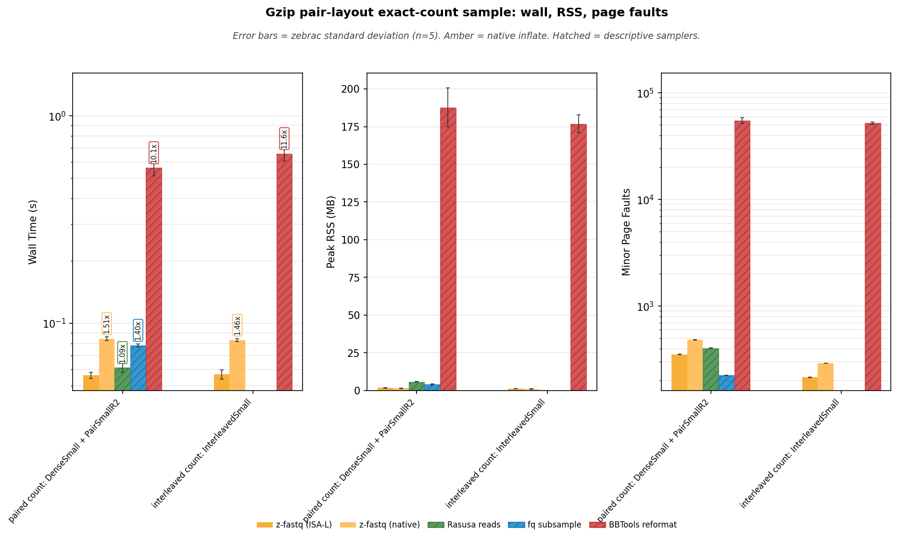

**Reading Figure 16**

- Facets: wall time (log y) | peak RSS (linear) | minor page faults (log y).
- X-axis: `--paired --count` then `--interleaved --count` on the matching mates.
- Gold bars are z-fastq ISA-L. Amber bars are native inflate. Hatched bars are descriptive samplers. Blank cells are unsupported for that layout.

