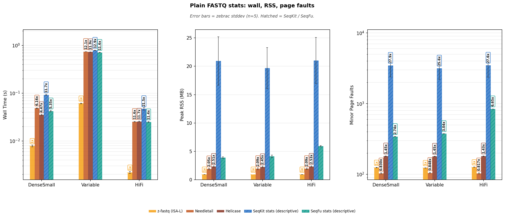
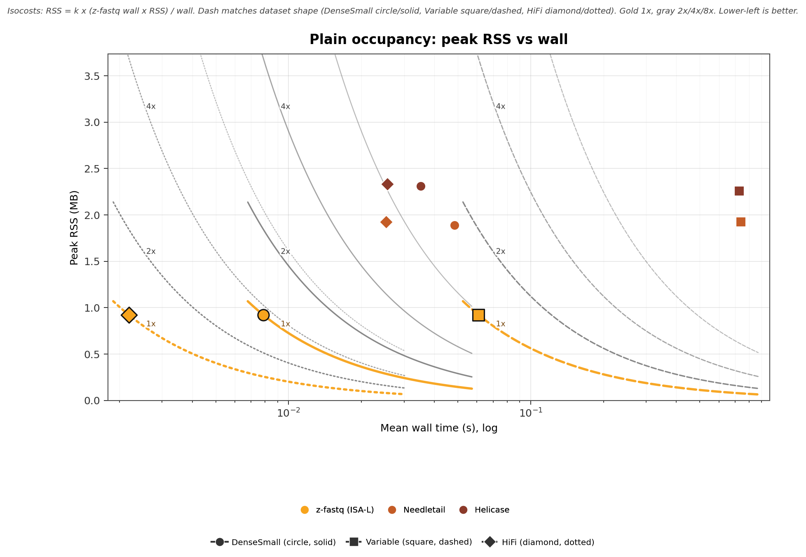
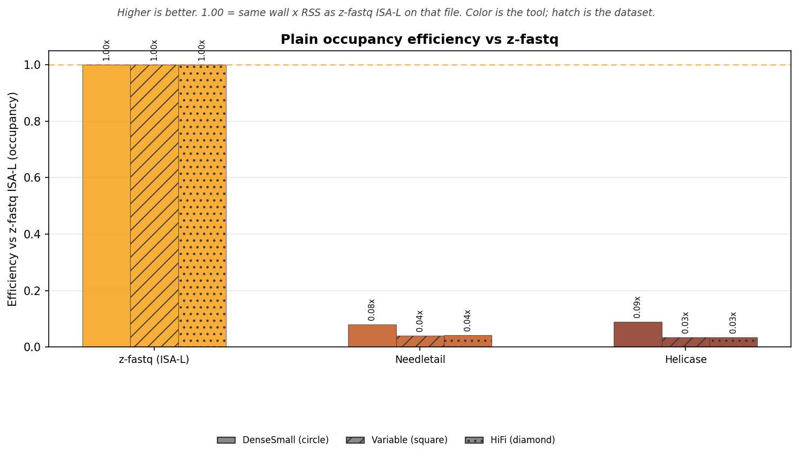
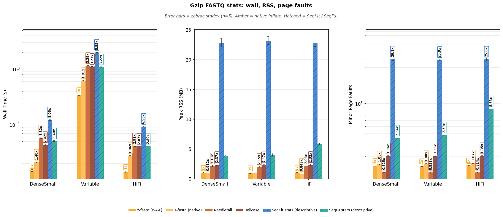
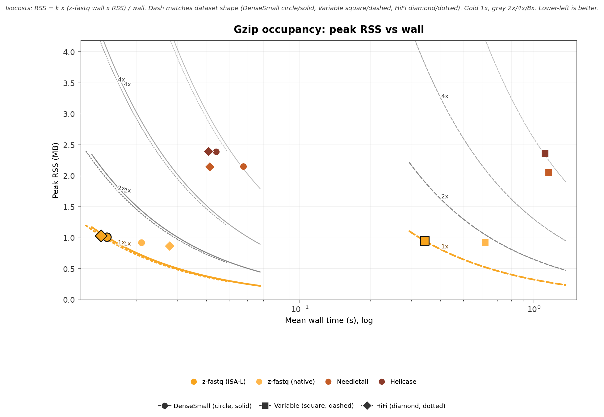
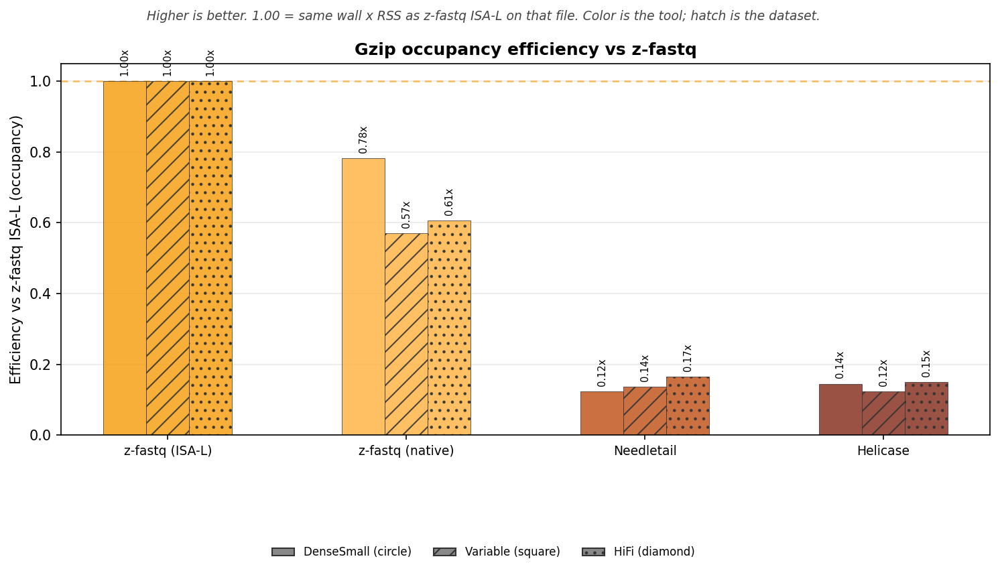

<!-- markdownlint-disable MD024 MD032 MD033 MD036 MD041 MD049 -->

# z-fastq Stats Benchmark Report

_Generated by `bench/stats/generate_report.py` from zebrac results._

_This is a bring-up measurement: small set: DenseSmall, Variable, HiFi (publication also times Long and PairR1); zebrac duration_ms=5000, runs=5, warmup=3 (published default is 5000 ms, 25 runs, 5 warmups). Read it as a check of the suite, not a published ranking._

## Overview

This report times `z-fastq stats` on matched plain and gzip FASTQ. Stats uses catalog ids, not the count Dense/Variable/Long slots. Timed here: DenseSmall, Variable, HiFi. Dense (SRR1810900) is omitted: every quality byte is `?`, so Q20/Q30 and mean quality are not a quality-score job. DenseSmall is SRR10325788 MiniSeq RNA-seq R1, 60,910 x 153 bp, real Illumina quality. The R2 mate is PairSmallR2 and is not timed here. Variable is ERR164407, 454 GS FLX Titanium, 282,806 reads, 40-631 bp (mean 345). Mixed length, not Illumina. HiFi is DRR054114, PacBio RS II CCS, 1,114 reads, 863-7274 bp (mean 2,818).

**What is timed**

- One process, one file. Zebrac starts that argv; it does not start a shell.
- Plain files use the ISA-L product binary only. Gzip files also time the native inflate binary (`-Disa-l=false`).
- Needletail and Helicase adapters print the same human fields as z-fastq. They are complete stats peers.
- SeqKit `stats -a -T -j 1` and SeqFu `stats --threads 1 --gc` are the field's stats CLIs. They are not the same job. Wall time is shown; RSS is not used for occupancy.

Needletail, Helicase, and both z-fastq binaries matched the independent four-line aggregator on every timed file before any duration measurement. SeqKit `stats -a` and SeqFu `stats --gc` were checked on overlapping length, GC, and (for SeqKit) Q20/Q30 fields, not on SeqKit AvgQual. Details are in Stats agreement below.

## What each tool does

`z-fastq stats` prints one human block: reads, bases, length min/max/mean, ACGTN, other_bases, GC over A+C+G+T, quality_sum, arithmetic mean Phred, q20/q30 bases and fractions. That is the compared fact.

| Tool               | Command                          | Same stats job                                          | Timed as                      |
| :----------------- | :------------------------------- | :------------------------------------------------------ | :---------------------------- |
| z-fastq (ISA-L)    | `z-fastq stats`                  | yes                                                     | product default               |
| z-fastq (native)   | `z-fastq-native stats`           | yes, gzip only                                          | second inflate backend        |
| Needletail         | `needletail-adapter stats`       | yes, same human fields                                  | equal-work wrapper            |
| Helicase           | `helicase-adapter stats`         | yes, same human fields                                  | equal-work wrapper            |
| SeqKit             | `seqkit stats -a -T -j 1`        | no; lengths, GC%, Q20%, Q30%; AvgQual is error-mean Q   | hatched; RSS not occupancy    |
| SeqFu              | `seqfu stats --threads 1 --gc`   | no; lengths and GC; default is 8 threads                | hatched; RSS not comparable   |

SeqKit AvgQual on the fixture is ~6 while arithmetic mean Phred is ~31. That is a different formula, not a bug in either tool. Occupancy uses only complete peers.

**Not timed**

| Tool            | Why it is not here                                                          |
| :-------------- | :-------------------------------------------------------------------------- |
| seqtk `size`    | reads and bases only; that is the count suite                               |
| seqtk `fqchk`   | drops empty sequences; positional quality histogram, not per-base Q20/Q30   |
| fqtools         | count only                                                                  |
| fqkit `stats`   | writes files, logs to stderr, panics on an empty sequence                   |
| fqkit `size`    | reads/bases/ACGTN plus stderr logs; not quality                             |

**Fields**

| Field                                     | z-fastq + adapters         | SeqKit -a                            | SeqFu --gc          |
| :---------------------------------------- | :------------------------- | :----------------------------------- | :------------------ |
| reads / bases / min / max / mean length   | yes                        | yes (avg_len rounded)                | yes (Avg rounded)   |
| A/C/G/T/N / other_bases                   | yes                        | sum_n only                           | no                  |
| GC                                        | fraction over A+C+G+T      | GC%                                  | %GC, 2 decimals     |
| quality_sum / mean_quality                | arithmetic Phred+33 mean   | AvgQual is -10 log10(mean error p)   | no                  |
| q20 / q30                                 | bases and fraction         | integer percent                      | no                  |

## Stats agreement

Valid four-line FASTQ only. SeqKit and SeqFu are not error-status references. Malformed fixtures are a separate z-fastq reject check.

Status: **ALL PASSED**. Complete peers (z-fastq, native on gzip, Needletail, Helicase, and the independent four-line aggregator) had to match every human field except `input:`. SeqKit was checked on reads, bases, min, max, N, GC%, and Q20/Q30%. SeqFu was checked on reads, bases, min, max, mean length, and GC. SeqKit AvgQual is not part of that check. The first mismatch would have stopped the run.

Log: `verify_20260915_140052.log`.

## Run provenance

- **Timestamp:** `20260915_140052`
- **Runner:** zebrac, warm page cache, runs=5, warmup=3, duration_ms=5000
- **zebrac:** zebrac 0.6.2
- **z-fastq ISA-L:** z-fastq 0.0.18 (754,560 bytes)
- **z-fastq native:** z-fastq 0.0.18 (535,088 bytes)
- **Stats check:** ALL PASSED (`verify_20260915_140052.log`)

**Peer versions**

- **needletail:** needletail 0.7.3
- **helicase:** helicase 0.2.0
- **seqkit:** seqkit v2.13.0
- **seqfu:** seqfu 1.27.1

DenseSmall is SRR10325788 MiniSeq RNA-seq R1, 60,910 x 153 bp, real Illumina quality. The R2 mate is PairSmallR2 and is not timed here. Variable is ERR164407, 454 GS FLX Titanium, 282,806 reads, 40-631 bp (mean 345). Mixed length, not Illumina. HiFi is DRR054114, PacBio RS II CCS, 1,114 reads, 863-7274 bp (mean 2,818).

## Performance: plain FASTQ

Uncompressed siblings of the same records. One z-fastq lane (the ISA-L product binary). Ratios use z-fastq ISA-L as 1x.

## Wall time

Zebrac mean wall time for one `stats` / peer process with stdout discarded.

**Table 1:** Mean ± stddev by dataset and tool.

| Dataset      | z-fastq (ISA-L)     | Needletail      | Helicase        | SeqKit stats (descriptive)     | SeqFu stats (descriptive)     |
| :----------- | :------------------ | :-------------- | :-------------- | :----------------------------- | :---------------------------- |
| DenseSmall   | 0.008±0.000 s       | 0.048±0.001 s   | 0.035±0.001 s   | 0.092±0.003 s                  | 0.042±0.001 s                 |
| Variable     | 0.061±0.001 s       | 0.738±0.003 s   | 0.728±0.003 s   | 0.783±0.007 s                  | 0.707±0.005 s                 |
| HiFi         | 0.002±0.000 s       | 0.025±0.000 s   | 0.026±0.000 s   | 0.047±0.003 s                  | 0.025±0.001 s                 |

<strong>Table 2:</strong> Time x = lane wall / z-fastq ISA-L. Same ratios as bar labels.

| Dataset      | z-fastq vs                   | z-fastq     | Peer      | Time x     |
| :----------- | :--------------------------- | :---------- | :-------- | :--------- |
| DenseSmall   | Needletail                   | 0.0079s     | 0.0484s   | 6.16x      |
| DenseSmall   | Helicase                     | 0.0079s     | 0.0352s   | 4.47x      |
| DenseSmall   | SeqKit stats (descriptive)   | 0.0079s     | 0.0918s   | 11.7x      |
| DenseSmall   | SeqFu stats (descriptive)    | 0.0079s     | 0.0420s   | 5.35x      |
| Variable     | Needletail                   | 0.0609s     | 0.7381s   | 12.1x      |
| Variable     | Helicase                     | 0.0609s     | 0.7280s   | 11.9x      |
| Variable     | SeqKit stats (descriptive)   | 0.0609s     | 0.7834s   | 12.9x      |
| Variable     | SeqFu stats (descriptive)    | 0.0609s     | 0.7073s   | 11.6x      |
| HiFi         | Needletail                   | 0.0022s     | 0.0253s   | 11.6x      |
| HiFi         | Helicase                     | 0.0022s     | 0.0256s   | 11.7x      |
| HiFi         | SeqKit stats (descriptive)   | 0.0022s     | 0.0470s   | 21.5x      |
| HiFi         | SeqFu stats (descriptive)    | 0.0022s     | 0.0249s   | 11.4x      |

## Memory

Peak RSS of the timed process. Zebrac starts the tool directly and does not start a shell. SeqKit and SeqFu are omitted from RSS ratios: they are not the same stats job, SeqFu may launch helpers, and SeqKit RSS is the Go image.

**Table 3:** Mean ± stddev by dataset and tool.

| Dataset      | z-fastq (ISA-L)     | Needletail     | Helicase       | SeqKit stats (descriptive)     | SeqFu stats (descriptive)     |
| :----------- | :------------------ | :------------- | :------------- | :----------------------------- | :---------------------------- |
| DenseSmall   | 0.92±0.01 MB        | 1.89±0.12 MB   | 2.31±0.12 MB   | 20.92±4.27 MB                  | 3.90±0.12 MB                  |
| Variable     | 0.92±0.00 MB        | 1.92±0.17 MB   | 2.26±0.13 MB   | 19.68±3.63 MB                  | 4.12±0.22 MB                  |
| HiFi         | 0.92±0.00 MB        | 1.93±0.13 MB   | 2.33±0.09 MB   | 21.02±4.08 MB                  | 5.90±0.12 MB                  |

<strong>Table 4:</strong> RSS x = lane peak RSS / z-fastq ISA-L.

| Dataset      | z-fastq vs     | z-fastq     | Peer      | RSS x     |
| :----------- | :------------- | :---------- | :-------- | :-------- |
| DenseSmall   | Needletail     | 0.92 MB     | 1.89 MB   | 2.05x     |
| DenseSmall   | Helicase       | 0.92 MB     | 2.31 MB   | 2.51x     |
| Variable     | Needletail     | 0.92 MB     | 1.92 MB   | 2.09x     |
| Variable     | Helicase       | 0.92 MB     | 2.26 MB   | 2.45x     |
| HiFi         | Needletail     | 0.92 MB     | 1.93 MB   | 2.09x     |
| HiFi         | Helicase       | 0.92 MB     | 2.33 MB   | 2.53x     |

## Page faults

Minor page faults for the same commands.

**Table 5:** Mean ± stddev by dataset and tool.

| Dataset      | z-fastq (ISA-L)     | Needletail     | Helicase     | SeqKit stats (descriptive)     | SeqFu stats (descriptive)     |
| :----------- | :------------------ | :------------- | :----------- | :----------------------------- | :---------------------------- |
| DenseSmall   | 124±1               | 103±2          | 181±2        | 3468±1081                      | 341±1                         |
| Variable     | 123±0               | 105±1          | 179±1        | 3161±963                       | 375±1                         |
| HiFi         | 126±1               | 103±2          | 181±2        | 3483±1113                      | 840±1                         |

<strong>Table 6:</strong> Faults x = lane minor faults / z-fastq ISA-L.

| Dataset      | z-fastq vs                   | z-fastq     | Peer     | Faults x     |
| :----------- | :--------------------------- | ----------: | -------: | :----------- |
| DenseSmall   | Needletail                   | 124         | 103      | 0.830x       |
| DenseSmall   | Helicase                     | 124         | 181      | 1.45x        |
| DenseSmall   | SeqKit stats (descriptive)   | 124         | 3468     | 27.9x        |
| DenseSmall   | SeqFu stats (descriptive)    | 124         | 341      | 2.74x        |
| Variable     | Needletail                   | 123         | 105      | 0.848x       |
| Variable     | Helicase                     | 123         | 179      | 1.45x        |
| Variable     | SeqKit stats (descriptive)   | 123         | 3161     | 25.6x        |
| Variable     | SeqFu stats (descriptive)    | 123         | 375      | 3.04x        |
| HiFi         | Needletail                   | 126         | 103      | 0.817x       |
| HiFi         | Helicase                     | 126         | 181      | 1.43x        |
| HiFi         | SeqKit stats (descriptive)   | 126         | 3483     | 27.6x        |
| HiFi         | SeqFu stats (descriptive)    | 126         | 840      | 6.65x        |

**Figure 1:** Wall, peak RSS, and minor page faults for the real datasets.

**Reading Figure 1**

- Facets: wall time (log y) | peak RSS (linear) | minor page faults (log y).
- X-axis: DenseSmall, Variable, HiFi.
- Gold bars: z-fastq ISA-L (1x). One z-fastq lane on plain FASTQ.
- Hatched bars: SeqKit and SeqFu (descriptive; not the same stats job). They are not occupancy peers.
- Error bars show standard deviation.

## Occupancy (50/50 wall and RSS)

Occupancy is mean wall times peak RSS. SeqKit and SeqFu are omitted because they are not the same stats job and SeqFu child RSS is not measured. The scatter is peak RSS against mean wall, not a ratio plot. Each dataset has its own 1x/2x/4x/8x family through that file's z-fastq ISA-L. Curve dash matches the scatter shape. Color is the tool. Shape is the dataset. Efficiency vs z-fastq is the next figure, not this one.

**Table 7:** Occupancy (MB·s) = mean wall x peak RSS. Equal 50/50 weight.

| Dataset      | z-fastq (ISA-L)     | Needletail     | Helicase     |
| :----------- | ------------------: | -------------: | -----------: |
| DenseSmall   | 0.0072              | 0.0915         | 0.0813       |
| Variable     | 0.0562              | 1.4202         | 1.6445       |
| HiFi         | 0.002               | 0.0487         | 0.0596       |

**Table 8:** Occupancy efficiency vs z-fastq ISA-L. Higher is better.

| Dataset      | z-fastq (ISA-L)     | Needletail     | Helicase     |
| :----------- | :------------------ | :------------- | :----------- |
| DenseSmall   | 1x                  | 0.079x         | 0.089x       |
| Variable     | 1x                  | 0.040x         | 0.034x       |
| HiFi         | 1x                  | 0.041x         | 0.034x       |

**Figure 2:** Peak RSS vs mean wall. Per-dataset occupancy isocosts through z-fastq ISA-L.

**Reading Figure 2**

- X: mean wall (s, log). Y: peak RSS (MB, linear).
- Color = tool. Shape = dataset (DenseSmall circle/solid, Variable square/dashed, HiFi diamond/dotted).
- Curves are 1x/2x/4x/8x memory-seconds of that dataset's z-fastq ISA-L. Dash matches the shape. Gold 1x, gray 2x/4x/8x.
- Lower-left is better. Native inflate appears on gzip only.

**Figure 3:** Occupancy efficiency vs z-fastq ISA-L. Higher is better. 1.00 matches z-fastq memory-seconds.

**Reading Figure 3**

- X-axis is the tool. Grouped bars are DenseSmall / Variable / HiFi (hatch).
- Bar color is the tool. Gold dashed line is 1x.
- This is the inverse of occupancy cost on the scatter.

## Performance: gzip FASTQ

The same records as gzip. Gold bars are z-fastq ISA-L (product default, 1x). Amber bars are native Zig inflate (`-Disa-l=false`). Decoded FASTQ MiB/s (uncompressed sibling size / wall) is the gzip unit that matches inflate work.

## Wall time

Zebrac mean wall time for one `stats` / peer process with stdout discarded.

**Table 9:** Mean ± stddev by dataset and tool.

| Dataset      | z-fastq (ISA-L)     | z-fastq (native)     | Needletail      | Helicase        | SeqKit stats (descriptive)     | SeqFu stats (descriptive)     |
| :----------- | :------------------ | :------------------- | :-------------- | :-------------- | :----------------------------- | :---------------------------- |
| DenseSmall   | 0.015±0.001 s       | 0.021±0.000 s        | 0.057±0.001 s   | 0.044±0.001 s   | 0.121±0.002 s                  | 0.051±0.001 s                 |
| Variable     | 0.341±0.004 s       | 0.618±0.008 s        | 1.156±0.007 s   | 1.115±0.005 s   | 1.995±0.011 s                  | 1.099±0.009 s                 |
| HiFi         | 0.014±0.001 s       | 0.028±0.000 s        | 0.041±0.001 s   | 0.041±0.000 s   | 0.093±0.001 s                  | 0.041±0.001 s                 |

<strong>Table 10:</strong> Time x = lane wall / z-fastq ISA-L. Same ratios as bar labels.

| Dataset      | z-fastq vs                   | z-fastq     | Peer      | Time x     |
| :----------- | :--------------------------- | :---------- | :-------- | :--------- |
| DenseSmall   | z-fastq (native)             | 0.0150s     | 0.0211s   | 1.40x      |
| DenseSmall   | Needletail                   | 0.0150s     | 0.0574s   | 3.82x      |
| DenseSmall   | Helicase                     | 0.0150s     | 0.0439s   | 2.92x      |
| DenseSmall   | SeqKit stats (descriptive)   | 0.0150s     | 0.1212s   | 8.06x      |
| DenseSmall   | SeqFu stats (descriptive)    | 0.0150s     | 0.0511s   | 3.40x      |
| Variable     | z-fastq (native)             | 0.3408s     | 0.6184s   | 1.81x      |
| Variable     | Needletail                   | 0.3408s     | 1.1563s   | 3.39x      |
| Variable     | Helicase                     | 0.3408s     | 1.1154s   | 3.27x      |
| Variable     | SeqKit stats (descriptive)   | 0.3408s     | 1.9953s   | 5.85x      |
| Variable     | SeqFu stats (descriptive)    | 0.3408s     | 1.0985s   | 3.22x      |
| HiFi         | z-fastq (native)             | 0.0142s     | 0.0278s   | 1.96x      |
| HiFi         | Needletail                   | 0.0142s     | 0.0412s   | 2.91x      |
| HiFi         | Helicase                     | 0.0142s     | 0.0408s   | 2.87x      |
| HiFi         | SeqKit stats (descriptive)   | 0.0142s     | 0.0931s   | 6.56x      |
| HiFi         | SeqFu stats (descriptive)    | 0.0142s     | 0.0410s   | 2.89x      |

## Decoded throughput

Decoded FASTQ MiB/s is uncompressed sibling size divided by mean wall. That is the gzip unit that matches inflate work. Compressed MiB/s (on-disk gzip size / wall) is under the fold.

**Table 11:** Decoded FASTQ MiB/s.

| Dataset      | z-fastq (ISA-L)     | z-fastq (native)     | Needletail     | Helicase      | SeqKit stats (descriptive)     | SeqFu stats (descriptive)     |
| :----------- | :------------------ | :------------------- | :------------- | :------------ | :----------------------------- | :---------------------------- |
| DenseSmall   | 1301.5 MiB/s        | 928.7 MiB/s          | 340.6 MiB/s    | 445.5 MiB/s   | 161.4 MiB/s                    | 383.0 MiB/s                   |
| Variable     | 577.0 MiB/s         | 317.9 MiB/s          | 170.1 MiB/s    | 176.3 MiB/s   | 98.5 MiB/s                     | 179.0 MiB/s                   |
| HiFi         | 424.0 MiB/s         | 216.4 MiB/s          | 145.9 MiB/s    | 147.5 MiB/s   | 64.6 MiB/s                     | 146.9 MiB/s                   |

<strong>Table 12:</strong> Compressed on-disk MiB/s (supporting column).

| Dataset      | z-fastq (ISA-L)     | z-fastq (native)     | Needletail     | Helicase     | SeqKit stats (descriptive)     | SeqFu stats (descriptive)     |
| :----------- | :------------------ | :------------------- | :------------- | :----------- | :----------------------------- | :---------------------------- |
| DenseSmall   | 100.4 MiB/s         | 71.6 MiB/s           | 26.3 MiB/s     | 34.4 MiB/s   | 12.4 MiB/s                     | 29.5 MiB/s                    |
| Variable     | 213.5 MiB/s         | 117.7 MiB/s          | 62.9 MiB/s     | 65.2 MiB/s   | 36.5 MiB/s                     | 66.3 MiB/s                    |
| HiFi         | 220.2 MiB/s         | 112.4 MiB/s          | 75.8 MiB/s     | 76.6 MiB/s   | 33.6 MiB/s                     | 76.3 MiB/s                    |

## Memory

Peak RSS of the timed process. Zebrac starts the tool directly and does not start a shell. SeqKit and SeqFu are omitted from RSS ratios: they are not the same stats job, SeqFu may launch helpers, and SeqKit RSS is the Go image.

**Table 13:** Mean ± stddev by dataset and tool.

| Dataset      | z-fastq (ISA-L)     | z-fastq (native)     | Needletail     | Helicase       | SeqKit stats (descriptive)     | SeqFu stats (descriptive)     |
| :----------- | :------------------ | :------------------- | :------------- | :------------- | :----------------------------- | :---------------------------- |
| DenseSmall   | 1.01±0.05 MB        | 0.92±0.00 MB         | 2.15±0.11 MB   | 2.39±0.11 MB   | 22.85±0.72 MB                  | 3.91±0.09 MB                  |
| Variable     | 0.95±0.06 MB        | 0.92±0.00 MB         | 2.05±0.11 MB   | 2.36±0.03 MB   | 23.20±0.67 MB                  | 4.01±0.23 MB                  |
| HiFi         | 1.03±0.03 MB        | 0.87±0.00 MB         | 2.15±0.14 MB   | 2.40±0.14 MB   | 22.84±0.64 MB                  | 5.86±0.11 MB                  |

<strong>Table 14:</strong> RSS x = lane peak RSS / z-fastq ISA-L.

| Dataset      | z-fastq vs         | z-fastq     | Peer      | RSS x     |
| :----------- | :----------------- | :---------- | :-------- | :-------- |
| DenseSmall   | z-fastq (native)   | 1.01 MB     | 0.92 MB   | 0.912x    |
| DenseSmall   | Needletail         | 1.01 MB     | 2.15 MB   | 2.13x     |
| DenseSmall   | Helicase           | 1.01 MB     | 2.39 MB   | 2.37x     |
| Variable     | z-fastq (native)   | 0.95 MB     | 0.92 MB   | 0.966x    |
| Variable     | Needletail         | 0.95 MB     | 2.05 MB   | 2.15x     |
| Variable     | Helicase           | 0.95 MB     | 2.36 MB   | 2.47x     |
| HiFi         | z-fastq (native)   | 1.03 MB     | 0.87 MB   | 0.843x    |
| HiFi         | Needletail         | 1.03 MB     | 2.15 MB   | 2.08x     |
| HiFi         | Helicase           | 1.03 MB     | 2.40 MB   | 2.32x     |

## Page faults

Minor page faults for the same commands.

**Table 15:** Mean ± stddev by dataset and tool.

| Dataset      | z-fastq (ISA-L)     | z-fastq (native)     | Needletail     | Helicase     | SeqKit stats (descriptive)     | SeqFu stats (descriptive)     |
| :----------- | :------------------ | :------------------- | :------------- | :----------- | :----------------------------- | :---------------------------- |
| DenseSmall   | 149±0               | 157±1                | 123±2          | 202±2        | 3873±144                       | 348±1                         |
| Variable     | 148±1               | 159±1                | 122±3          | 201±1        | 3823±83                        | 382±1                         |
| HiFi         | 151±0               | 162±1                | 123±2          | 203±2        | 3858±145                       | 847±1                         |

<strong>Table 16:</strong> Faults x = lane minor faults / z-fastq ISA-L.

| Dataset      | z-fastq vs                   | z-fastq     | Peer     | Faults x     |
| :----------- | :--------------------------- | ----------: | -------: | :----------- |
| DenseSmall   | z-fastq (native)             | 149         | 157      | 1.05x        |
| DenseSmall   | Needletail                   | 149         | 123      | 0.825x       |
| DenseSmall   | Helicase                     | 149         | 202      | 1.36x        |
| DenseSmall   | SeqKit stats (descriptive)   | 149         | 3873     | 26.1x        |
| DenseSmall   | SeqFu stats (descriptive)    | 149         | 348      | 2.34x        |
| Variable     | z-fastq (native)             | 148         | 159      | 1.08x        |
| Variable     | Needletail                   | 148         | 122      | 0.828x       |
| Variable     | Helicase                     | 148         | 201      | 1.36x        |
| Variable     | SeqKit stats (descriptive)   | 148         | 3823     | 25.9x        |
| Variable     | SeqFu stats (descriptive)    | 148         | 382      | 2.59x        |
| HiFi         | z-fastq (native)             | 151         | 162      | 1.07x        |
| HiFi         | Needletail                   | 151         | 123      | 0.814x       |
| HiFi         | Helicase                     | 151         | 203      | 1.35x        |
| HiFi         | SeqKit stats (descriptive)   | 151         | 3858     | 25.6x        |
| HiFi         | SeqFu stats (descriptive)    | 151         | 847      | 5.63x        |

**Figure 4:** Wall, peak RSS, and minor page faults for the real datasets.

**Reading Figure 4**

- Facets: wall time (log y) | peak RSS (linear) | minor page faults (log y).
- X-axis: DenseSmall, Variable, HiFi.
- Gold bars: z-fastq ISA-L (1x). Amber bars: native inflate.
- Hatched bars: SeqKit and SeqFu (descriptive; not the same stats job). They are not occupancy peers.
- Error bars show standard deviation.

## Occupancy (50/50 wall and RSS)

Occupancy is mean wall times peak RSS. SeqKit and SeqFu are omitted because they are not the same stats job and SeqFu child RSS is not measured. The scatter is peak RSS against mean wall, not a ratio plot. Each dataset has its own 1x/2x/4x/8x family through that file's z-fastq ISA-L. Curve dash matches the scatter shape. Color is the tool. Shape is the dataset. Efficiency vs z-fastq is the next figure, not this one.

**Table 17:** Occupancy (MB·s) = mean wall x peak RSS. Equal 50/50 weight.

| Dataset      | z-fastq (ISA-L)     | z-fastq (native)     | Needletail     | Helicase     |
| :----------- | ------------------: | -------------------: | -------------: | -----------: |
| DenseSmall   | 0.0152              | 0.0194               | 0.1237         | 0.1049       |
| Variable     | 0.3252              | 0.5701               | 2.3749         | 2.6326       |
| HiFi         | 0.0147              | 0.0242               | 0.0886         | 0.0977       |

**Table 18:** Occupancy efficiency vs z-fastq ISA-L. Higher is better.

| Dataset      | z-fastq (ISA-L)     | z-fastq (native)     | Needletail     | Helicase     |
| :----------- | :------------------ | :------------------- | :------------- | :----------- |
| DenseSmall   | 1x                  | 0.782x               | 0.123x         | 0.145x       |
| Variable     | 1x                  | 0.570x               | 0.137x         | 0.124x       |
| HiFi         | 1x                  | 0.606x               | 0.165x         | 0.150x       |

**Figure 5:** Peak RSS vs mean wall. Per-dataset occupancy isocosts through z-fastq ISA-L.

**Reading Figure 5**

- X: mean wall (s, log). Y: peak RSS (MB, linear).
- Color = tool. Shape = dataset (DenseSmall circle/solid, Variable square/dashed, HiFi diamond/dotted).
- Curves are 1x/2x/4x/8x memory-seconds of that dataset's z-fastq ISA-L. Dash matches the shape. Gold 1x, gray 2x/4x/8x.
- Lower-left is better. Native inflate appears on gzip only.

**Figure 6:** Occupancy efficiency vs z-fastq ISA-L. Higher is better. 1.00 matches z-fastq memory-seconds.

**Reading Figure 6**

- X-axis is the tool. Grouped bars are DenseSmall / Variable / HiFi (hatch).
- Bar color is the tool. Gold dashed line is 1x.
- This is the inverse of occupancy cost on the scatter.

